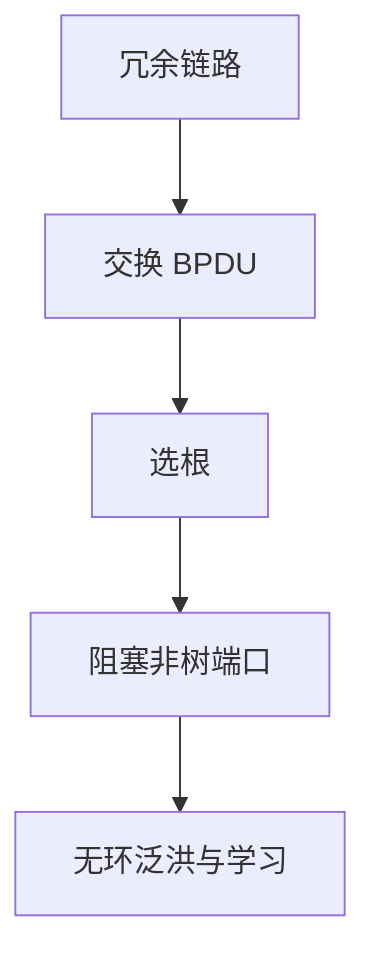

# 生成树

冗余链路形成环时，广播与未知单播会绕圈放大；生成树先关掉一些端口，留下无环转发拓扑。

<footer>—— 据 Perlman, An Algorithm for Distributed Computation of a Spanning Tree in an Extended LAN, 1985；IEEE 802.1D 整理</footer>

[上一课](/cs/vlan)让交换机对未知帧泛洪。两条交换机之间若有两条链路，泛洪帧会永转，MAC 表抖动。缺口不是再学一遍源地址，而是在链路层算一棵**生成树**，阻塞冗余端口。图算法课的[最小生成树](/cs/mst-kruskal-prim)给过边权树；这里权是桥优先级与端口代价，目标先是无环连通。

## 问题

物理环提供容错，逻辑必须无环。Perlman 的分布式算法：选根桥，每桥选根端口，每网段选指定端口，其余阻塞。BPDU 在桥之间交换。缺口是这套选举，不是 IP 的最短路径——生成树甚至不优化应用延迟，只保证二层可泛洪。

本课不把 RSTP 的握手时序写到状态机每一行。

阻塞端口仍听 BPDU，以便根失败时恢复。数据平面不转发，控制平面活着。

## 方法

比较桥 ID（优先级 + MAC）最小者为根。根代价沿 BPDU 传播。指定端口是该网段上根代价最好的桥的端口。收敛期间端口可处于学习/监听，避免临时环。VLAN 可每 VLAN 一棵树（PVST 等），主干只要求：有环必须先成树再按上一课转发。

## 机制

生成树把二层以太网限制成树，于是[交换机](/cs/csma-switch)的泛洪有终止。代价是：有的链路闲置，带宽浪费；根附近成为瓶颈。这正是后课要用三层路由、等价多路径的动机之一，本课不提前 BGP。与端到端：树断了会黑一阵，主机 TCP 自己重传——下层「几乎连通」仍不是文件保证。

## 边界

本课不把 TRILL、SPB、EVPN 当默认校园网，不引入最短路径二层的全部控制平面。也不把生成树根劫持写成攻击步骤。无线 mesh 与有线桥不是同一算法。

根桥选举若被更小优先级抢占，树会 reconverge，转发暂停。优先级是管理配置，不是 MAC 自动最优。

RSTP 用提议/同意加速，对象仍是一棵无环活动拓扑。

后课默认：同一广播域在树上看是无环的。跨网还缺「哪一跳的 MAC 对应哪个 IP」，下一课 ARP。

## 小结

- 二层环 + 泛洪 = 风暴；生成树阻塞冗余。
- 选根、根端口、指定端口；BPDU 传播。
- IP 与 ARP 还没有：下一课在已连通的链路上解析地址。
- 出处：Perlman, 1985；IEEE 802.1D；Kurose and Ross。
