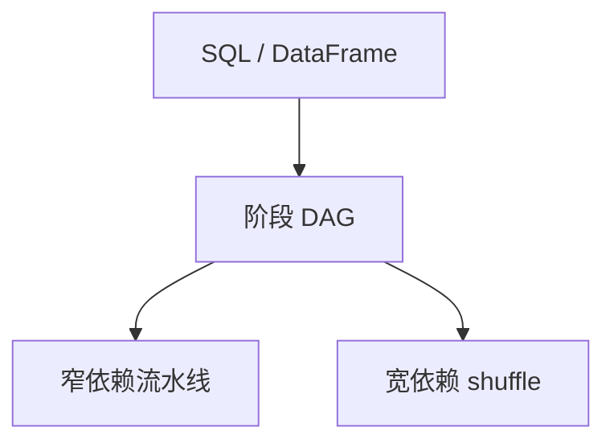

# Spark 与 DAG

把作业收成 RDD/DataFrame 上的有向无环图，窄依赖流水线，宽依赖才洗牌；谱系让失败后从检查点重算，而不必每两跳落盘。

<footer>—— Zaharia et al., Resilient Distributed Datasets, NSDI 2012；Spark SQL / Catalyst</footer>

[上一课](/cs/mapreduce)强制 map→shuffle→reduce。缺口是多阶段查询：过滤、map、join、再聚合。本课钉 Spark 式 DAG；流窗口下一课把无界数据接进来。不重写 MR 的再执行定理。

## 问题

MR 每次 shuffle 物化，迭代与交互查询太慢。RDD：不可变分区集合 + 转换谱系。宽依赖（groupBy、join）画成 DAG 的边，窄依赖（map、filter）融合。缺口是**计划与谱系**：Catalyst 把 SQL 收成同一 DAG，失败按谱系重算丢失分区。与湖仓：DataFrame 读表快照，写回表格式提交。

Zaharia, NSDI 2012。内存缓存是谱系上的提示，不是缓存一致性协议。倾斜仍在宽依赖上。

## 方法

读逻辑计划 → 优化（谓词下推、join 重排）→ 物理 DAG → 任务按分区调度。shuffle 服务替代 MR 的文件系统中间文件。AQE 运行时改 join 策略。与 TPC-H：后课基准测的就是这类 DAG。

## 机制

谱系是函数式重算：分区丢了，从最近检查点沿边再跑。需要确定性与可重读输入。宽依赖失败会重跑整个 shuffle 上游，比 MR 单任务再执行更贵也更灵活。Catalyst 做谓词下推与连接重排，物理层仍是 broadcast / sort-merge / hash——[分布式连接](/cs/distributed-join-shuffle) 的同一菜单。整阶段代码生成对应 [编译执行](/cs/query-compilation)。

调度：任务对分区。执行内存与存储缓存争用，扫描污染像 2Q。AQE 在运行时改 join 策略，是 [自适应查询处理](/cs/adaptive-query-processing) 的集群实例。输出进湖仓表格式，提交快照即作业的「commit」。

## 边界

本课不写某发行版的调参表。下一课无界流：DAG 变成持续运行的图，窗口取代作业结束。不要把 Spark 当 OLTP：没有行锁热点路径，RTO 是作业级重跑。

后课默认：批分析用 DAG + 血统；shuffle 仍是税。流处理与窗口把无界输入切成可聚合的包。

## 小结

- DAG 把多阶段查询连成谱系；宽依赖才洗牌。
- 容错靠重算分区，前提是可重读与确定性。
- 流处理与窗口下一课。
- 出处：Zaharia et al., NSDI 2012；Catalyst。
