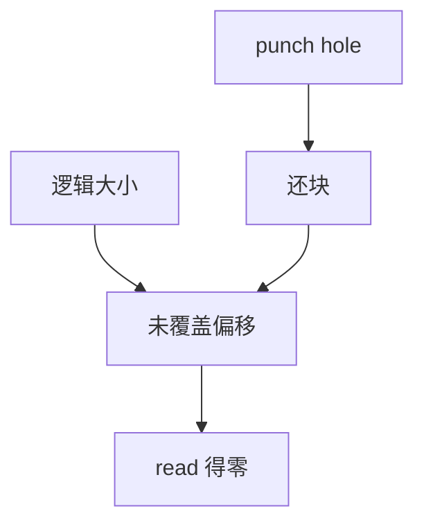

# 稀疏文件与穿孔

逻辑大小可以盖住从未分配的洞；读洞得零。穿孔把已分配块还回去，使中间再次变成洞。

<footer>—— 据 POSIX lseek 与 <code>FALLOC_FL_PUNCH_HOLE</code>；McKusick 对空洞文件的讨论</footer>

[上一课](/cs/fs-mmap-coherence)假定偏移对应页。若从未写入某偏移，[extent](/cs/ext4-extents) 可以不覆盖它，FAT 链也可以跳过——但接口要统一：**稀疏文件**。缺口是洞的 POSIX 语义与 `fallocate` 穿孔，不是再讲块组位图。

## 问题

虚拟机镜像、下载占位、科学数据经常「中间没有写过」。若按逻辑大小预分配，盘瞬间满。Unix 约定：`lseek` 越过 EOF 再写，中间是洞；`read` 洞返回零，不占块。穿孔：已有数据的区间也可以改回洞，释放块，再次读零。缺口：`SEEK_HOLE`/`SEEK_DATA` 如何让工具跳过洞；mmap 洞页是零页还是写时分配；与配额、快照的交叉（穿孔是否立刻减占用）。

`fallocate` 预分配与穿孔是同一系统调用的不同模式。预分配减少碎片，与稀疏相反。教学上两者都改「逻辑 vs 物理」关系。

## 方法

FS：洞不出现在块图/extent/FAT 链中。写洞中某页：分配块，插入图，页缓存从零页变成普通脏页。穿孔：切 extent 或拆链，位图清位，作废页缓存对应页。与 COW：穿孔是新树，旧快照仍握旧块。与 [fsck](/cs/fsck)：洞不是交叉，位图空闲而逻辑大小盖住是合法。

## 机制

稀疏把「文件」从「已占用块的集合」里解放出来：对象是逻辑字节数组，物理是部分函数。备份工具若按逻辑大小拷会把洞物化成零，撑爆目标——必须懂 `SEEK_HOLE`。不要把洞写成数据库 NULL：没有列，只有偏移。

mmap 共享映射写洞会分配并标脏，等于物化。私有映射写洞只物化匿名页，文件仍稀疏。

实现上：SEEK_HOLE 的精度取决于 FS：有的按 extent，有的只在整个文件级。备份若忽略它会把 TB 级洞物化成零。fallocate 预分配则相反，故意让洞消失以减运行时分配。 读法上只引用[上一课](/cs/fs-mmap-coherence)的结论，不把对象换成训练推理或限价簿。

本课在操作系统进阶的「文件系统实现 / 布局与日志」课序里，对象是 **稀疏文件与穿孔**。

- 先修只引用，不重导：上一课的结论当公理，本课只补差。
- 五栏不吞并：不把本课写成大模型训练/推理，也不写成限价簿或权重量化。
- 文献用 OSTEP、McKusick、内核文档与具名会议论文；不发明 arXiv 编号。

## 边界

本课不保证网络 FS 上穿孔的每一种缓存失效。不引入压缩：压缩后「洞」与「压缩零」不同，那是具体 FS 附录。下一课把「数据块之外」的旁路字节：扩展属性与 ACL。

版本字段会变，课序钉的是机制对象「稀疏文件与穿孔」，不是某一主线内核的结构体名。
后课默认：逻辑空洞合法且可读零。名空间里的权限与键值元数据，下一课 xattr/ACL。

## 小结

- 洞不占块；read 零；穿孔归还已分配块。
- 快照可保留穿孔前的块。
- 扩展属性与 ACL 是下一课。
- 出处：POSIX；Linux fallocate；McKusick；*OSTEP*。
