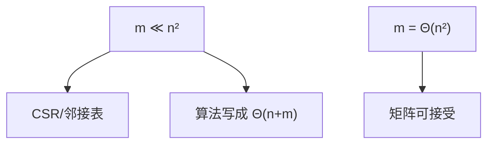

# 稀疏图

$m$ 随 $n$ 近似线性时，任何 $\Theta(n^2)$ 的表示或算法都在付不存在的边的账。

<footer>—— 据 Cormen, Leiserson, Rivest and Stein, Introduction to Algorithms 整理</footer>

[上一课](/cs/adj-list-matrix)对比了矩阵与表。[渐近记号](/cs/adj-list-matrix)已经能写 $O(n+m)$。[局部性原理](/cs/locality-principle)要求顺序扫真实存在的边。本课不重画两种结构。缺口是把**稀疏**写成工作假设：平面图、有界度数、随机图的常见区段里 $m=O(n)$ 或 $O(n\log n)$，邻接表（及压缩行存储）成为默认，矩阵只留给稠密或代数。

## 问题

若每次分析都按最坏 $m=\Theta(n^2)$，表的优点写不出来，BFS 也会被写成 $\Theta(n^2)$。缺口不是新的指针类型，而是约定：主干算法用 $n$ 与 $m$ 两个参数，稀疏意味着 $m\ll n^2$，实现不得把不存在的边扫一遍。

CSR：把所有出边拼成一个数组，另用 $n+1$ 个偏移标记每顶点的段。枚举连续，空间仍 $\Theta(n+m)$，无指针。这是表的数组化，针对稀疏。

稀疏不是「边很少到没有结构」。社交图、网格、道路网都稀疏却仍有局部团。

## 方法

声明输入规模为 $(n,m)$。建图用表或 CSR，拒绝为问边而分配 $n^2$ 除非 $m$ 已接近。需要 $O(1)$ 问边时，对稀疏图用边散列，不用矩阵。

度分布可以偏斜：少数顶点 $\deg=\Theta(n)$，表仍正确，只是这些顶点的枚举本身就 $\Theta(n)$。稀疏指全局 $m$，不是每个度都小。建图时若预先知道 $m$，一次分配边数组，避免链表节点逐条堆分配。

## 机制

后课 BFS/DFS/最短路的界一律带 $m$。稀疏假设让这些算法接近线性。稠密图用矩阵乘法或直接 $\Theta(n^2)$ 扫描可能更简单，那是另一分支，主干先走稀疏。

NUMA 与 cache：CSR 顺序扫边数组，空间局部性好于指针表，这是稀疏图在现代机器上的实现注脚，不改变 $\Theta(n+m)$。

## 边界

本课不引入图稀疏化算法（cut sparsisifiers），不把「稀疏」写成矩阵里零的比例以外的随机矩阵理论。动态边更新下 CSR 重建有代价，动态图可用邻接动态数组。

后课默认：图是稀疏给出的，表示是表或 CSR。无环有向是再加一条约束，用来预备拓扑序。

## 小结

- 稀疏：$m$ 远小于 $n^2$；复杂度必须显式带 $m$。
- CSR 把邻接表收成连续数组，枚举吃局部性。
- 有向无环作为表示约束，下一课 DAG。
- 稀疏指全局 $m$，不是每个顶点度数都小。
- 出处：Cormen et al. 图算法章对 $n,m$ 参数的用法。
