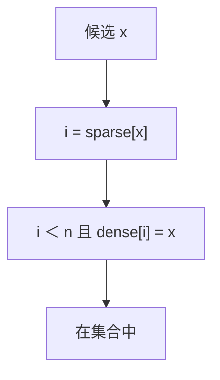

# 稀疏集合

稠密数组记下标，稀疏数组存元素；成员测试是一次下标往返，清集只要把 $n$ 置零。

<footer>—— 据 Briggs and Torczon, An Efficient Representation for Sparse Sets, ACM Letters on Programming Languages and Systems, 1993；Knuth 整理</footer>

[上一课](/cs/bitset)在 $U$ 大时要 $\Theta(U/w)$ 空间与清零。编译器着色、图算法里常有「当前工作集很小、论域下标却到 $10^6$」。[数组](/cs/array-random-access)随机访问仍 $O(1)$。本课不把位图扫字当默认。缺口是 Briggs–Torczon 稀疏集合：两数组不初始化全体，成员测试仍 $O(1)$，清空 $O(1)$。

## 问题

需要：`add`/`remove`/`contains`、迭代当前 $n$ 个成员、以及反复 `clear`。位图 `clear` 是 $\Theta(U/w)$；哈希常数大且不保插入序。稀疏集合：`dense[0..n)` 存元素，$`sparse[x]`$ 若有效则指向 `dense` 中位置。不变式：

$$
x\in S \iff 0\le \mathrm{sparse}[x]\lt n \ \land\ \mathrm{dense}[\mathrm{sparse}[x]]=x.
$$

`sparse` 的垃圾值只要不满足往返就不会被当成成员——因此**不必初始化 `sparse`**。缺口是这个往返测试，不是新的散列。

Briggs and Torczon 1993 原文用于编译器活跃集。与并查集的「父指针未初始化」同类：用往返或版本号避免 $\Theta(U)$ 填表。

## 方法

`contains(x)`：读 $i=\mathrm{sparse}[x]$，判断 $i\lt n$ 且 `dense[i]==x`。`add`：已在则返回；否则 `dense[n]=x`，`sparse[x]=n`，$n{+}{+}$。`remove`：与末尾交换并改 `sparse`。`clear`：$n\leftarrow 0$，旧 `sparse` 槽全部失效。迭代扫 `dense[0..n)`。

空间仍 $\Theta(U+n)$ 的数组容量，但清零与迭代按 $n$。$U$ 必须能分配两个数组；只是不付初始化与按 $U$ 扫描的时间。

## 机制

与位图：精确、无假阳性；交并要按较小集迭代再 contains，不是字级。与哈希：下标即键，无碰撞。版本号变体：`sparse` 存（位置, 世代），`clear` 只加世代，可避免交换删除时的部分麻烦，本课点名不写完。

区间查询课序在此收束：序列上从可逆前缀、幂等倍增、可更新树、扫描单调、分块离线，收到位级与稀疏下标。下一单元回到有序字典与堆的对数结构，不重写[红黑直觉](/cs/rbtree-intuition) 的着色 case。

## 边界

键必须是 $[0,U)$ 整数。字符串键先编号。并发无锁稀疏集不是本课。不要把未初始化 `sparse` 读进未定义行为——语言合同须保证读任意位型合法（或先用 mmap 等零页）。

后课默认：小工作集、大下标论域，用稀疏集合。平衡树与随机 BST 的续篇从 Treap 开始。

## 小结

- 稀疏集合：dense/sparse 往返，$O(1)$ 成员与清空。
- 不初始化 sparse；迭代按 $n$。
- 序列区间课序结束；下一课 Treap 接对数字典。
- 出处：Briggs and Torczon, *LOPLAS*, 1993。
