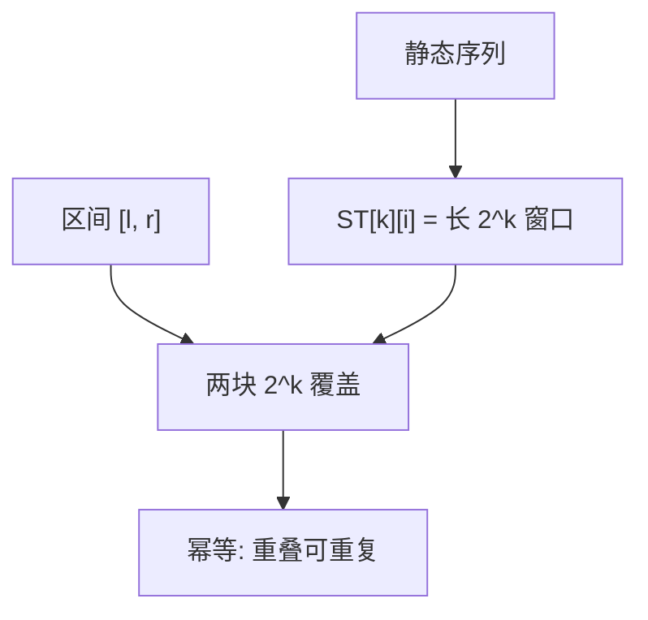

# 稀疏表

把每个起点的 $2^k$ 长窗口预先算好，任意区间用两块对齐的 2 的幂盖住；幂等运算下重叠不要紧。

<footer>—— 据 Bender and Farach-Colton, The LCA Problem Revisited, LATIN 2000；Cormen, Leiserson, Rivest and Stein 整理</footer>

[上一课](/cs/prefix-sum-difference)把可逆的区间和收成两次查表。最大值、最小值、最大公因数没有群逆，$S[r]-S[l-1]$ 无意义。本课不重做差分。缺口是静态、**幂等**（或可重叠）的区间查询：稀疏表（sparse table）用 $O(n\log n)$ 空间换 $O(1)$ 查询。

## 问题

区间 $[l,r]$ 长度 $len=r-l+1$，令 $k=\lfloor\log_2 len\rfloor$。两段 $[l,l+2^k-1]$ 与 $[r-2^k+1,r]$ 并起来覆盖 $[l,r]$，中间重叠。若运算 $\oplus$ 满足 $x\oplus x=x$（幂等）且结合，则

$$
A[l]\oplus\cdots\oplus A[r]
= \mathrm{ST}[k][l]\oplus \mathrm{ST}[k][r-2^k+1].
$$

缺口不是新的数组布局，而是**按长度的 2 的幂做倍增预处理**。RMQ（区间最值）是标准实例；LCA 化 RMQ 时同一张表出现，本课只钉序列上的表。

$\mathrm{ST}[k][i]$ 表示从 $i$ 起长 $2^k$ 的窗口聚合。建表：$\mathrm{ST}[k][i]=\mathrm{ST}[k-1][i]\oplus\mathrm{ST}[k-1][i+2^{k-1}]$。

## 方法

建表 $\Theta(n\log n)$：先 $k=0$ 抄 $A$，再按 $k$ 升。查询读 $\lfloor\log_2(r-l+1)\rfloor$，两次表项 $\oplus$。$\log$ 可预处理成每个长度一张表，避免查询时算浮点。数组不可改：改一个点要重建，或退回后课可更新结构。

与前缀和对照：前缀和靠逆元消去中间，稀疏表靠重叠可重复。两者都静态。

## 机制

空间 $\Theta(n\log n)$ 个聚合结果，比前缀和厚一截，换来无逆运算。查询两次随机读，常数小于线段树的 $O(\log n)$ 次访存——静态 RMQ 常因此选稀疏表。不幂等的求和不能用两块覆盖（中间被加两次）；求和请回上一课。

$\lfloor\log_2\rfloor$ 表本身是 $O(n)$ 预处理。建表顺序必须从小窗口到大窗口，否则引用尚未写出的半段。

## 边界

本课不把 Fischer–Heun 的 $O(n)$ 空间 RMQ 写完，也不把树剖成欧拉序。单点修改、区间加都不属于稀疏表合同。需要更新时，下一课树状数组走可加群的另一条路。

后课默认：静态幂等区间查询可以 $O(1)$；要改数组，换树状结构。

## 小结

- 稀疏表：$O(n\log n)$ 建，$O(1)$ 幂等区间查询。
- 覆盖用两段等长 2 的幂；求和请用前缀和。
- 可更新的加法结构从树状数组开始。
- 出处：Bender and Farach-Colton, LATIN 2000；Cormen et al.。
