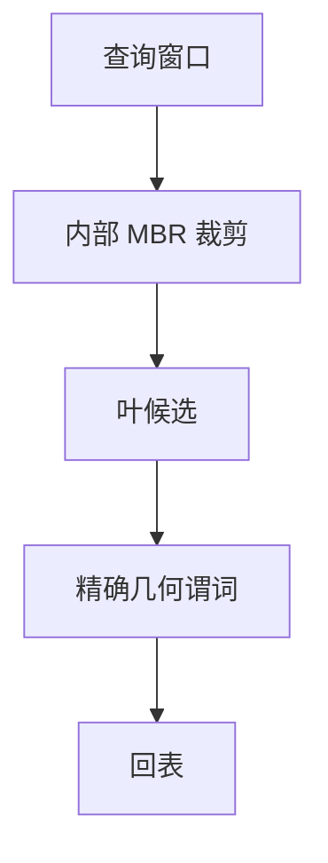

# 空间索引

矩形不能按一维键排序还不拆语义；R 树用最小外接矩形分层，查询是递归裁剪，不是 B+ 的全序下降。

<footer>—— 据 Guttman, R-Trees, SIGMOD 1984；计算机栏 R 树课接到库；SQL/MM</footer>

[上一课](/cs/inverted-index-fulltext)的键是词项。本课不建 posting。缺口是几何：点、线、多边形上的相交、包含、kNN。计算机课已有 [R 树](/cs/r-tree)；数据库进阶接到 GiST、页、事务与选择率。B+ 只能给 Hilbert 码之类的一维代理，邻接会碎。

## 问题

谓词 `ST_Intersects(geom, :box)` 选择率与 min/max 一维直方图对不上。R 树：叶存几何或 RID+MBR，内部节点 MBR 覆盖孩子。查询从根裁掉与查询窗不相交的枝。缺口是**引擎**：页裂变算法（Guttman、R*）、并发 latch、更新导致 MBR 上提、vacuum。

网格、quadtree、地理哈希是另一族：规则划分，倾斜时空节点或热点格子。本课以 R 树为主，点名网格。

Guttman SIGMOD 1984。PostgreSQL GiST 把 R 树当扩展。本课不重推分裂启发式，只钉：空间谓词要空间访问路径。

## 方法

创建 GiST/SP-GiST/R 树索引于几何列。计划：与 B+ 并列的扫描类型。过滤+精炼：索引用 MBR 粗滤，再精确几何算法（计算几何），避免只信矩形。

并行：按 R 树子枝或空间分区切工人。zone map 对 MBR 也可以，粒度粗。

## 机制

代价：优化器常缺好的空间直方图，易误判「索引扫 vs 全表」。这是基数误差课的空间版。更新：物体移动等于删+插，MBR 调整可能级联。

与分片：空间分片键难选，热点城市会打爆一 shard——分布式后课。

## 边界

本课不讲学习索引。也不把轨迹时序当纯空间；时序库后课。三维、路网最短路是另一索引（CALT 等），点名。

后课默认：空间谓词走 R 树/GiST 粗滤再精炼。学习索引：用模型代替树下降估位置，有序键上的另一赌局。

MBR 假阳性靠精炼消化；没有精炼会错结果。

## 小结

- 空间查询用 R 树等 MBR 分层裁剪，再精确几何。
- 选择率难估；移动更新贵。
- 学习索引下一课：有序键上的模型定位。
- 出处：Guttman 1984；GiST；SQL/MM。
