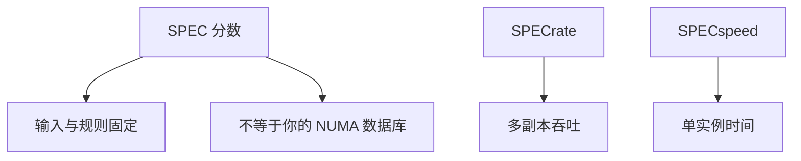

# SPEC 与基准陷阱

分数是在规定输入、规定规则下的时间比；换编译器、开不准的旗、只跑热缓存的子集，都可以让数字动，而不代表你的负载会动。

<footer>—— 据 SPEC CPU 基准文档；Hennessy and Patterson, CA:AQA 对基准的讨论 整理</footer>

[上一课](/cs/strong-weak-scaling) 要求声明规模。工业界常用 SPEC CPU、SPECrate、SPECpower 给微结构打分。本课不重画扩展曲线。缺口是 **基准规则与常见作弊/误读：训练集过大、峰值频率、只测吞吐不测延迟。**

## 问题

微结构论文用 SPEC 证明 [TAGE](/cs/tage-predictor) 或 [RRIP](/cs/rrip-dead-block) 有效，这合理。把分数当成「任意服务器快多少」不合理：输入固定（偏 Amdahl/强），工作集未必像你的数据库。缺口不是否定 SPEC，而是**读分数时核对：基线编译器、峰值 vs 持续频率、rate（吞吐多副本）还是 speed（单问题时间）。**

Hennessy–Patterson 反复强调：用真实负载、报告几何平均、警惕峰值。SPEC 禁止针对基准的源码改动（规则随版本），但仍允许编译选项在范围内优化。

## 方法

读报告：speed 还是 rate；整数还是浮点；能耗。对照自己的 [MLP](/cs/mlp-memory-parallelism) 与分支密度是否同类。微基准（只测延迟、只测带宽） complementary，不能替代。模拟器下一课 gem5 用 SPEC 子集时更要防「只跑 100M 指令的暖机幻觉」。

## 机制

编译器把 [宏融合](/cs/macro-micro-fusion) 与向量化吃满，分数涨，ISA 没变。频率：睿频让短跑很高，TDP 墙让长跑掉下来——与 [深流水功耗](/cs/deep-pipeline-clock) 一致。基准陷阱是测量方法，不是某条微结构定理。

几何平均会掩盖「某一个子程序崩了」：某个 SPECfp 子项吃内存带宽，总分仍可被其他子项拉回。读分要看单项，尤其当你的负载只像其中一两个子项时。

## 边界

本课不把所有 SPEC 套件版本列成表。PMU 下一课才是「在自己的负载上看事件」，比迷信总分更有用。Roofline 再下一课给「算力墙还是带宽墙」一张图。

后课默认：基准分数有规则；解释自己的程序要用计数器与模型。

## 小结

- SPEC 是受控比较，不是工作负载的充分统计。
- rate/speed、编译器、频率墙都会改数字。
- 性能计数器把测量搬到你的二进制上，下一课。
- 出处：SPEC 文档；Hennessy and Patterson, *CA:AQA*。
