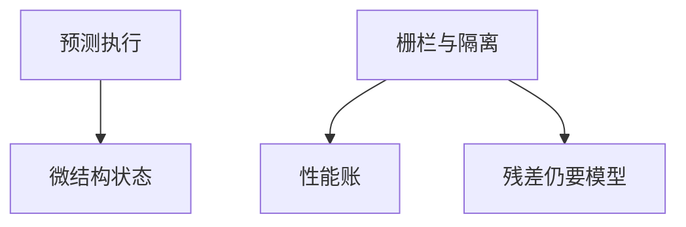

# Spectre 缓解与代价

Spectre 用预测执行把秘密打进微结构状态。缓解是隔离、栅栏、间接预测限制——每一刀都有性能账。合同是威胁模型与账单，不是「已彻底消失」。

<footer>—— Kocher et al., Spectre Attacks, 2019 IEEE S&P；对照[瞬态执行](/cs/transient-exec)</footer>

## 定位

上一课[PUF](/cs/puf)是制造差异。缺口回到**共享 CPU**：主干瞬态课已给现象。本课收缓解与代价，不给测量密钥的步骤。

后课默认已经读完本课钉下的合同，只补差，不从该领域第一性原理重开。

## 问题

进程隔离不隔离预测器与缓存。缓解：retpoline、IBRS、站点隔离、减共享。缺口是性能与覆盖的清单。

### 浏览器

站点隔离是软件缓解，与 CPU 微码叠加。

Kocher et al. Spectre。禁止利用步骤。Rowhammer 下一课是 DRAM 物理。

## 方法

对照软件栅栏与硬件计数器刷新。账单：系统调用与上下文切换变贵。下一课 Rowhammer。

图中节点是本课的机制骨架；课程不把图展开成可运行的攻击步骤。

## 机制

逻辑正确的程序仍可漏 C。Rowhammer 下一课扰的是 DRAM 比特而不是预测器。

前提写进合同之后，游戏外的误用只当失败模式点名，不在本课写成操作程序。

## 边界

不写 PoC。Rowhammer 缓解下一课。

## 小结

- PUF 之后回到共享 CPU 泄漏。
- 缓解是隔离加栅栏，带性能账。
- 不是一次补丁永久关闭。
- 下一课 Rowhammer。
- 出处：Kocher et al., Spectre；[transient-exec](/cs/transient-exec)。
