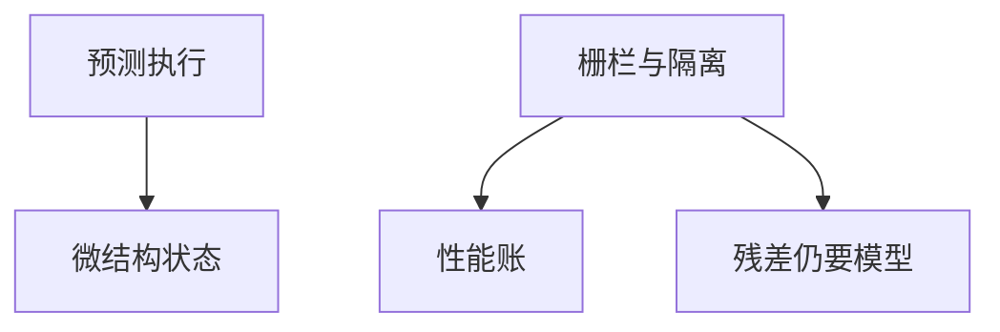

# Spectre 缓解与代价

Spectre 用预测执行把秘密打进微结构状态。缓解是隔离、栅栏、间接预测限制——每一刀都有性能账。合同是威胁模型与账单，不是「已彻底消失」。

<footer>—— Kocher et al., Spectre Attacks, 2019 IEEE S&P；对照[瞬态执行](/cs/transient-exec)</footer>

上一课[PUF](/cs/puf)讲制造差异当身份；缺口回到**共享 CPU**：主干瞬态执行课已给出现象，本课收拢缓解手段与它们的性能代价，不给测量密钥的步骤。

后课默认已经读完本课钉下的合同，只补差，不从该领域第一性原理重开。

## 问题

操作系统的进程隔离只管架构状态——寄存器与内存页，不管预测器与缓存这类微结构状态：错误路径上的加载照样把秘密带进缓存。缓解清单分层：软件侧 retpoline 重写间接跳转、编译器插栅栏斩断泄漏窗口；硬件侧 IBRS 一类微码开关限制间接预测跨权限共享；系统侧站点隔离把不同站点拆进不同进程、云上减少共驻。缺口是性能与覆盖的账。

### 浏览器

浏览器值得单说：站点隔离是纯软件缓解，不改一条 CPU 指令，但把「能共享受害者地址空间的对手」压到同站点之内；它与微码缓解叠加，各挡各的变体。

Kocher et al. Spectre。禁止利用步骤。Rowhammer 下一课是 DRAM 物理。

## 方法

方法是把软件缓解与硬件缓解对照记账：栅栏与 retpoline 在热路径上直接加指令；页表隔离把内核页从用户态摘掉，系统调用与上下文切换变贵；微码开关关掉的是积累几十年的预测器收益。每项缓解都要问覆盖率——封哪几个变体，残余多大。下一课 Rowhammer。

```mermaid
flowchart TD
  SPEC["预测执行"] --> LEAK["微结构状态"]
  MIT["栅栏与隔离"] --> COST["性能账"]
  MIT --> RES["残差仍要模型"]
```

## 机制

机制最反直觉的一层：程序在架构上完全正确——每条指令的提交结果都对——秘密仍从瞬态路径漏出，因为微结构状态不随错误路径回滚。这把「正确」与「不泄漏」拆成两个合同：单元测试能过，侧信道仍在。缓解因此永远带残差，要靠建模特跟踪新变体。Rowhammer 下一课扰的是 DRAM 比特而不是预测器。

## 边界

不写 PoC；边界要点名：缓解矩阵随硬件代际变化，同一微码开关在不同 CPU 上语义不同，安全声明必须绑定具体型号与微码版本。Rowhammer 缓解下一课。

## 小结

- PUF 之后回到共享 CPU 泄漏。
- 缓解是隔离加栅栏，带性能账。
- 不是一次补丁永久关闭。
- 下一课 Rowhammer。
- 出处：Kocher et al., Spectre；[transient-exec](/cs/transient-exec)。
