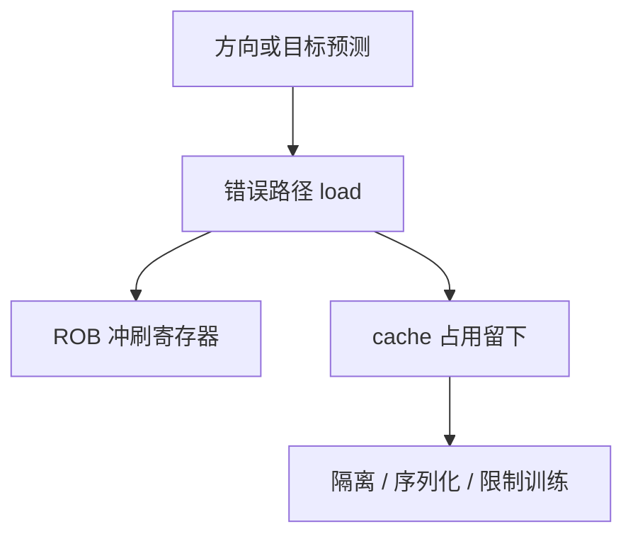

# Spectre v1 / v2

分支预测让错误路径上的 load 仍然发生；架构状态回滚之后，缓存占用还在。v1 是条件方向，v2 是间接目标被训练到错误处。

<footer>—— 据 Kocher et al., Spectre Attacks, IEEE S&P 2019 整理</footer>

[上一课](/cs/mttf-redundancy) 管随机翻转。[推测恢复](/cs/speculation-recovery) 已写明：cache 填充不随 ROB 冲刷回滚。[瞬态执行对照](/cs/transient-exec) 在安全主干点过名。本课在微结构进阶里把 **Spectre v1（边界检查绕过）与 v2（分支目标注入）接到 gshare/BTB**，只讲机制与缓解，不给探测程序。

## 问题

[gshare](/cs/gshare-predictor) 与 [间接预测](/cs/indirect-branch-predict) 故意在核对前取指执行。错误路径上的 load 可以用推测值当索引去碰 cache。[恢复](/cs/speculation-recovery) 丢掉寄存器写，不丢 L1 占用。缺口不是再加 ECC，而是**承认预测器 + cache 是安全边界，而不只是 CPI 旋钮。**

v1：条件误预测让越界下标在检查失败前执行。v2：间接 BTB/ITT 被训练到错误目标。缓解包括序列化、间接目标隔离、编译器栅栏，皆有性能税。

## 方法

设计：敏感下标不按推测值索引；编译器在检查后插入硬序列化（实现相关）。系统：间接分支隔离（每进程 BTB 上下文）、限制跨特权训练。微码可改预测器行为。本课不描述如何训练预测器去越权读。

## 机制

与 [fence 代价](/cs/fence-cost) 直接冲突：关掉推测就回到深管线的误预测损失。[循环器](/cs/loop-predictor) 与 TAGE 越准，攻击面的「可用错误路径」形态在变，但不会消失。SMT 共核共享预测器与 cache，信任域应视为合并。

retpoline 一类把间接跳转改成不会走被污染 BTB 的序列，是 v2 的软件补丁，前端带宽与 [uop cache](/cs/uop-cache) 命中都会变差。硬件间接隔离之后可以关掉部分补丁。

## 边界

本课不列变体编号大全，不给测量代码。Meltdown 下一课是故障抑制而不是分支预测。KPTI 是 OS 对故障路径的页表药方。Rowhammer 是 DRAM 物理层，再下一课。

后课默认：v1/v2 的根是预测 + 不可回滚的 cache。故障路径上的特权检查被乱序绕过，是 Meltdown。

## 小结

- Spectre v1/v2 把分支预测器接到缓存足迹。
- 缓解是限制推测与隔离预测器状态，对 CPI 不免费。
- 故障抑制路径是下一课 Meltdown。
- 出处：Kocher et al., *IEEE S&P*, 2019。
