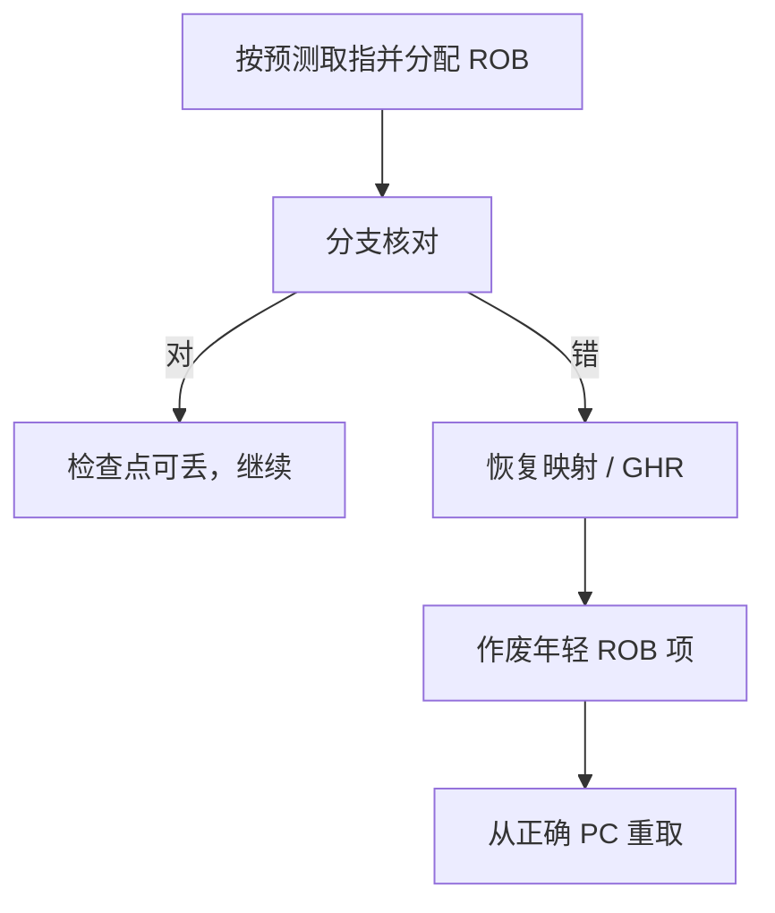
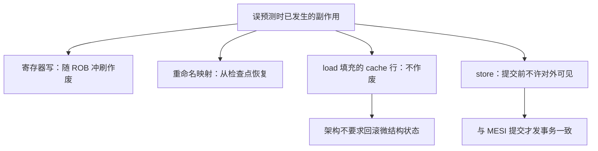

# 推测执行与恢复

按预测把指令送进窗口可以填满功能单元；一旦核对失败，架构寄存器、内存与预测器状态都要回到那个分支之前，像那些指令从未执行。

<footer>—— 据 Hennessy and Patterson, Computer Architecture: A Quantitative Approach；Smith and Pleszkun, Implementing Precise Interrupts, ISCA 1985 整理</footer>

[上一课](/cs/loop-predictor)要求预测表在提交后才固化。[乱序与 ROB](/cs/ooo-rob) 已经规定：执行可以超前，架构状态只在队头提交。[Tomasulo](/cs/tomasulo) 用标签唤醒。本课不重画保留站。缺口是：**误预测不是异常，但恢复动作与精确异常同源——检查点、冲刷、从正确 PC 重取。**

## 问题

深流水 + 宽发射意味着核对点（分支 EX/ALU）与 IF 之间可能已有几十条推测指令：它们改了重命名映射、占了 ROB 项、可能发了 load。若只冲刷流水线寄存器（五级那套），乱序窗口里的副作用还在。缺口不是再训一个预测器，而是**在每个（或足够密的）推测点留下可恢复快照**。

数字实例：深流水宽发射的核在分支核对点前平均压着 30-50 条推测指令。一次误预测不是重填五级流水，而是重填几十项的 ROB 与发射队列——这就是误预测罚金从五级的 1-2 拍涨到 15-20 拍的原因，也是预测准确率值得抠到 99% 的原因。

Smith–Pleszkun 的结果移位、未来文件、ROB 三种精确中断实现，乱序核几乎都走 ROB：冲刷头之后的项即丢掉推测写。

## 方法

在预测分支处：复制一份映射表（或用检查点栈 / 带版本号的映射），记下 GHR 与循环器等预测器检查点，ROB 记该分支的序号。核对成功：提交路径上释放检查点。核对失败：

1. 恢复映射表到该分支；
2. 作废 ROB 中更年轻的项，释放其物理寄存器与发射队列槽；
3. 取消未提交的 load/store；
4. 恢复 GHR 等；
5. IF 从正确目标重取。

术语翻译：检查点（checkpoint）就是分支解码时顺手复制的重命名映射表快照。核对失败时不许慢慢重算，而是整表瞬回——平时多占一份表的钱，换冲刷时一个周期的恢复时间。

```mermaid
flowchart TD
  PRED["按预测取指并分配 ROB"] --> CHK["分支核对"]
  CHK -->|"对"| KEEP["检查点可丢，继续"]
  CHK -->|"错"| REST["恢复映射 / GHR"]
  REST --> FLUSH["作废年轻 ROB 项"]
  FLUSH --> REF["从正确 PC 重取"]
```

## 机制

恢复延迟计入误预测损失拍：不只是「重新填满五级」，而是「重新填满 ROB 与发射队列」。这就是为何 [gshare](/cs/gshare-predictor) 之后要把准确率抠得很紧——窗口越大，一次冲刷越贵。load 已经填了 cache 的行**不会**因冲刷而作废：那是微结构副作用，架构上允许；后课 Spectre 会把这点当成泄露面，本课只记「cache 不是 ROB 的一部分」。

```mermaid
flowchart TD
  SIDE["误预测时已发生的副作用"] --> REG["寄存器写：随 ROB 冲刷作废"]
  SIDE --> MAP["重命名映射：从检查点恢复"]
  SIDE --> LD["load 填充的 cache 行：不作废"]
  LD --> WHY["架构不要求回滚微结构状态"]
  SIDE --> ST["store：提交前不许对外可见"]
  ST --> MESI["与 MESI 提交才发事务一致"]
```

这张图回答的是：一次误预测冲刷时各类副作用各自的归宿——哪些回滚、哪些从快照恢复、哪些（cache）根本不在回滚合同里、哪些（store）靠延迟到提交来绕开。

store 不得在提交前对别的核可见，否则无法恢复——与 [MESI](/cs/mesi-protocol) 的「提交才发事务」一致。

## 边界

本课不引入寄存器重命名的具体自由列表算法，那是下一课。也不处理内存序与 load 越过 store 的消歧，那是 LSQ 课。精确异常与误预测共用冲刷通道，但异常的 PC 与原因码要在 ROB 头递交，时机更严。

后课默认：推测 = 检查点 + 按预测执行；失败 = 恢复映射并冲刷年轻指令。WAR/WAW 仍要靠重命名才能在窗口里真正并行。

常见误区：初学者容易以为冲刷会「清掉一切」。寄存器、映射、队列都会回滚，唯独 load 已填进 cache 的行不作废——cache 不是 ROB 的一部分。这个「漏网之鱼」正是后课 Spectre 的泄露面。

## 小结

- 误预测恢复与精确中断共用 ROB 冲刷；预测器与映射要有检查点。
- cache 填充不会随冲刷回滚。
- 重命名如何提供可恢复的映射，是下一课。
- 出处：Hennessy and Patterson, *CA:AQA*；Smith and Pleszkun, *ISCA*, 1985。
