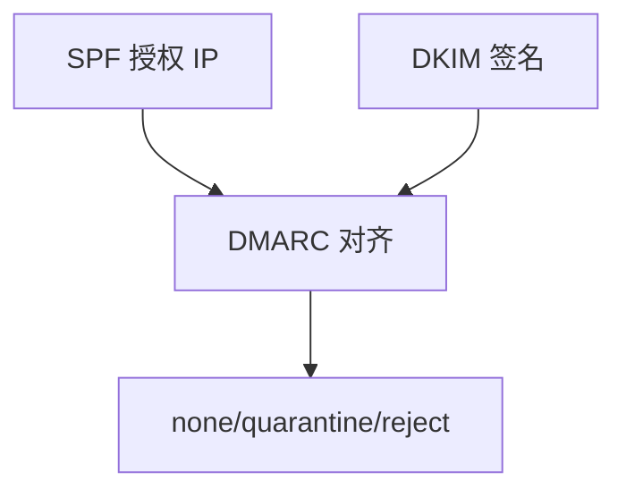

# SPF / DKIM / DMARC

SPF 授权哪些 IP 能用你的域发信，DKIM 签报头与正文，DMARC 告诉接收方失败时拒还是隔离，并要报告。

<footer>—— 据 RFC 7208 SPF；RFC 6376 DKIM；RFC 7489 DMARC 整理</footer>

[SMTP](/cs/smtp-imap) 默认信 MAIL FROM。[DNS](/cs/dns) 能放策略记录。[上一课](/cs/smtp-imap) 留下伪造。缺口是**域认证三件套**。本课不把 SSH 写完。

## 问题

任何人可对 25 说 `MAIL FROM: you@bank`。SPF：TXT 列合法发送主机，收信方查连接 IP。转发会破 SPF。DKIM：私钥签，公钥在 DNS，转发后仍可验（除非改体）。DMARC：对齐标识，政策 p=reject/quarantine，rua 报告。与 DNSSEC：公钥 TXT 最好也被签。与 RPKI 同构：用 DNS/PKI 钉源。

不要把三件套写成端到端加密。

RFC 7489。对齐 relaxed/strict。本课不写垃圾分类器特征。

### 钉域不是加密邮件

SPF 授权 IP，转发会破；DKIM 签体；DMARC 给政策。与 RPKI 同属源认证。

## 方法

画：发出 → DKIM 签 → 收：SPF+DKIM → DMARC 决策。对照 Cookie：都是身份关联，一层邮件域，一层 Web。

方法止于选定对象与对照；机制才说它如何嵌入已有分层与主干课。

## 机制

GeoDNS 不要把 MX 指到未授权 IP。转发列表要 SRS 或 ARC（点名）。TTL 太长使密钥轮换慢。DoH 不改这些 TXT 的语义。

失败报告帮助发现劫持，也会泄露邮箱元数据，运营权衡。

## 边界

本课不引入 BIMI 的全部。SSH 协议是下一课。后课默认：邮件域认证靠 SPF+DKIM+DMARC，不提供机密。

只开 SPF 不开 DKIM，转发场景脆弱。

上一课留下的缺口在本课收口；「SPF / DKIM / DMARC」进入后课词汇表后只引用。文献用来钉对象与边界，不把本课写成该主题的独立综述。下一课[SSH 协议](/cs/ssh-protocol)。

## 小结

- SPF 钉 IP，DKIM 钉内容，DMARC 钉政策。
- 转发是 SPF 的经典裂缝。
- 与 DNSSEC/RPKI 同属源认证。
- 后课只引用本课钉死的对象，不从该领域总问题重开。
- 出处：RFC 7208；RFC 6376；RFC 7489。
