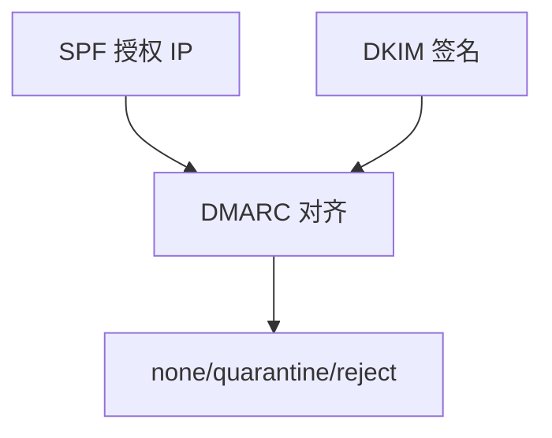

# SPF / DKIM / DMARC

SPF 授权哪些 IP 能用你的域发信，DKIM 签报头与正文，DMARC 告诉接收方失败时拒还是隔离，并要报告。

<footer>—— 据 RFC 7208 SPF；RFC 6376 DKIM；RFC 7489 DMARC 整理</footer>

[SMTP](/cs/smtp-imap) 默认信 MAIL FROM，[DNS](/cs/dns) 能放策略记录，[上一课](/cs/smtp-imap) 留下伪造缺口。缺口是**域认证三件套**。本课不把 SSH 写完。

## 问题

任何人可对 25 端口说 `MAIL FROM: you@bank`，SMTP 本身不验。三件套各补一层：SPF 是 IP 授权——域主在 DNS TXT 里列合法发送主机，收信方查连接 IP 是否在列，它挂在信封 MAIL FROM 域上，邮件一被转发就破，因为转发者 IP 不在原域清单里。DKIM 是内容签名——私钥签报头与正文，公钥在 DNS，验证不依赖传输路径，转发后仍可验，除非中间改了正文。DMARC 是政策层——要求通过的域与可见的 From 头对齐，失败时按 p=none/quarantine/reject 处置，并要求 rua 报告。与 DNSSEC/RPKI 同构：都是用既有基础设施钉住「源是谁」。不要把三件套写成端到端加密：路由上的服务器照样读信。

RFC 7489。对齐 relaxed/strict。本课不写垃圾分类器特征。

### 钉域不是加密邮件

分工一句话：SPF 钉发送路径，转发会破；DKIM 签体；DMARC 给政策。三者与 RPKI 同属源认证，与加密无关。

## 方法

流程走一遍：发出端 DKIM 签名，接收端先查 SPF 再验 DKIM，最后按 From 域的 DMARC 记录决策，聚合报告经 rua 回流域主。对照 Cookie：都是把身份关联到请求——一层绑邮件域，一层绑 Web 会话，失败模式也同型：伪造声明或劫持既有信任。

```mermaid
flowchart TD
  SPF["SPF 授权 IP"] --> DEC["DMARC 对齐"]
  DKIM["DKIM 签名"] --> DEC
  DEC --> POL["none/quarantine/reject"]
```

## 机制

运营四个坑。GeoDNS 别把 MX 指向不在 SPF 里的出口 IP，自相矛盾直接掉进隔离。转发要靠 SRS 重写信封或 ARC 传递既有验证结论（点名）。DKIM 记录 TTL 太长则密钥轮换慢，泄露后撤不干净。DoH 加密查询，但不改这些 TXT 的语义，挡不住策略本身配错。失败报告帮域主发现劫持滥发，也携带收件元数据——可见性与隐私之间的运营权衡。

## 边界

本课不引入 BIMI 的全部；SSH 协议是下一课。后课默认：邮件域认证靠 SPF+DKIM+DMARC，提供源认证不提供机密。组合经验一条：只开 SPF 不开 DKIM，转发场景脆弱；只开 DKIM 不开 DMARC，接收方无政策可执行。

下一课[SSH 协议](/cs/ssh-protocol)。

## 小结

- SPF 钉 IP，DKIM 钉内容，DMARC 钉政策。
- 转发是 SPF 的经典裂缝。
- 与 DNSSEC/RPKI 同属源认证。
- 后课只引用本课钉死的对象，不从该领域总问题重开。
- 出处：RFC 7208；RFC 6376；RFC 7489。
