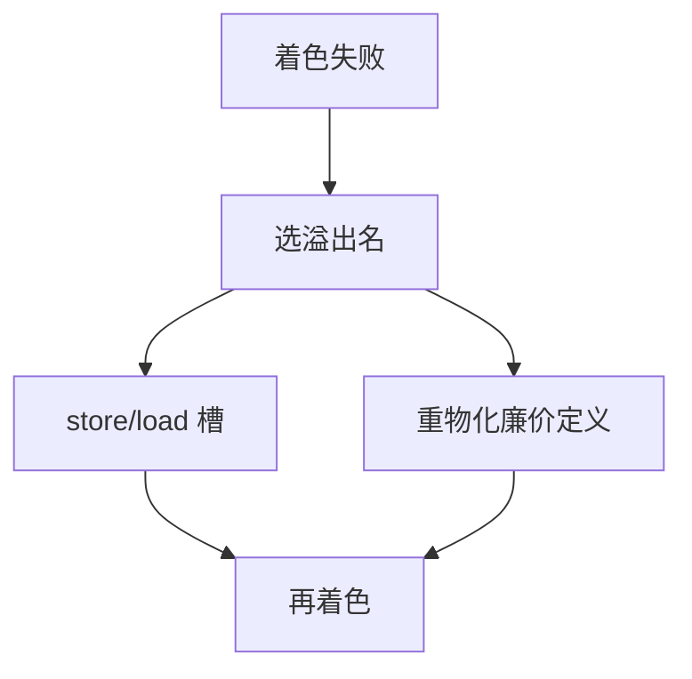

# 溢出与重物化

颜色不够就把虚拟寄存器存到栈槽；能从立即数或不变地址再算出来的值，宁可重物化，也不占一条活过调用的槽。

<footer>—— 据 Chaitin, Register Allocation and Spilling, 1982；Briggs, Cooper and Torczon, Rematerialization, 1992 整理</footer>

上一课[寄存器分配着色](/cs/regalloc-color)建冲突图、启发式 $K$-着色，失败则溢出再写 IR。本课不重做简化压栈。缺口是**溢出之后写什么指令**：`store`/`load` 到帧槽，以及 Briggs 的重物化——常量、全局地址、`sp` 相对的不变计算不必 round-trip 内存。窥孔下一课再清 `move` 垃圾。

## 问题

着色挑出溢出候选（度数高、跨度长、在循环外代价低）。朴素：在每次使用前 load、定值后 store。槽位按帧布局编号，[调用约定](/cs/calling-convention-stack) 的帧指针已有直觉，ABI 课再钉对齐。缺口是代价：load 延迟与占用，可能让调度与活跃一起变坏，故分配–溢出–再着色循环。

重物化：若值的定义是 `li t, 4` 或 `lui+addi` 形成的池常量，使用处重新执行那几条便宜指令，不分配槽、不延长内存相关。判断：定义无副作用、操作数随时可再得（立即数、日历寄存器）。循环里重物化 vs 在循环外 load 一次，用简单代价比。

### 溢出不是 malloc

槽在当前帧，随调用生灭。不要把 spill 写成堆对象。callee-save 的保存也是一种「溢出到序言」，但是 ABI 合同，不是着色失败。

Chaitin 1982 溢出。Briggs et al. 1992（PLDI）rematerialization。乐观着色减少「其实着得上却被溢出」的候选。本课两者都要。

## 方法

对溢出名：拆活跃区间或整名溢出。插入访问。对可重物化名：在使用处复制定义指令，删原跨区间的冲突边。更新 IR 后重算活跃与冲突图，再着色。

无限循环：每次必须减少「无法着色的压力」，或放大 $K$ 的有效（拆区间）。实现设轮数上限。

## 机制

溢出增加访存，[Cache](/cs/locality-principle) 变差，分配器不模拟层次。重物化增加指令条数、可能加长调度关键路径，用加法延迟对比 load 延迟。φ 应在溢出前拆掉，否则槽与前驱 `move` 纠缠。

不要溢出 `sp` 本身。不要把条件执行的定值重物化到必经路上而不顾控制。

## 边界

本课不写窥孔模式、不输出目标文件。后课默认：函数体是物理寄存器加必要的 spill/re-mat。短窗口代数简化是窥孔的缺口。

## 小结

- 溢出：帧槽 round-trip；重物化：再执行廉价定义。
- 二者都改变 IR，需再着色。
- 槽不是堆；合同保存不是失败溢出。
- 出处：Chaitin, 1982；Briggs, Cooper and Torczon, 1992。
