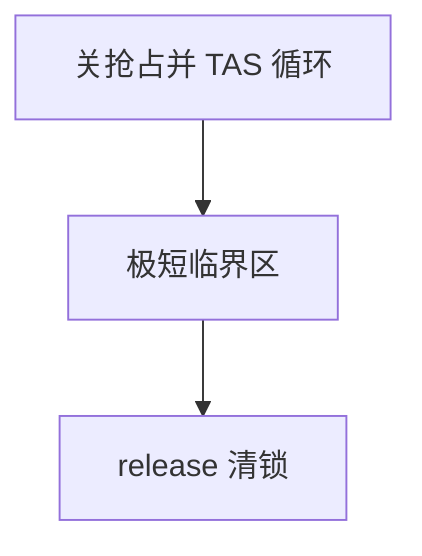

# 自旋锁

自旋锁在拿不到时原地忙等；持有期间不能睡眠，临界区必须短，否则它把 CPU 烧成等待器。

<footer>—— 据 Love, Linux Kernel Development；Tanenbaum MOS 整理</footer>

[上一课](/cs/lock-irq)给出互斥要用原子能力，并分清：IRQ 上下文只能忙等，同核还要关中断。缺口是把 **spinlock** 收成对象：锁字 + 获取时循环 RMW + 释放时写 0 并带 release 语义。本课钉何时能用、为何不能睡，不把 MCS 队列锁写完。

## 问题

睡眠锁在拿不到时[上下文切换](/cs/context-switch)，但 ISR 与软中断不能调度。共享「线程与硬 IRQ」的队列必须自旋。单核上若不关 IRQ，持锁线程被同核 ISR 抢到同一把锁会自死等。多核上关本地 IRQ 挡不住他核，仍要自旋。缺口不是再讲 RMW 指令，而是这把**短临界区锁**的纪律。

持自旋锁时开抢占会让持有者被迁走，等待者在别的核上空转。因此获取路径关抢占；释放时再开。

## 方法

`spin_lock`：关抢占，必要时关本地 IRQ（`spin_lock_irqsave`），然后 `while (test_and_set)`；有的实现先读后 TAS 以减轻乒乓。`spin_unlock`：store-release 清锁，恢复 IRQ 与抢占。临界区只碰已经在内存里的结构，不调可能睡眠的分配、不 `copy_from_user`。

调试用的锁依赖检测记住获取顺序，那是死锁课；本课只要求一把锁的正确用法。

## 机制

自旋把等待变成 CPU 时间，换来不睡眠、可在 IRQ 用。临界区一长，[调度指标](/cs/scheduling-metrics) 的响应与实时 WCET 一起坏掉，也会加重反转：高优先级在自旋，低优先级持锁却跑不完。PI 对纯自旋支持差，因为等待者不睡，调度器看不见。

简单 TAS 锁所有等待者打同一 cache 行；核多时要排队锁，下一课 MCS。

## 边界

本课不把 `raw_spinlock` 与 RT 里改睡眠的路径写完。用户态自旋在锁持有者被切走时会空转整个量子，一般要 futex。也不把读写锁提前展开。

后课默认：IRQ 与极短内核路径用自旋。多核排队减少乒乓，下一课 MCS 锁。

## 小结

- 自旋：忙等、禁睡、关抢占；与 IRQ 共享数据时还要关本地中断。
- 临界区必须短；简单 TAS 会乒乓。
- 排队自旋是下一课。
- 出处：Love, *LKD*；Tanenbaum and Bos, *MOS*。
