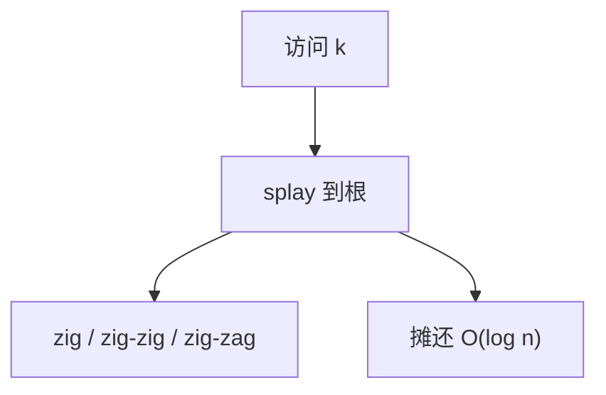

# Splay 与摊还

每次访问把目标旋到根；单次可能线性，一串访问的摊还却是对数——没有随机，也没有颜色位。

<footer>—— 据 Sleator and Tarjan, Self-Adjusting Binary Search Trees, JACM 1985；Tarjan, Amortized Computational Complexity, 1985 整理</footer>

[上一课](/cs/treap)靠随机优先级。[摊还分析](/cs/amortized-analysis)已在动态数组上练过势能。[BST](/cs/bst) 旋转原语现成。本课不抛硬币。缺口是伸展树：访问后 splay 到根，摊还 $O(\log n)$，并得到动态最优性一类推论的入口。

## 问题

工作集若有局部性（刚访问的键很快再访问），平衡树仍每次从根走 $\log n$，不「变矮」。Splay：查找/插入/删除后，把目标（或删除的父）用 zig / zig-zig / zig-zag 转到根。单次可能 $\Theta(n)$。缺口是证明**任意 $m$ 次操作总时间 $O((m+n)\log n)$**（或更细的工作集界），而不是最坏每次对数。

势能常取 $\sum \log(\mathrm{size}(u))$。zig-zig 是摊还分析里真正省时间的一步：一次转两个，比两次 zig 便宜。

## 方法

zig：目标是根的孩子，单旋。zig-zig：目标与父同侧，先旋祖父再旋父。zig-zag：折线，先旋父再旋祖父。插入当 BST 插入再 splay；删除可 splay 目标，合并左右子树（右子树最小 splay 上来接左）。

与 Treap/红黑：无额外字段、无随机；缓存局部性差时常数可能输给红黑。合同是摊还不是最坏。

## 机制

静态最优性、工作集定理：频繁键会在靠近根处停留一段时间。这不是概率期望，是对任意序列的摊还。不要把 splay 当成「每次 $O(\log n)$ 最坏」写进实时路径。

并发 splay 几乎不用：旋转改根，锁粒度粗。本课串行。

## 边界

本课不证明完整势能全部引理，只钉合同与三种旋转形状。不引入 tango 树。顺序统计（秩、第 $k$）可在任一平衡 BST 上加 size，下一课专收，不绑死 splay。

后课默认：自调整 BST 摊还对数。要 `select`/`rank`，加子树计数。

## 小结

- Splay：访问旋到根，摊还对数，无随机无颜色。
- 单次可线性；实时用确定平衡树。
- 下一课在平衡 BST 上加顺序统计。
- 出处：Sleator and Tarjan, *JACM*, 1985。
