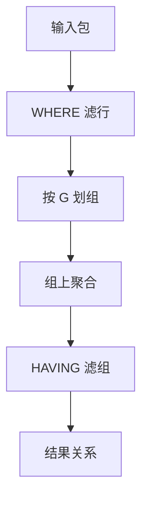

# 聚合与 GROUP BY

分组把包切成等价类，聚合把每一类收成一行标量；结果仍是关系，只是属性不再是输入列的简单子集。

<footer>—— 据 Chamberlin and Boyce, SEQUEL, 1974；SQL 标准对 GROUP BY；Ramakrishnan and Gehrke 对聚合算子的整理</footer>

[上一课](/cs/app-backpressure)把计算机网络进阶收到应用背压。本课打开数据库进阶：主干 [SQL 声明](/cs/sql-declarative) 已把 `SELECT`–`FROM`–`WHERE` 钉在代数上，并点名分组「把元组集收成组上的标量」，但没有机制。缺口不是重讲投影，而是 **GROUP BY 如何改变结果模式**，以及 `HAVING` 与 `WHERE` 为何不能互换。不重写 Transformer，不进限价簿。

## 问题

声明课把查询收成代数树。连接与选择之后，用户仍要「每个顾客多少订单」「每个月合计」。若应用拉回全部行再自己加，等于放弃声明性，优化器看不见分组。缺口是语言里的分组算子：按一组列划等价类，每组产出一行；`COUNT`/`SUM`/`AVG`/`MIN`/`MAX` 是组上的函数，不是行上的投影。

`WHERE` 在分组前滤行；`HAVING` 在分组后滤组。把聚合写进 `WHERE` 没有指称。未分组查询里的裸聚合把整张输入当成一组。`SELECT` 列表在有 `GROUP BY` 时只能出现分组列或聚合——否则一行组无法决定「其余列取哪一个值」。

SQL 默认包：同一组里重复行计入 `COUNT(*)`。`COUNT(col)` 不计该列上的 NULL。`SUM` 全 NULL 组得 NULL 不是 0。三值逻辑仍是 [空值](/cs/sql-null) 那一套，本课不重推。

## 方法

逻辑上看，分组是 $\gamma_{G,A}(R)$：按 $G$ 分组，算聚合列表 $A$，输出模式是 $G$ 加上各聚合的结果列。物理实现可以排序后扫描相邻组，或哈希建桶——算子形状后课 [哈希聚合](/cs/hash-aggregation) 才写；本课只要求语义先钉住。

`DISTINCT` 聚合（`COUNT(DISTINCT x)`）先在组内去重再聚合。过滤聚合（`FILTER (WHERE …)`）是组内再选，不等于外层 `WHERE`。本课不把每个方言的 `GROUPING SETS` 当必会语法，只点名：同一输入上多个分组集是多个 $\gamma$ 的并。

## 机制

分组挡住若干代数律：不能把组后谓词随便推到组前，除非谓词只谈 $G$ 且不含聚合。连接与分组的交换要看键：若连接键是分组键的超集，有时可先聚后连以缩小输入——这是改写，不是改语义。优化器后课会搜这些形状；本课只承认分组是改写防火墙之一，与 [查询改写](/cs/query-rewrite) 点名的窗口、极限同类。

空组：`FROM` 为空时，无 `GROUP BY` 的裸聚合仍产出一行（`COUNT(*)` 为 0）；有 `GROUP BY` 则零行。这是标准里的坑，声明含义必须包含它，否则「有没有分组」会改结果基数。

## 边界

本课不讲窗口函数：窗口也聚合，但不把多行收成一行，组的边界与帧不同。子查询里的聚合、相关与否，下一课之后才去相关。也不把 OLAP 立方、`CUBE`/`ROLLUP` 的稀疏格写进本课必做。

存储与索引：分组列上的有序扫描能省排序，那是计划选择，不是 GROUP BY 的定义。后课默认：谈到分组查询，先有 $\gamma$ 的模式与空组规则；物理是排序或哈希，语义不是循环加器。

主干连接算法课未改分组语义。进阶从这里把查询语言从「行过滤」接到「组收缩」。

## 小结

- `GROUP BY` 按列划组，聚合把每组收成一行；`HAVING` 滤组，`WHERE` 滤行。
- 未分组的裸聚合视整表为一组；空输入时与有分组的基数规则不同。
- 分组是改写防火墙；窗口函数下一课，形状不同。
- 出处：Chamberlin and Boyce；SQL 标准；Ramakrishnan and Gehrke。
