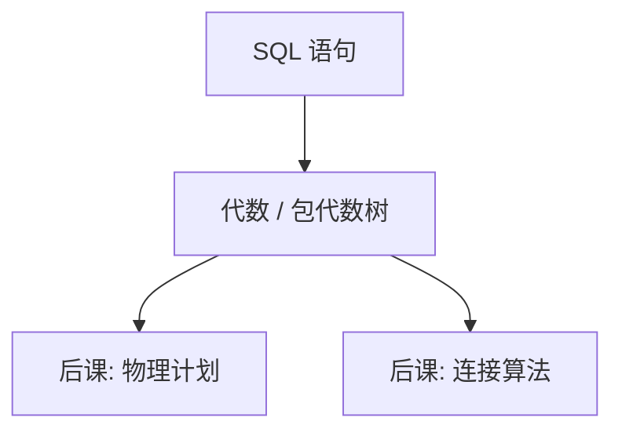

# SQL 声明性

写要什么，不写怎么扫；同一句话应对许多物理计划，语义先钉在代数上。

<footer>—— 据 Chamberlin and Boyce, SEQUEL, 1974；SQL 标准对关系演算的工程落地整理</footer>

[上一课](/cs/algebra-reorder)给出选择、投影、连接对关系封闭。本课不重推五种运算。缺口是：代数是数学记号，应用需要一种可写、可嵌套、可被优化器改写的语言。SQL 声明「结果应满足什么」，扫描、索引、连接顺序是后课计划的事。

## 问题

代数树能表达查询，但不能当接口：没有词法、没有分组、没有对包与 NULL 的约定。若应用自己写嵌套循环，等于退回文件 API，数据独立性丢掉。缺口不是「SELECT 语法课」，而是把[关系代数](/cs/relational-algebra)收成声明：同一语句对应一类等价代数，优化器再挑物理实现。

Chamberlin and Boyce 的 SEQUEL（1974）针对的是「非过程、面向表格」。后来的 SQL 默认包语义、三值逻辑，与 Codd 集合代数有缝，本课承认缝，不假装没有。

## 方法

`SELECT`–`FROM`–`WHERE` 对应投影、积（或连接）、选择；`UNION` 对应并。嵌套子查询是演算侧的写法，语义上仍应落到代数或多重集代数。`GROUP BY` 与聚合把元组集收成组上的标量，结果仍是关系，但属性不再是输入列的简单子集。

本课按声明读：正确性 = 结果关系（或包）是否等于代数指称，而不是「是否走了某条索引」。`ORDER BY` 不是关系运算，它给的是展示序；没有它，行无序，与[关系模型](/cs/relational-model)一致。

## 机制

声明性把「含义」与「算法」切开。优化器可以改连接顺序、下推选择，只要指称不变。包语义下重复行有计数，投影默认不去重，`DISTINCT` 才回到集合。NULL 使谓词出现 UNKNOWN，选择只保留 TRUE，这改变了某些代数律——后课改写必须知道哪些律在三值下仍成立。

完整性约束在语句边界被检查，本课不把触发器当查询语言的一部分。视图是命名的声明，下一课以后才物化。

## 边界

本课不讲存储过程、游标循环、也不把 ORM 当模型。过程式 SQL 可以写对，但它不是本课的对象：一写成循环，优化器就看不见代数。也不展开窗口函数与递归 CTE 的全部语义；主干只需：查询先有声明含义，再谈算子。

DML（插入、更新、删除）同样是对关系的声明变换，只是结果写回基表；它们会碰到完整性检查，但检查仍是[键](/cs/keys-integrity)的断言，不是另一套查询语言。后课默认：谈到一条查询，先有代数树；物理算子是实现，不是另一套语义。

后课连接算法不再解释 `SELECT` 的含义，只实现树上的 $\bowtie$。声明与计划的裂缝，正是优化器的工作面。

## 小结
- 分组与聚合扩展了代数，结果仍当关系读，属性来自组而不是任意过程变量。
- 后课不再从「SQL 是什么语言」起笔，只问树怎么实现。

- 代数已在；SQL 是声明接口，含义在树上，不在某次扫描。
- 包与 NULL 是对集合代数的工程放松，后课优化必须记账。
- 连接怎么算、计划怎么挑，都是后课缺口。
- 出处：Chamberlin and Boyce, 1974；Date；Ramakrishnan and Gehrke。
