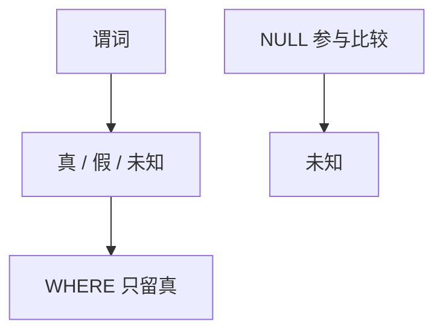

# 空值与三值逻辑

NULL 不是域里的值；谓词遇上它得到 unknown，WHERE 只留真，于是同一表达式不再总服从集合代数的直觉。

<footer>—— 据 Date 对缺失信息的批评；SQL 标准三值逻辑；Codd 后来的标记方案对照</footer>

[上一课](/cs/sql-declarative)把查询写成声明：含义应对准代数。本课不重写 SELECT。缺口是 SQL 允许缺失：外键置空、未填列。若把 NULL 当普通值，相等与连接会把「不知道」当成匹配或当成不等，两种都会错。三值逻辑是工程合同，不是关系模型 1970 的一部分。

## 问题

[关系模型](/cs/relational-model) 的域里每个属性有值。SQL 增加 NULL。比较结果是 true / false / unknown；`WHERE` 与 `HAVING` 保留 true。`NOT unknown` 仍是 unknown。连接在 NULL 上不匹配。缺口是**声明语义相对集合代数的缝**，以便后课连接算法不要把 NULL 当哈希键上的普通字节就完事。

Date 主张避免 NULL。主干承认 SQL 有它，并用三值把坑钉死：`x = x` 在 x 为 NULL 时不是真；`UNIQUE` 对多 NULL 的行为按标准版本而异。

## 方法

求值：算术与比较遇 NULL 变 unknown（除少数 `IS NULL`）。聚合默认跳过 NULL，`COUNT(*)` 例外。外连接用 NULL 填不成配的一侧——这是有意的标记，不是「零」。本课不把全部标准边角写成百科。

## 机制

三值使优化器的某些代数律失效：选择下推遇到 NULL 与外连接时要检查。哈希连接把 NULL 当不相等，嵌套循环同样。完整性：主键不允许 NULL；外键列可空是[参照动作](/cs/fk-actions) 置空的前提。

## 边界

本课不引入第四种逻辑或 Codd 的 A/I 标记当主干。物理上连接怎么扫表，下一课连接算法总览。

后课默认：SQL 结果按三值过滤。同一逻辑连接仍有多种物理算法。

## 小结

- NULL 产生 unknown；WHERE 不留未知。
- 部分代数律在 SQL 里要加条件。
- 连接的物理实现下一课。
- 出处：SQL 三值逻辑；Date；对照 Codd。
