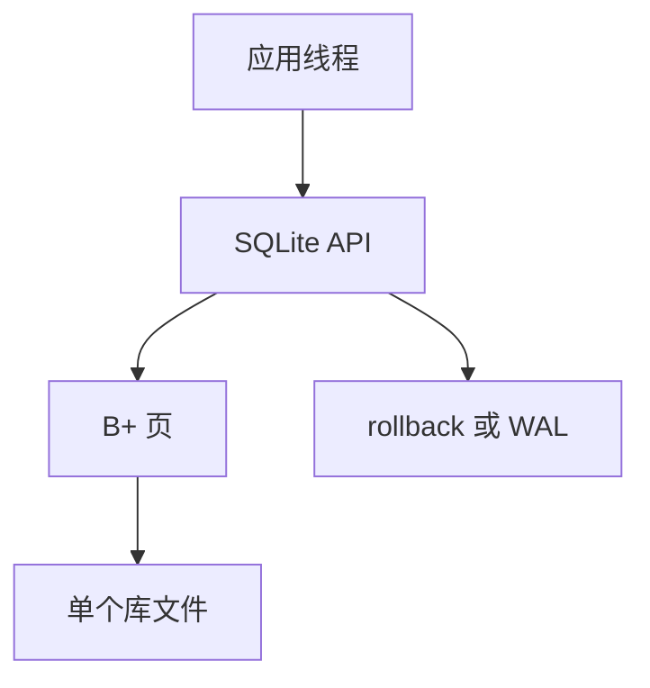

# SQLite 架构

库即文件：B+ 页、回滚日志或 WAL、嵌入进程。无服务器、无连接池网关，锁在文件粒度上从简，SQL 仍声明。

<footer>—— 据 Hipp SQLite 设计；Gray 嵌入式；影子/WAL 对照</footer>

[上一课](/cs/search-engine-index)是集群搜索。本课相反极端：SQLite 嵌入式。数据模型族封口。缺口是把本课程机制在**单文件、少线程**上收束：页与槽、B+、WAL 模式、锁、查询规划器简化。分析与流单元从星型模式再开。

## 问题

进程内 `sqlite3_open`，无守护进程。并发：默认写锁库级（历史 rollback journal）；WAL 模式读不挡写但仍单写者。缺口是**适用**：移动、应用文件、测试、边缘。不是 NewSQL。规划器：基于代价但连接枚举有限，无分布式 shuffle。

VFS：把页 I/O 接到 OS，TDE 可在 VFS 做。备份：拷文件要注意检查点。

D. Richard Hipp。SQLite 文档对事务与 WAL 很清楚。本课对照课程树，不背 C API。

## 方法

模式仍是表与索引。类型亲和。JSON 函数让文档进单元格。FTS 虚表接倒排。不替代 Postgres 服务器。

与 ORM：常直接 SQL。连接池无意义（同进程），但多线程要 per-connection 或 serialized 模式。

## 机制

恢复：journal 或 WAL 重放，影子课已对照。RTO 极短。无半同步。分析：可把文件当只读副本。不适合多机写。

计划：`EXPLAIN QUERY PLAN` 仍看索引是否覆盖。回归同样发生。

## 边界

本课不讲星型模式。也不把 SQLite 当 HTAP 集群。补层数据模型在此收：KV、文档、宽列、图、时序、向量、搜索、嵌入式关系。

后课默认：单机嵌入用 SQLite 合同（单写者 WAL）。星型模式：分析库的维表事实表，反规范化受控。

嵌入式把连接池、网络读己之写全部删掉，锁与 WAL 留下。

## 小结

- SQLite：文件即库，B+ 与 WAL/journal，单写者为主。
- SQL 声明仍在；分布式协议不在。
- 下一单元星型模式：分析建模。
- 出处：SQLite 文档；Gray；本课存储对照。
