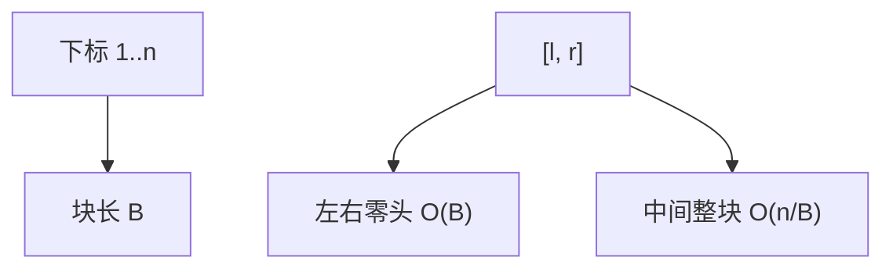

# 分块

把序列切成约 $\sqrt{n}$ 长的段，整块用摘要、零头用扫；查询更新都落在「几个整块加两小段」上。

<footer>—— 据 Sedgewick and Wayne；Knuth, TAOCP；Bentley, Programming Pearls 对分治与块状布局的整理</footer>

[上一课](/cs/monotonic-stack-queue)吃掉了扫描型近邻。查询若是任意 $[l,r]$、操作又不止最值或加法，线段树要为每种 $\mathrm{op}$ 设计节点。有时实现一块整段摘要更快。[数组](/cs/array-random-access)本来就连续。本课不重写单调队列。缺口是分块（sqrt decomposition）：块长 $B\approx\sqrt{n}$，用时间在 $O(B)$ 与 $O(n/B)$ 之间折中。

## 问题

$n$ 个元素，$m$ 次操作。若每次扫全表 $\Theta(n)$ 太慢；若写完整线段树，标记与合并可能比问题本身重。分块：下标 $[1,B],[B+1,2B],\ldots$。每块存一个摘要（和、懒加、排序副本、众数候选……视问题而定）。查询跨块：左零头、右零头暴力，中间整块用摘要。缺口是**把区间切成 $O(n/B)$ 整块加 $O(B)$ 零头**，令 $B=\sqrt{n}$ 时两边都是 $O(\sqrt{n})$。

块长不必精确 $\sqrt{n}$；常数随摘要成本和 cache 行调整。思想是平衡「扫零头」与「点多少块」。

## 方法

建块 $\Theta(n)$。点修：改 $A[i]$ 并重算该块摘要，常 $O(B)$（若摘要是和则 $O(1)$）。区间操：零头暴力，整块打块级懒标记或改摘要。查询对称。

与线段树：分块代码短、局部性好、改需求时摘要好换；渐近常多一个 $\sqrt{n}$。与稀疏表：分块易加更新。

## 机制

总时间 $O((n+m)\sqrt{n})$ 是常见合同，不是唯一。块内排序后的二次块（再按值分）可做区间第 $k$ 类问题，本课只点名：仍是「块摘要 + 零头」。下标换算：$i$ 所在块 $\lfloor(i-1)/B\rfloor$，不要每次除法写错边界。

[局部性](/cs/locality-principle)：整块顺序扫对 cache 友好，这是分块相对指针树的实际优势。

## 边界

本课不把莫队的块序排序写进来——那是下一课把**离线询问**按块重排。也不把二维分块、树分块写完。实时最坏若必须 $O(\log n)$，仍用树。

后课默认：在线、摘要好写时分块够用。一堆静态询问要来回扩缩区间，用莫队。

## 小结

- 分块：$B\approx\sqrt{n}$，零头加整块摘要。
- 实现短、易改；渐近常逊于线段树。
- 离线询问的块序是莫队。
- 出处：Sedgewick and Wayne；Knuth；Bentley。
