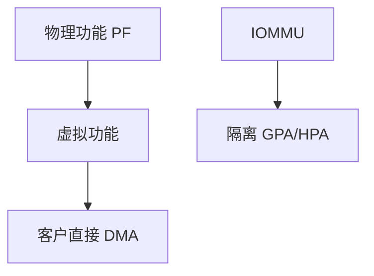

# SR-IOV 与直通

SR-IOV 让一张物理网卡露出多个 VF：客户直接操作 VF 队列，几乎无 hypervisor 数据面；PF 仍由宿主管。

<footer>—— 据 PCI-SIG SR-IOV；Linux 对 VF 的说明；[半虚拟](/cs/paravirtualization) 为对照</footer>

[virtio](/cs/paravirtualization) 仍经宿主。[DMA](/cs/dma-coherence) 要 IOMMU。缺口是 **直通**：VF 或整卡交给客户。

## 问题

PF 出 VF，每个 VF 有自己的 BAR 与队列。客户跑原厂或 VF 驱动。缺口：迁移难（状态在卡上）；与 [RSS](/cs/rss-multiqueue) 在 VF 内。本课不把每家网卡工具当文档。

GPU 直通同类但更重。对象是 PCI 功能级虚拟化。

## 方法

宿主启用 SR-IOV → VFIO 绑定 VF → QEMU  dist 给客户。对照 virtio：可迁移、可快照更好。对照 [DPDK](/cs/dpdk-kernel-bypass)：客户里可再旁路。对照 md RAID：无关。

## 机制

SR-IOV 把数据面还给硬件，换运维灵活性。IOMMU 是安全前提。不要写成网卡广告。与 [netns](/cs/netns-veth)：VF 可进宿主 ns 或直通，二选路径。

没有 IOMMU 的直通等于客户可 DMA 宿主。

实现上：VF 的 MAC/VLAN 由 PF 上的宿主策略管。迁移要热拔 VF 再在对端插，状态难搬。没有 ACS 的桥可能让 DMA 隔离失败。 读法上只引用[上一课](/cs/paravirtualization)的结论，不把对象换成训练推理或限价簿。

本课在操作系统进阶的「虚拟化与隔离进阶 / Hypervisor」课序里，对象是 **SR-IOV 与直通**。

- 先修只引用，不重导：上一课的结论当公理，本课只补差。
- 五栏不吞并：不把本课写成大模型训练/推理，也不写成限价簿或权重量化。
- 文献用 OSTEP、McKusick、内核文档与具名会议论文；不发明 arXiv 编号。

## 边界

本课不引入所有 ACS 桥问题。不保证无线 SR-IOV。下一课用户态安全直通框架：VFIO。

版本字段会变，课序钉的是机制对象「SR-IOV 与直通」，不是某一主线内核的结构体名。
后课默认：VF 可直通给客户。VFIO 如何绑 IOMMU 组，下一课。

## 小结

- SR-IOV 提供 VF 供客户直通。
- 快，但迁移与共享策略变难。
- VFIO 是下一课。
- 出处：PCI SR-IOV；Linux networking；VFIO。
