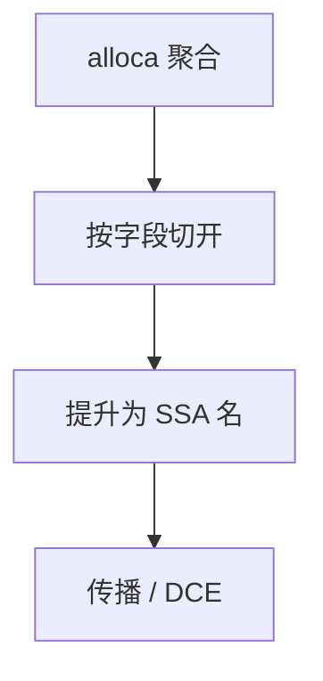

# 标量替换 SROA

把不逃逸的结构体或数组拆成成员标量，用 SSA 名代替内存槽，使后续传播与分配看见寄存器，而不是 load/store。

<footer>—— 据 Cytron 等标量替换思想；LLVM SROA；Appel 对聚合的讨论整理</footer>

上一课[逃逸分析](/cs/escape-analysis)标出未逃逸对象。缺口是**拆开**：`struct {int a,b;}` 的 `p.a` 不应经过栈槽。SROA（scalar replacement of aggregates）：按偏移切成元素，能提升则变 `alloca` 上的 SSA。本课钉切分条件，不写完整 mem2reg 与 φ 插入——SSA 构造后课。

## 方法

对 `alloca`：若只被常量偏移的 load/store 访问、无变长索引、指针不逃逸，则每个槽一个名。数组常下标则整数组可能无法拆。选择：拆字段，留无法拆的部分在内存。

### SROA 不是寄存器分配

拆完是虚拟寄存器；着色后课。不要声称 SROA 已选物理寄存器。

LLVM 的 SROA/mem2reg 是工程标准名。Muchnick 有标量替换。与 SSA 构造紧密：提升后的名要插 φ。

## 问题

聚合在 IR 里常是内存，阻塞 GVN 与常量传播。提升后 `s.a=1; use(s.a)` 变成常量。缺口是**可拆形状**，不是逃逸分类本身。

与 ABI：参数结构体可能 already 在寄存器；SROA 处理的是局部槽。返回结构体由调用约定课再谈。

## 机制

选择字段：union、指针算术、可变下标使切分失败。必须保守留内存。不要拆 `volatile` 槽。

内联后新 `alloca` 是 SROA 的主要客户——与内联顺序绑在一起。

## 边界

本课不写 Cytron φ 放置。后课默认：未逃逸聚合可标量化。下一课 PRE：部分冗余，在标量 IR 上更有效。

也不把 SROA 当对象布局 ABI 的改变（公开结构体布局仍由语言定）。

## 小结

- SROA：未逃逸聚合 → 成员标量 SSA。
- 变下标、逃逸、volatile 阻止拆分。
- 为传播与分配打开门，本身不着色。
- 出处：LLVM SROA；对照 Cytron SSA、Appel、Muchnick。
