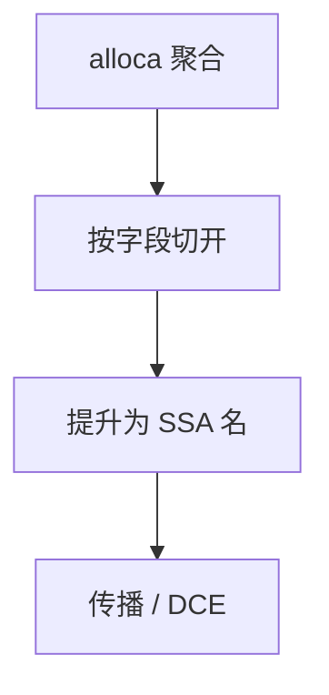
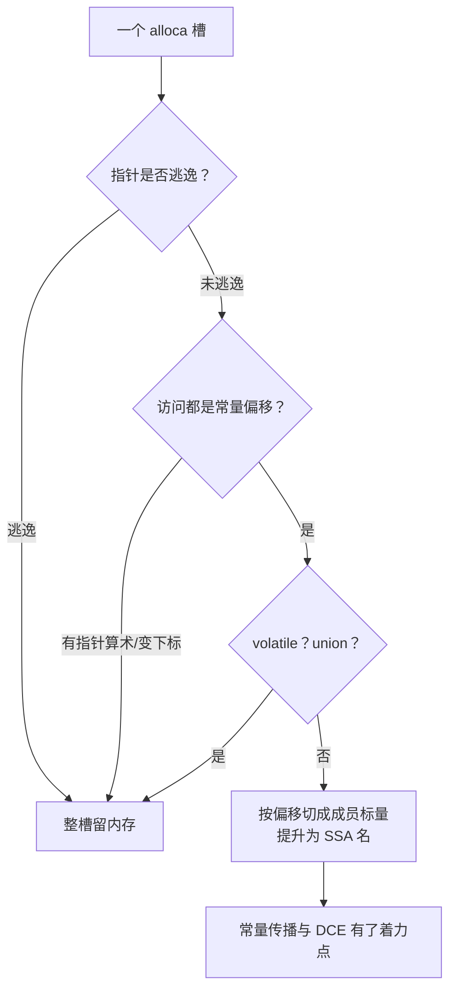

# 标量替换 SROA

把不逃逸的结构体或数组拆成成员标量，用 SSA 名代替内存槽，使后续传播与分配看见寄存器，而不是 load/store。

<footer>—— 据 Cytron 等标量替换思想；LLVM SROA；Appel 对聚合的讨论整理</footer>

上一课[逃逸分析](/cs/escape-analysis)标出未逃逸对象。缺口是**拆开**：`struct {int a,b;}` 的 `p.a` 不应经过栈槽。SROA（scalar replacement of aggregates）：按偏移切成元素，能提升则变 `alloca` 上的 SSA。本课钉切分条件，不写完整 mem2reg 与 φ 插入——SSA 构造课已给。

## 方法

对 `alloca`：若只被常量偏移的 load/store 访问、无变长索引、指针不逃逸，则每个槽一个名。数组常下标则整数组可能无法拆。选择：拆字段，留无法拆的部分在内存。

### SROA 不是寄存器分配

拆完是虚拟寄存器；着色后课。不要声称 SROA 已选物理寄存器。

LLVM 的 SROA/mem2reg 是工程标准名。Muchnick 有标量替换。与 SSA 构造紧密：提升后的名要插 φ。

直觉类比：SROA 像把整箱行李拆成几件手提——原本要「开箱取物」（load/store）的东西，现在各拿各的（寄存器名）；只有塞不进手提限量的件（变下标、逃逸）才留在箱里。

## 问题

聚合在 IR 里常是内存，阻塞 GVN 与常量传播。提升后 `s.a=1; use(s.a)` 变成常量。缺口是**可拆形状**，不是逃逸分类本身。

```mermaid
flowchart TD
  AGG["alloca 聚合"] --> SPLIT["按字段切开"]
  SPLIT --> SSA["提升为 SSA 名"]
  SSA --> OPT["传播 / DCE"]
```

与 ABI：参数结构体可能 already 在寄存器；SROA 处理的是局部槽。返回结构体由调用约定课再谈。

## 机制

选择字段：union、指针算术、可变下标使切分失败。必须保守留内存。不要拆 `volatile` 槽。

```mermaid
flowchart TD
  S["一个 alloca 槽"] --> Q{"指针是否逃逸？"}
  Q -->|"逃逸"| KEEP["整槽留内存"]
  Q -->|"未逃逸"| Q2{"访问都是常量偏移？"}
  Q2 -->|"有指针算术/变下标"| KEEP
  Q2 -->|"是"| Q3{"volatile？union？"}
  Q3 -->|"是"| KEEP
  Q3 -->|"否"| SPLIT["按偏移切成成员标量<br/>提升为 SSA 名"]
  SPLIT --> WIN["常量传播与 DCE 有了着力点"]
```

内联后新 `alloca` 是 SROA 的主要客户——与内联顺序绑在一起。

数字实例：`struct {int a, b;}` 占 8 字节，SROA 把它切成两个 4 字节的 SSA 名。写 `s.a = 1; use(s.a)` 后传播直接把 use 换成常量 1，两次 load/store 全部消失——这就是「让优化器看见标量」的直接收益。

常见误区：初学者容易以为拆完就进了物理寄存器。SROA 只是把内存槽换成虚拟寄存器（SSA 名），至于这些名最终落在哪几个真实寄存器、哪些溢出到栈，是后面的寄存器分配课的事。

## 边界

本课不写 Cytron φ 放置。后课默认：未逃逸聚合可标量化。PRE 一类部分冗余消除在标量 IR 上更有效。下一课[PGO](/cs/pgo)：热度告诉内联与展开往哪使劲。

也不把 SROA 当对象布局 ABI 的改变（公开结构体布局仍由语言定）。

## 小结

- SROA：未逃逸聚合 → 成员标量 SSA。
- 变下标、逃逸、volatile 阻止拆分。
- 为传播与分配打开门，本身不着色。
- 出处：LLVM SROA；对照 Cytron SSA、Appel、Muchnick。
