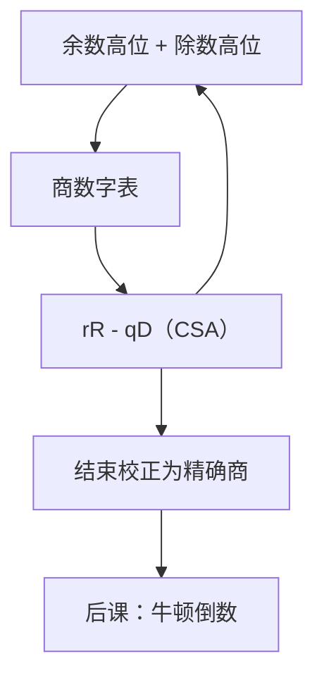

# SRT 除法

  
商数字若允许冗余，就不必等余数的完整符号才决定这一位：用最高几位查表，每步可以切出两位甚至更多。

  <footer>—— 据 Robertson, A New Class of Digital Division Methods, IRE Trans. 1958；Ercegovac and Lang, Digital Arithmetic 整理</footer>

[上一课](/cs/restoring-division)的恢复/不恢复每步只定 1 比特商，且试减往往要看完整余数符号。缺口是延迟：64 位除要几十拍，卡住整数单元。SRT（Sweeney–Robertson–Tocher）用**冗余商数字**和余数的高位近似，让每步切 $r$ 位。

## 问题

不恢复除法已经允许中间余数为负，商比特仍是 $0/1$。若商数字取自 $\{\bar 1,0,1\}$ 或更宽（基-4 SRT 用 $\{\bar 2,\ldots,2\}$），同一数值可有多种表示，选择不必精确。缺口因此不是再写一遍移位减，而是：**用余数与除数的最高若干比特查表**，选出商数字 $q_i$，做 $R\leftarrow rR - q_i D$，余数保持在可纠正的窗口内。

Pentium FDIV 的著名缺陷正是 SRT 表漏项——本课用它当边界警告，不写勘误表。

### 冗余不是「商可以随便错」

冗余保证：近似选择之后，下一步还能把误差吸收。最后必须把冗余表示收成常规补码商（片上加一次校正）。把 SRT 理解成近似除法，整数 `div` 的精确性合同会破。IEEE 754 要求正确舍入的除法，硬件仍要精确商，只是中间数字冗余。

Robertson 1958；Tocher 同期独立。Intel 的基-4 SRT 实现见各种微结构文献；教材级叙述见 Ercegovac/Lang 与 Parhami, *Computer Arithmetic*。Harris 通常不把 SRT 表画完，本课只钉机制。

## 方法

选定基 $r=2^k$。除数规格化到 $[1/2,1)$ 一类区间（整数除可先数前导零）。查表输入：余数高 $p$ 位与除数高 $q$ 位。输出 $q_i$。部分余数用 CSA 更新，避免每步 CLA——与[华莱士](/cs/wallace-carry-save)同一压缩思想，用在迭代里。最后一次传播进位，若余数为负则商减 1 并加回除数。

基越高，每步位数越多，表越大、余数窗口越紧。Pentium 的表是基-4 的实现选择，不是 SRT 定义本身。

## 机制

后课牛顿迭代走乘法器求倒数，适合已有快速 [FMA](/cs/fp-mul-fma) 的浮点通路；SRT 适合整数与浮点共用的移位–加单元。微处理器常：整数除 SRT 或恢复，浮点除 SRT 或 Goldschmidt。本课不把两种都画进同一框图。

## 边界

本课不给完整商选择表，不分析 Pentium FDIV 的具体漏项坐标。不引入 Goldschmidt 级数。也不把验证用的形式化除法证明写进来——那是[证明助手](/cs/proof-assistants)另一课程已结束的技能，本课只做电路。

后课默认：SRT 用冗余商数字与短余数估计加速迭代除；最终校正后仍是精确商。

## 小结

- 恢复/不恢复每步 1 比特；SRT 用冗余让每步切 $k$ 位。
- 查表只看高位；CSA 更新部分余数；结束校正。
- 表不完整会错（FDIV）；语义仍是精确除。
- 出处：Robertson, *IRE Trans.*, 1958；Ercegovac and Lang；Parhami, *Computer Arithmetic*。
