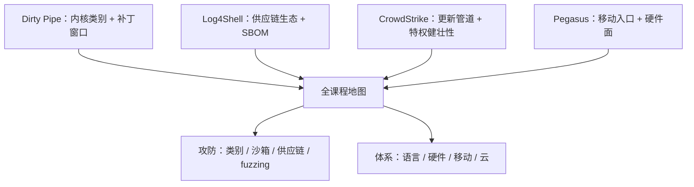

# 系统安全案例与收束

案例不是故事集，是给前面八课做的交叉验证：每一课钉下的类别，都得在真实事故里出现过至少一次，这门课才自洽。

<footer>—— 据 Dirty Pipe（Kellermann, 2022）、Log4Shell（Apache/CISA, 2021）、CrowdStrike 事件初步报告（2024）公开材料整理</footer>

[上一课](/cs/ss-cloud-model)把模型收在身份与责任分割，身份成了剩下的那道墙。本课程到此收束：不再引入新机制，用四个横跨多课的案例做交叉验证——每个案例至少落在两课的类别上——最后给出全课程的地图。

## 问题

单课视角各管一段，真实事故却是组合的：一个内核 bug 走供应链通道进来，被云上的身份放大成全球事件。只学类别表而不看组合，会低估两种风险：机制正确但路径意外的攻击，与机制普通但规模放大的事故。案例的挑选标准因此有两条：至少落在两课的交点上，且公开材料足以钉住事实。

## 方法

### 四个案例对表

Dirty Pipe（CVE-2022-0847，2022 年 3 月）：Linux 管道缓冲复用时标志位未清零，攻击者可向任意只读文件追加写，直达提权——[内核类别](/cs/ss-kernel-vuln-classes)里未初始化与逻辑类的合体，修复走补丁窗口。Log4Shell（CVE-2021-44228，2021 年 12 月）：一个日志库的配置表达式可触发远程类加载，把互不相干的软件折成同一批受害者——[供应链](/cs/ss-supply-chain)生态站的教科书案，SBOM 的价值是回答「我在不在其中」。CrowdStrike 停摆（2024 年 7 月 19 日）：一份内容更新经内核态驱动解析出空指针，全球约 850 万台 Windows 崩溃（Microsoft 口径）——「不可信输入抵达特权计算」的合法输入版，叠加更新管道与「可用性也是安全」两课的论点。Pegasus 零点击：消息解析器当入口，链式走到提权——[移动栈](/cs/ss-mobile)的格子被绕过入口攻入，落点在[硬件面](/cs/ss-hardware-perspective)与取证。

四个案例里只有一个用了「漏洞」的狭义定义：CrowdStrike 案的输入完全合法，坏的是特权层对它的健壮性；事故不是攻破，是设计把可用性押在了内核驱动的解析器上。

## 机制

地图把两个单元缝起来。攻防单元是一条发现与限制链：[类别表](/cs/ss-kernel-vuln-classes)钉敌情，[沙箱](/cs/ss-sandbox-escape)限爆炸半径，[供应链](/cs/ss-supply-chain)管代码从哪来，[模糊测试](/cs/ss-fuzzing-deep)自动找；体系单元是一条构建链：[语言](/cs/ss-memory-safe-langs)把内存类证掉，[硬件](/cs/ss-hardware-perspective)给根信任并暴露新面，[移动](/cs/ss-mobile)是平台标本，[云](/cs/ss-cloud-model)把边界换成身份。两链相交于一句话：安全是整条栈的性质——每一层把上一层的假设变成可检查的合同，检查不过的地方就是下一课该写的缺陷。类别表不因新事件过时，因为框架本来就是按「怎么修」而不是按「谁中了招」组织的。

## 边界

案例只使用公开材料，不构成利用教学；每案的技术细节以原始报告为准，本课只取与类别表的对应。新事故不会推翻框架——推翻框架的写法是「类别有了新成员」，那是新课文的工作，不是收束课的工作。

## 小结

- 案例的挑选标准：落在两课交点上，公开材料足以钉住事实。
- 四案对表：Dirty Pipe 对内核类别，Log4Shell 对供应链，CrowdStrike 对特权健壮性与可用性，Pegasus 对移动与硬件。
- 合法输入也能击穿特权层：健壮性与可用性是安全的一部分，不只是防「攻破」。
- 攻防单元是发现与限制链，体系单元是构建链；安全是整条栈的性质。
- 本课程到此收束：类别表与「每层一层合同」的地图是留下的框架，新事故归新课。
- 出处：Kellermann, 2022；Apache 与 CISA 的 Log4Shell 公告；CrowdStrike 初步报告与 Microsoft 估计（2024）；Amnesty International 的 Pegasus 取证报告。
