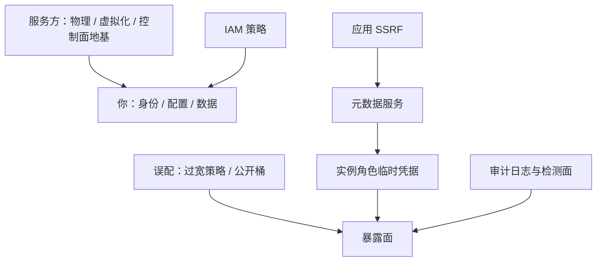

# 云安全模型

云的第一份礼物是「基座有人替你守」，第二份是「守门的钥匙换成了你写的策略」；事故的重心随之从攻破转为配错。

<footer>—— 据 NIST SP 800-145；2019 年 Capital One 事件法庭材料与 AWS 文档整理</footer>

[上一课](/cs/ss-mobile)收在单机多格子的平台标本；云把问题升一维——格子换成多租户共享的机房，格子之下不再是你的内核。主干已有[虚拟化安全边界](/cs/virt-security-boundary)、[容器逃逸](/cs/container-escape)、[机密计算](/cs/confidential-computing)与[零信任架构](/cs/zero-trust-architecture)；本课写云自己的安全模型：责任怎么分、边界画在哪、身份为什么取代位置成为边界。

## 问题

IaaS、PaaS、SaaS 三种服务模型各画一条责任分界（NIST SP 800-145 的口径）：服务方守物理、虚拟化与控制面的地基，你守身份、配置与数据。事故的重心随之移动：云上的大头不是攻破虚拟化层——那要穿过[虚拟化边界](/cs/virt-security-boundary)量过 TCB 的一整层——而是误配置与凭据：公开的存储桶、过宽的 IAM 策略、被 SSRF 偷走的角色凭据。缺口是：把「配错」当一类可分类、可缓解的漏洞来写，而不是当运维事故道歉了事。

## 方法

### 模型件五件

IAM：策略语言几乎能表达任何规则，表达力就是新的攻击面，最小权限在云端必须落成「每条策略可审计、可差异比对」。元数据服务：实例自举用的本地 HTTP 端点，一次 SSRF 直达实例角色的临时凭据——IMDSv2 用会话 token 与默认拒绝抬高门槛。KMS 与加密：密钥归属是责任分割的钉子，谁持钥谁担责。审计日志：控制面每个动作留痕，是检测面的地基。机密计算：把「服务方也在 TCB 里」的那一段移走，用[远程证明](/cs/confidential-computing)而不是合同背书。

Capital One 2019：WAF 误配让一次 SSRF 打进 IMDSv1，读到实例角色的临时凭据，约 1.06 亿申请人的记录外泄；AWS 同年年底推 IMDSv2，凭据改为 token 化请求获取。据法庭文件与 AWS 文档整理。

## 机制

误配置为何成为云上的主要根因：控制面的表达力乘以默认值乘以环境漂移。它的结构正是[内核漏洞类别](/cs/ss-kernel-vuln-classes)逻辑类在配置层的重现——分类表可以整体复用：根因轴换成「策略如何写错」，原语轴换成「拿到什么凭据」：过宽的 IAM 等价于缺一次权限检查，SSRF 取 IMDS 等价于信任混淆，公开桶等价于把内部客体挂上全局可读。缓解也按格对号：策略差异审计对逻辑类，token 化取凭据对信任混淆，密钥归属对原语升级。[零信任](/cs/zero-trust-architecture)补上边界的另一半：位置不再是身份，每请求重新评估——云把网络边界溶解之后，身份是剩下的那道墙。

## 边界

hypervisor 与容器隔离的机制专课已讲，本课不重讲逃逸；合规框架（SOC 2、等保的条文清单）是流程不是机制，点到为止；具体厂商的产品名只作实例不作教学对象。可观测性如何落地检测面，属于可观测性课。

## 小结

- 责任分界随服务模型移动：服务方守地基，你守身份、配置与数据。
- 云上大头是误配置与凭据，不是攻破虚拟化层；模型件五件各管一段。
- 误配是内核类别表逻辑类的配置层重现：根因轴换「策略写错」，原语轴换「拿到凭据」。
- IMDSv2 的 token 化是信任混淆的工程解；零信任把身份立为剩下的边界。
- 出处：NIST SP 800-145；Capital One 2019 法庭材料；AWS 文档；对照 [virt-security-boundary](/cs/virt-security-boundary)、[zero-trust-architecture](/cs/zero-trust-architecture)。
