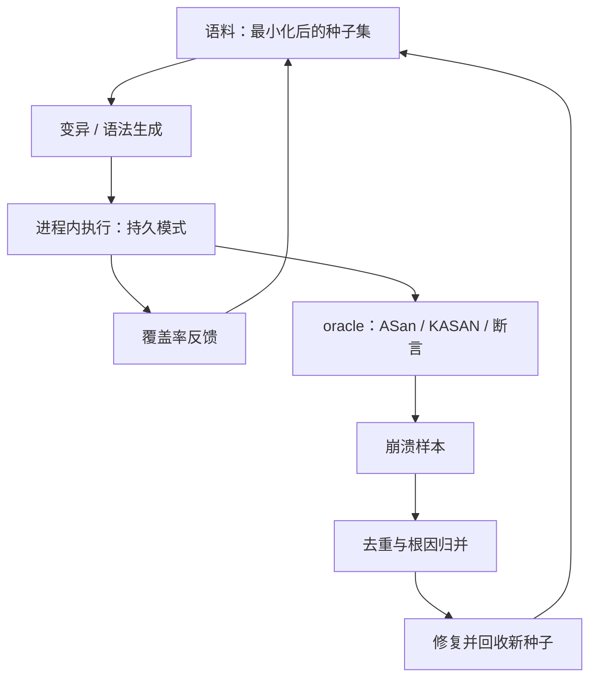
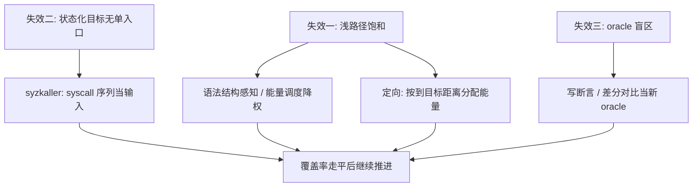

# 模糊测试的深入

模糊测试的赌注是：bug 在输入空间里不是均匀分布的，而覆盖率反馈能把随机行走变成有梯度的爬山；梯度的尽头，才是方法开始的地方。

<footer>—— 据 Zalewski, AFL；Manès et al., The Art, Science, and Engineering of Fuzzing, TSE 2019 整理</footer>

[上一课](/cs/ss-supply-chain)把「代码从哪来」钉成站点图，xz 一案顺带留了一个注脚：fuzzing 没抓到它，因为它没跑在 sshd 上。本课深钻 fuzzing 本身。主干已有[覆盖引导模糊测试](/cs/coverage-guided-fuzzing)（AFL 的反馈回路）、[sanitizer](/cs/sanitizers)（崩溃预言）、[符号执行](/cs/symbolic-execution)与[编译器模糊测试](/cs/compiler-fuzzing)；缺口是从「跑一个 fuzzer」到「经营一场战役」的方法：覆盖率走平之后，靠什么继续推进。

## 问题

覆盖率反馈回路有三个失效模式。浅路径饱和：解析器前面百分之几的分支吃掉全部能量，深层结构永远够不着；种子语料里没有合法样例，变异产物全死在第一道校验。状态化目标没有单入口：协议实现与内核不收「一个文件」，收的是「一个合法的调用序列」，变异单输入无从谈起。oracle 盲区：预言机只认崩溃，[内核漏洞类别](/cs/ss-kernel-vuln-classes)里不崩溃的逻辑类与信息泄漏类，跑多久都是零报告。三个失效对应四种推进手段，加一项战役经营。

## 方法

### 语法、定向、提速与内核目标

结构感知：把变异约束在语法有效域内，或从种子语料反学语法（Godefroid 等的 Learn&Fuzz 路线），让第一道校验不再是全程的瓶颈。定向：不是均匀撒能量，而是按「到目标代码的距离」分配——已知某补丁附近有洞、审计标出了可疑函数时，定向灰盒（AFLGo 路线）把爬山推向指定山坡。提速：进程内持久模式省掉 fork，每秒执行数抬高数量级；fuzzing 的产出以每秒执行数乘以时长计，速度本身就是深度。内核目标：syzkaller 把 syscall 序列写成可变异的微型程序，配上 KASAN 这类检测器当 oracle——[内核类别表](/cs/ss-kernel-vuln-classes)的空间、时间与未初始化类，恰好都是内存检测器看得见的崩溃。

战役经营的四件套：语料最小化去掉等价输入；崩溃去重先用栈哈希初筛、再人工归并根因——同一根因常报出几十条不同栈；能量调度把饱和目标降权；检测器全套打开（ASan/KASAN），否则崩了也看不见。

数字实例：产出按「每秒执行数 × 时长」计——fork 每次冷启动约 100 次/秒时，24 小时只试了约 860 万个输入；换持久模式做到 1000 次/秒，同样 24 小时约 8600 万个，深度差一个数量级，这就是「速度本身就是深度」的算法。

## 机制

把框架拆开看：fuzzer 是输入采样器加 oracle。覆盖率反馈改变采样分布，让深路径从「指数概率」变成「有梯度可达」；oracle 决定能发现哪一类根因，与[类别表](/cs/ss-kernel-vuln-classes)逐格对齐——内存类有现成预言机，逻辑类没有，这就是 fuzzing 的硬边界，也是 xz 那类定向后门能穿过的缝。反过来，oracle 也在升级：把「不该发生」写成断言（不变量、差分对比、与参考实现互检），就是把逻辑类一格一格搬进可检测集合。无崩溃不等于无洞，等于「当前 oracle 看不见的类别无洞」——这句话是本课与第 1 课之间的合同。

直觉类比：覆盖率反馈像摸黑爬山——随机变异是在平原上乱走，覆盖率反馈是每走一步感觉一下坡度、只往变高的方向多踩几脚；走平了不是山没了，是该换个山坡（定向）或换双鞋（语法/提速）。

常见误区：初学者容易以为「换个更强的 fuzzer」就有产出。实际产出 = 每秒执行数 × 时长 × oracle 可见类别——三样缺一样都是零：没有 ASan/KASAN，内存坏了也不崩；只跑一小时，再快的采样器也到不了深路径。

## 边界

符号执行与污点分析作为向导的机制专课已讲，本课只用其结论；不写针对具体 CVE 的 harness 构造；执行速度的基准测量方法论不展开。内核目标的部署细节（syzkaller 的描述语言与复现格式）属于工具手册，不进本课。

## 小结

- 覆盖率回路的三个失效：浅路径饱和、状态化目标无单入口、oracle 盲区。
- 四种推进：语法结构感知、定向能量分配、持久模式提速、syzkaller 式序列目标。
- fuzzer 是采样器加 oracle；oracle 的覆盖与内核类别表逐格对齐，逻辑类是硬边界。
- 战役经营重于工具选择：语料最小化、崩溃归并、能量调度、检测器全开。
- 出处：Zalewski, AFL；Manès et al., TSE 2019；Godefroid et al., 2017；Böhme et al., 2017；对照 [coverage-guided-fuzzing](/cs/coverage-guided-fuzzing)、[sanitizers](/cs/sanitizers)。
