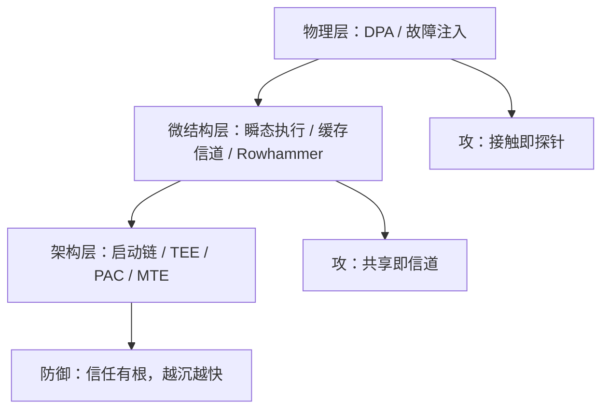
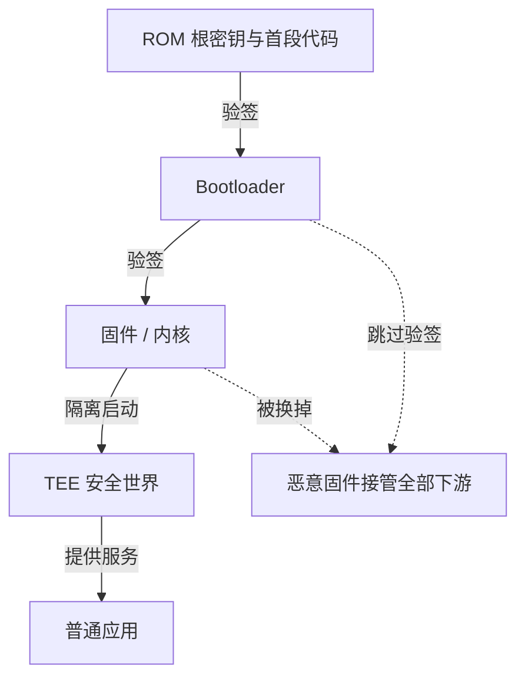

# 硬件安全的视角

ISA 是硬件写给软件的合同，微结构是没写进合同的行为；安全的麻烦从有人开始读合同的空白处开始。

<footer>—— 据 Kocher et al., Spectre Attacks, 2019；Kim et al., Rowhammer, ISCA 2014 整理</footer>

[上一课](/cs/ss-memory-safe-langs)把内存安全从运行时纪律改成编译期证明，但那份证明假设硬件是理想机——按 ISA 逐条忠实执行。本课把硬件请回舞台。主干已有[瞬时执行](/cs/transient-exec)、[Spectre 缓解](/cs/spectre-mitigations)、[Rowhammer 缓解](/cs/rowhammer-mitigations)、[Flush+Reload](/cs/flush-reload)、[功耗分析 DPA](/cs/power-analysis-dpa)、[安全启动链](/cs/secure-boot-chain)、[固件安全](/cs/firmware-security)与[指针认证](/cs/pointer-authentication)；缺口是一个统一视角：硬件同时是根信任的来源与新的攻击面，两份合同方向相反。

## 问题

作为防御，硬件提供了软件给不了的四样根：启动链把信任锚进 ROM 与一次性写入的密钥；TEE 把操作系统踢出敏感代码的 TCB；PAC/CET 把控制流完整性沉到硬件；内存标签把内存错误检测沉到访存路径。作为攻击面，同一批硬件自揭其短：微结构是 ISA 没写的行为——预测执行与缓存放大本为性能而生，却把「隔离」漏成信道（Spectre 类）；DRAM 的模拟行为被系统性扰动利用（Rowhammer 翻转比特）；物理接触下，功耗轨迹与故障注入是直接探针。缺口不是复述这些机制，而是给出读这份合同的层次与判据。

## 方法

### 三个层次各读一段

架构层：安全启动链从不可变的 ROM 代码出发逐级验签——信任有了根，代价是根不可热换，固件层的漏洞修补接回[供应链](/cs/ss-supply-chain)的站点图。微结构层：判据是「性能优化的每一处共享，都是潜在信道」——缓存、TLB、分支预测器、执行端口，凡是被秘密影响时长的部件都能计时读出；缓解是隔离加栅栏，每道都带性能税（专课已算过账）。物理层：DPA 把密钥从功耗轨迹里统计出来，防御是掩蔽与噪声；故障注入让「跳过一次比较」成为可能，防御是冗余校验与随机化时序。新工具也在此层兑现：内存标签（MTE）按 16 字节粒度给内存打 4 位标签、指针高位携带期望值，访存不符即陷阱——把[内存安全语言](/cs/ss-memory-safe-langs)一课证不掉的剩余内存类，变成确定性检测。

ARM MTE 的合同：内存按 16 字节粒度划分，4 位标签存于指针高位 unused 位，Load/Store 时硬件核对，不符即异常——use-after-free 与越界从概率攻击变成确定性的崩溃。据 ARM 架构手册整理。

4 位标签意味着每 16 字节内存块只有 16 种标签取值，赋错相邻标签的碰撞概率约 1/16——所以 MTE 能把绝大多数越界当场抓住，但不是 100% 拦截，工程上要按「大概率崩溃、小概率漏检」来评估它兜住多少风险。

## 机制

为什么硬件漏洞最难收尾：不可热修，缓解只能在微码、固件与软件栅栏之间分摊，各有性能账；攻击面与性能同源——你关不掉缓存与预测执行，只能给共享加策略。信任的传递链是「ROM → 固件 → TEE → 应用」，任何一环失守都从根上折价，所以固件供应链是这条链上最现实的一环，也是与第 3 课的交点。反过来看，硬件缓解（PAC、MTE、CET）的加速比在于：软件里逐次检查的开销，沉到硬件路径后按每条指令摊销——这是「越沉越快」的机制，也是内存安全语言与硬件缓解互为表里的原因。

微码就是烧在 CPU 内部、把一条机器指令翻译成一串更细小微操作的固件——相当于芯片里可以更新的「解释器」。所以 Spectre 这类改不了电路的漏洞，厂商常以微码更新的形式打补丁：合同改不了，就改执行合同的方式。

信任链可以想象成一串连锁的信封：每个信封都由上一把钥匙封口，拆到哪一层，就知道前面没有被换过——但拆封的规则写死在第一层（ROM）里，第一层坏了后面全部作废。初学者容易以为固件被攻破只是「电脑变慢」，实际上攻击者从此拥有了比操作系统更高的权限。

## 边界

Spectre、Rowhammer、Flush+Reload 的机制细节主干已有专课，本课不重讲；TEE 内部的调用约定与证明协议点到为止；硬件木马与逻辑级供应链攻击的检测不展开。物理攻击的实操配方不写，只写模型与防御对应。

## 小结

- 硬件同时是根信任与攻击面：启动链、TEE、PAC/CET、MTE 在防御侧，微结构与物理层在攻方。
- 判据：性能优化的每一处共享都是潜在信道；信任链任何一环失守都从根上折价。
- 硬件漏洞不可热修，缓解在微码、固件与软件栅栏间分摊，各有性能账。
- MTE 把剩余内存类变成确定性检测，与安全语言互为表里；固件供应链是现实交点。
- 出处：Kocher et al., 2019；Kim et al., ISCA 2014；ARM 架构手册；对照 [spectre-mitigations](/cs/spectre-mitigations)、[rowhammer-mitigations](/cs/rowhammer-mitigations)。
