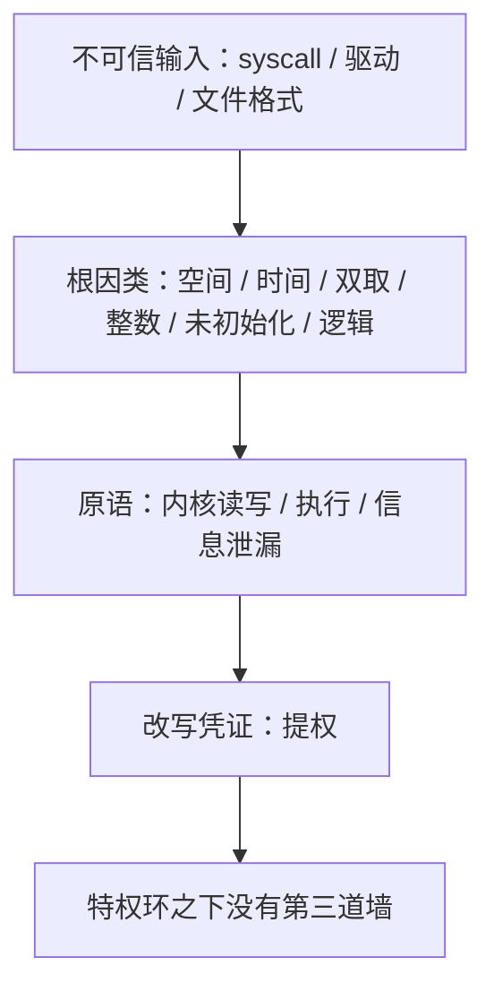
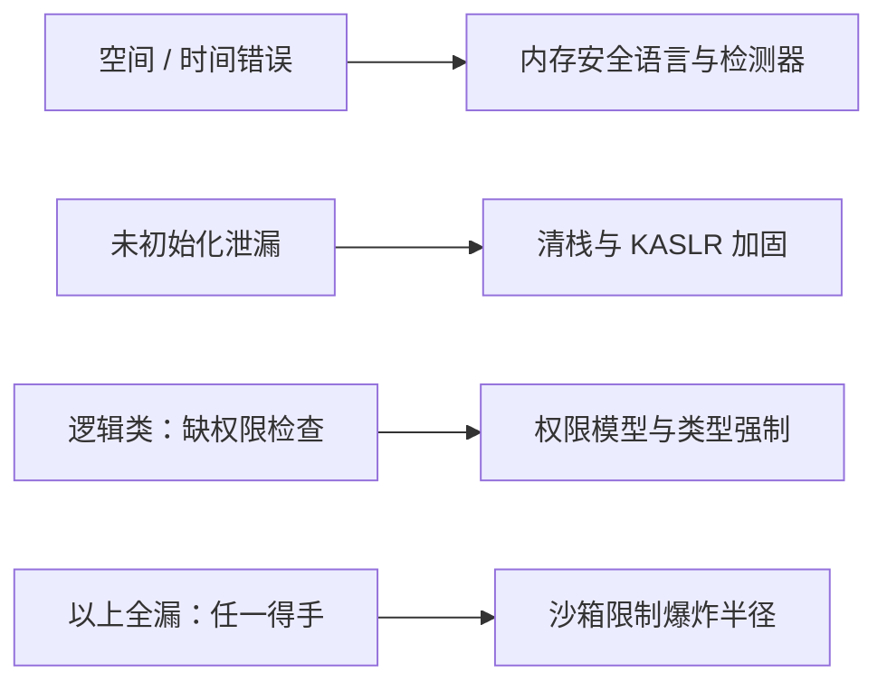

# 内核漏洞类别

用户态的内存错误多半是崩溃；同一个错误落进内核就换了名字：提权。分类不是为了背清单，而是为了让每一类都对得上一条确定的缓解。

<footer>—— 据 Chou et al., An Empirical Study of Operating System Errors, SOSP 2001；CWE 常见弱点枚举整理</footer>

[上一课](/cs/ce-map)给「密码学工程」收束：八层地图从选型排到迁移，决策先归层再查课；全部事故同机制——确定性冒充随机性，或随机性缺乏合同；全部防御同机制——把正确做法变成默认路径，在接口层没收犯错机会。主干课里 [JOP 与 COP](/cs/jop-cop)、[堆 UAF](/cs/heap-uaf)、[格式化字符串](/cs/format-string)给过利用侧的原语，[SELinux 类型强制](/cs/selinux-type-enforcement)给过策略侧的答案，但它们都以用户态为默认舞台。本课是「系统安全深化」的第一课，转向舞台本身：内核。缺口是给内核漏洞钉一张类别表——按根因分类，再映射到攻击者实际拿到的东西——本课程后面八课的沙箱、语言、硬件、移动与云，都按这张表对号入座。后课默认已经读完本课。

## 问题

内核不是「更大的用户程序」，三个结构性差别使它自成一个威胁模型。其一，特权终点：内核跑在[特权环](/cs/privilege-rings)的顶层，[用户-内核分界](/cs/user-kernel-split)处一次失守之后没有第二道墙，攻击者拿到的不是某个进程的权限，而是全系统。其二，面积：几千万行 C，驱动占大头；Chou 等对 Linux 与 OpenBSD 的实证统计给出，驱动代码的缺陷密度是核心代码的数倍。其三，并发：中断、抢占与多核让「检查时刻」与「使用时刻」天然分离，[TOCTOU](/cs/toctou) 在这里不是边角情况而是日常。

缺口因此是：把 CVE 流水账整理成按根因分类的表，使「这一类 bug 由什么缓解兜住」有确定答案，而不是逐案打补丁。

### 根因轴与原语轴

分类需要两条轴。根因轴问代码错在哪：空间错误（越界读写）、时间错误（释放后使用、双重释放）、未初始化、整数错误（长度计算回绕）、双取（double-fetch，同一内存被检查与使用各取一次而其间可被改写——TOCTOU 的内核特化）、引用计数错，以及不碰内存的逻辑类（缺权限检查）。原语轴问攻击者拿到什么：内核任意读写、任意执行、信息泄漏——[ASLR 与 NX](/cs/aslr-nx) 讲过泄漏如何吃掉随机化的熵——以及终局原语：改写凭证结构完成提权。

Chou et al. 的统计里，驱动代码的缺陷密度是核心内核的 3 到 7 倍；「驱动是内核攻击面的主体」从 2001 年至今没有翻案，syzbot 时代的报告分布仍然如此。

双取可以翻译成「先查后用，但查的和用的不是同一份」：内核以为自己是唯一读者，可用户页随时能被用户进程改写。类比成海关查验护照后把护照还给你、登机时再收走一次——中间那段时间护照被换了，第一次查验就白做了。防御因此是把值复制进内核自己的变量，只读这一份。

整数回绕的数字实例：32 位下，个数 $n$ 取 1073741825、单项 4 字节，$n \times 4$ 的真实结果是 4294967300，截断成 32 位后只剩 4——分配一个 4 字节的缓冲，随后却拷入约 4 GB。攻击者专挑这种「乘完变小」的位置，所以审计时先看长度乘法，再看有没有溢出检查。

## 方法

每类根因配一个内核特有的实例。空间错误：系统调用把用户传入的长度直接用于栈缓冲拷贝；`copy_from_user` 这类原语的存在理由，就是把「用户指针不可信」钉成内核调用约定。时间错误：引用计数少加一次，对象在他人仍持有时释放——[堆 UAF](/cs/heap-uaf) 的机制原样成立，只是槽位换成了内核对象。双取：先校验 `$\mathrm{size} \lt \mathrm{LIMIT}$`，再从同一用户页重读 `size` 去用，两次读之间用户改写、检查作废，防御是把值读进本地副本只读一次。整数错误：`$n \times \mathrm{sizeof}(\mathrm{item})$` 回绕成小值，小缓冲装下大拷贝。未初始化：栈上结构体带洞，回传用户即成内核地址泄漏，[内核加固](/cs/kernel-hardening)的清栈与 KASLR 正是补这一格。逻辑类：少一次 `capable()` 检查，与内存无关，不崩溃，fuzzing 抓不到，只能靠审计与[类型强制](/cs/selinux-type-enforcement)兜底。

## 机制

两条轴连成一条链：根因给原语，原语给提权。缓解的分工因此可以逐格核对：空间与时间类交给语言和检测器（内存安全语言一课），信息泄漏交给清栈与随机化（内核加固课），逻辑类只能交给权限模型，而沙箱一课回答「以上全部失败之后，爆炸半径还剩多少」。内核漏洞的特殊性不在错误本身——与用户态是同一批根因——而在链条终点没有缓冲：每一环都直接通向全系统，所以每一环都值得单独设防。

这张分工表的直觉：内存类漏洞像「墙被打穿」，要用更结实的材料（安全语言）砌墙；泄漏像「屋里东西被看走」，要拉窗帘（清栈、随机化）；逻辑类像「门根本没锁」，任何材料都帮不上，只能靠制度（权限模型）管人。初学者容易以为给逻辑漏洞上 fuzzing 就能覆盖——实际上不崩溃、不报错的路径，fuzzing 的大部分信号都是哑的。

## 边界

本课不写利用技术本身：ROP/JOP 的缝合与堆布局雕琢主干已给；模糊测试如何自动发现这些类别留给模糊测试一课；侧信道与瞬时执行是另一条泄漏通道，主干已有专课；驱动与固件的供应链问题留给供应链课。具体 CVE 来来去去，类别表是本课留下的稳定物。

## 小结

- 内核威胁模型的三个差别：特权终点无缓冲、驱动占攻击面主体、并发使检查与使用分离。
- 分类用两条轴：根因（空间/时间/双取/整数/未初始化/逻辑）与原语（读写/执行/泄漏/提权）。
- 双取是 TOCTOU 的内核特化；未初始化泄漏喂给 KASLR 攻击；逻辑类不崩溃，只能靠权限模型。
- 缓解按类别分工：语言管内存类、加固管泄漏、TE 管逻辑类、沙箱管剩余爆炸半径。
- 本课程后课按这张表对号入座，逐格交代各自的兜法。
- 出处：Chou et al., SOSP 2001；CWE；对照 [heap-uaf](/cs/heap-uaf)、[toctou](/cs/toctou)、[kernel-hardening](/cs/kernel-hardening)。
