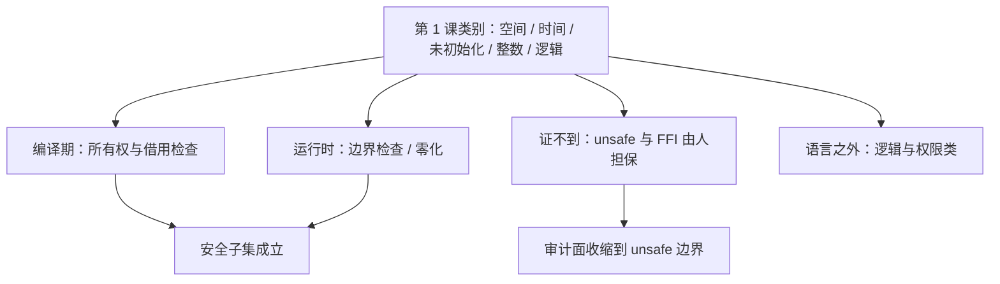

# 内存安全语言

安全语言把内存错误从「运行时碰运气」改成「编译时证不出来就编译不过」；代价是把审计对象从每一次内存访问，换成类型系统本身与它的 unsafe 缝隙。

<footer>—— 据 Jung et al., RustBelt, POPL 2018；Google Android 安全博客（2022）整理</footer>

[上一课](/cs/ss-fuzzing-deep)给了「bug 从哪来」的自动发现路线；发现之后，根治路线之一是换掉产生 bug 的语言合同。主干在[内存安全语言](/cs/memory-safe-languages)钉了立场——PAC/CET 是缓解，安全语言改语义，FFI 与运行时仍是 TCB；[Rust 进内核](/cs/rust-in-kernel)给了工程路径。本课深钻「安全」二字靠什么成立：类型系统的保证如何构造、覆盖[内核漏洞类别](/cs/ss-kernel-vuln-classes)表的哪几格、漏掉哪几格。

## 问题

先看规模：微软 MSRC 与 Chromium 各自的口径下，严重 CVE 里内存安全问题约占七成——类别表里空间、时间、未初始化、整数四类正是这份大头。C 的类型系统表达不出「这个指针在有效期内且无别名可写」，于是这两条性质只能靠运行时纪律维持，而纪律会被并发与重构磨穿。缺口是：安全语言的保证究竟怎么构造、构造到什么强度、证据是什么——而不是重申「Rust 好」。

## 方法

### 所有权、unsafe 与运行时托管

Rust 的构造是三条规则：每个值唯一所有（仿射类型，绑定即移动）；借用检查器证「可变与别名互斥」；生命周期把「引用不活得比所有者久」变成编译期事实。悬垂与双重释放属于时间类，在编译期被证掉；数组边界检查在运行时兜住空间类；未初始化类由默认零化与初始化检查兜住。证不到的地方不撒谎：`unsafe` 块把「机器证不了、由人担保」的代码显式圈出来，审计面从全部代码收缩到 unsafe 与 FFI 边界。RustBelt 进一步把这个「safe 的含义」做成机器检查的证明：只要 unsafe 边界守约，safe 子集整体类型安全。GC 语言走另一条路：空间与时间安全由托管运行时给，代价是运行时与 JIT 自身成为新的 TCB——它们一旦有洞，所有人的保证同时漏。

Android 的实测：内存安全漏洞占比从 2019 年的 76% 降到 2022 年的 35%——没有重写存量，只是新代码改用 Rust 与 Kotlin，占比随替换自然下降。据 Google 安全博客 Memory Safe Languages in Android 13 整理。

## 机制

把保证的边界讲清楚：类型安全不等于程序安全。逻辑类与权限类语言管不着——缺一次权限检查在 Rust 里照样能写；整数类只挡回绕导致的内存后果，数值算错照旧。并发是个分界线：Rust 把数据竞争变成类型错误（`Send`/`Sync` 标记），死锁与竞态逻辑仍然可能。迁移的机制因此不是重写，而是攻击面排序：把解析不可信输入的模块先换——新代码安全语言、旧代码靠缓解与 fuzzing 顶住，占比随替换率下降，Android 的曲线就是这个机制的实测结果。

## 边界

「safe 子集安全」依赖 unsafe 守约与标准库正确——这两者是显式 TCB，不是无限担保；Rust 进内核的构建与 ABI 工程专课已讲，不重写；供应链问题（安全语言项目照样会被投毒）归供应链课。C++ 的安全子集与硬化路线只在对照时点名，不展开。

## 小结

- 七成严重 CVE 是内存安全；空间/时间/未初始化/整数四类构成大头，正是类型系统能表达的部分。
- Rust 的构造：唯一所有权、可变与别名互斥、生命周期检查；边界检查与零化运行时兜底。
- unsafe 是显式 TCB；RustBelt 把「safe 的含义」做成机器检查证明。
- 语言不覆盖逻辑与权限类；数据竞争变类型错误，死锁仍可能。
- 迁移是攻击面排序加替换率：Android 从 76% 降到 35% 是实测曲线。
- 出处：Jung et al., POPL 2018；Google 安全博客 2022；对照 [memory-safe-langs](/cs/memory-safe-languages)、[rust-in-kernel](/cs/rust-in-kernel)。
