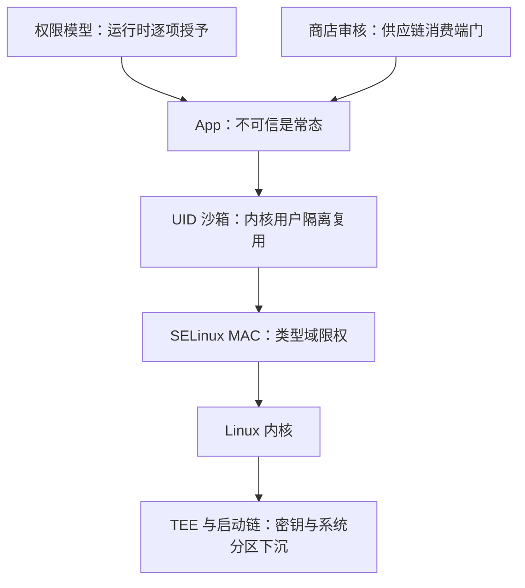
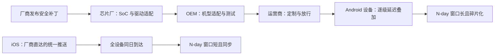

# 移动安全

手机把「一人一机」改成了「一机百 App」；安全的重心从守住一台机器，变成在它身上划几十个互不相认的格子。

<footer>—— 据 Enck et al., Understanding Android Security, IEEE S&P 2009；Apple Platform Security 文档整理</footer>

[上一课](/cs/ss-hardware-perspective)把硬件同时当根信任与攻击面；手机是这套东西最普及的兑现——每部手机出厂自带启动链、TEE 与按 App 划好的格子。本课把移动当体系课的标本写：内核沙箱、权限模型与更新链条三件套，如何把前面七课的机制压进一台贴身的设备。

## 问题

桌面威胁模型默认一人一机、装什么自己担责；手机把这个前提翻了过来：一台设备上几十个 App 互不相认，安装第三方代码是常态而非例外，传感器贴着人——位置、相机、麦克风、生物特征，泄露的后果直接落在个体身上。缺口是：在「不可信 App 是常态」的前提下，平台怎么划格子、怎么管入口、怎么补洞。这三问分别对应沙箱（第 2 课）、供应链（第 3 课）与补丁窗口（主干课）在移动平台的具体形态。

## 方法

### 格子、入口与补洞

格子：Android 给每个 App 分配一个独立的 Linux UID——沙箱不是新机制，就是内核讲过的用户隔离直接复用，再让 SELinux 的 MAC 盖一层，把即便被攻破的 App 也按类型域限权；iOS 走另一条路：代码必须经平台签名才能运行，沙箱 profile 收紧系统调用与文件面。入口：权限模型把敏感能力（定位、联系人、相机）收进受控中介，安装时声明、运行时逐项授予；应用商店审核是[供应链站点图](/cs/ss-supply-chain)的消费端门，重打包与仿冒 App 是这门没守住的典型样本。补洞：更新链条决定 N-day 窗口——Android 的「芯片厂到 OEM 到运营商」层级让补丁到达时间碎片化，把主干补丁管理课的窗口在移动端拉长；iOS 的统一推送把窗口压短到全设备同步。

Android 4.4（2013）先对少数守护进程启用 SELinux enforcing，5.0（2014）扩到整个平台；每个 App 的 UID 由 zygote 派生——「给每个应用一个用户」是 2009 年 Enck 等总结的平台核心设计，沿用至今。据 Android 平台安全文档整理。

「每个 App 一个 UID」翻译成大白话：操作系统把每个应用当成一台机器上互不相干的「不同用户」来管——A 用户读不到 B 用户的文件，正如银行 App 读不到相册。权限弹窗是第二道闸，管的是「这个用户是否被允许用相机」；两道闸各管各的，叠加才构成移动平台的格子。

## 机制

为什么格子之下还要硬件：第 2 课的逻辑原样成立——所有格子共享同一面内核墙，[内核漏洞类别](/cs/ss-kernel-vuln-classes)表对每个格子都成立；于是敏感资产再沉一层：密钥与生物特征比对进 TEE 的安全世界，启动链校验系统分区，远程证明把设备状态讲给服务端。这就是[硬件视角](/cs/ss-hardware-perspective)「信任有根」的消费级落地。攻方的经济学随之定型：对贴身设备，社会工程比重写内核便宜——重打包、仿冒、stalkerware 攻的是格子之间的人，不是格子本身；平台对策也相应从技术单点转向链条纵深。

N-day 窗口就是「补丁已存在」到「你的设备已打上」之间的时间差。直觉类比：安卓的更新像批发转零售——批发价（补丁）当天出，经过芯片厂、厂商、运营商层层加价（适配与放行）才到你手里；iOS 是厂商直营店，同一批货全网同天上架。链条每多一级，全世界的攻击窗口就多几周。

## 边界

TEE 与启动链的机制细节专课已讲，本课只借其结论；App 层的 Web 漏洞（XSS 等）已有专课；企业管控（MDM）与合规不展开。移动端侧信道与固件层问题分别归硬件课与固件课，此处不重讲。

常见误区：以为「点了允许」的权限越少就越安全。权限模型管的是 App 正常运行时的能力，管不住被攻破的进程——App 一旦被内存漏洞打穿，攻击者继承的是这个 UID 的全部文件面，而不是弹窗里那几项。所以格子的强度上限由内核与 TEE 决定，权限弹窗只是入口的一层减速带。

## 小结

- 移动翻转了桌面前提：不可信 App 是常态，传感器贴身，泄露直接伤及个体。
- 三件套：UID 沙箱加 MAC 划格子、权限模型与商店管入口、更新链条定补洞窗口。
- 格子共享一面内核墙，所以密钥与证明下沉 TEE——硬件信任根的消费级落地。
- 攻方经济学：贴身设备上社会工程便宜，重打包与 stalkerware 攻人攻链，不攻格子。
- 出处：Enck et al., IEEE S&P 2009；Android 平台安全文档；Apple Platform Security；对照 [selinux-type-enforcement](/cs/selinux-type-enforcement)。
