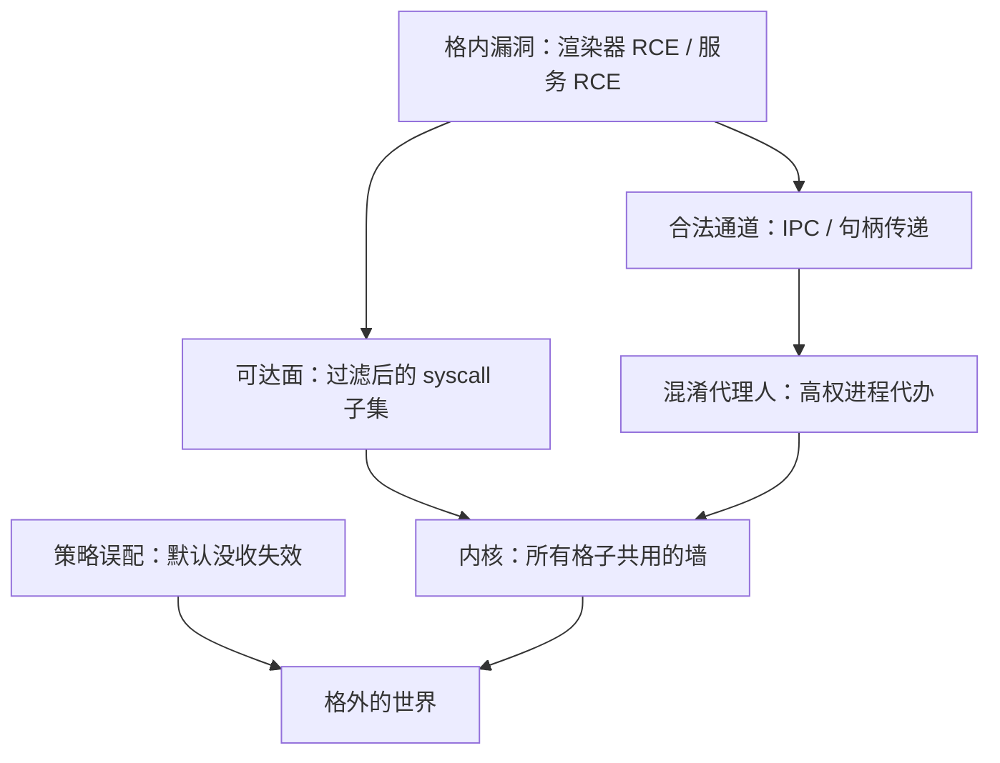
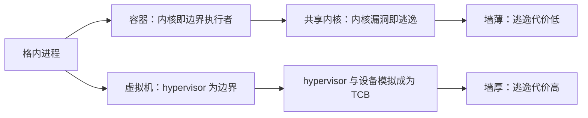

# 沙箱逃逸

沙箱从不承诺攻击者进不来，它承诺的是：进得来的那份代码，能摸到的世界已经小得可怜；逃逸研究的正是这份「小」在哪里失守。

<footer>—— 据 Barth, Jackson and Reis, The Security Architecture of the Chromium Browser, 2008；Linux seccomp(2) 整理</footer>

[上一课](/cs/ss-kernel-vuln-classes)把内核漏洞钉成两条轴：根因给原语，原语给提权，并留下一句「沙箱管剩余爆炸半径」。本课就把这句话展开。主干已有[隔离与沙箱](/cs/isolation-sandbox)、[浏览器沙箱](/cs/browser-sandbox)、[seccomp 过滤器](/cs/seccomp-filter)、[容器逃逸](/cs/container-escape)与[虚拟机逃逸](/cs/vm-escape)；缺口是把「逃逸」本身当成一个类别来写：边界由谁执行，执行者的哪几类失败会把它变成纸。

## 问题

沙箱的承诺靠一条组件链兑现：格内进程 → 内核的过滤器与命名空间 → CPU 特权级。承诺因此与链上最弱的一环同命。逃逸不是一类 bug，而是这条链上的三种失败。其一，执行者之下的漏洞：所有格子共享同一面内核墙，[上一课类别表](/cs/ss-kernel-vuln-classes)里的任何一格，落到边界执行者头上就是逃逸。其二，合法通道的滥用：格子必须留出口——渲染器要网络、要文件句柄——高权的中间人替格内代码办事时，一个混淆代理人 bug 就把出口变成了洞。其三，策略误配：能力默认没收、通道显式开，这条纪律反过来就是默认全开、事后修补。

## 方法

### 缩面、窄通道与误配审计

三招对应三种失败。缩面：syscall 过滤器把内核入口从几百个砍到几十个——类别表里凡是入口在 syscall 的根因，先在门口折损一截；Windows 侧同理，win32k 锁定把历史悠久的图形子系统从浏览器可达面里裁掉。窄通道：进程间只传句柄与强校验的结构化消息，反序列化是新的检查点；站点隔离再把不同站点的渲染器分格，让一个格子的代码执行不再等于跨站读。误配审计：通道清单进版本库，默认拒绝写进模板而非记忆。

Chromium 与 Adobe Reader 在 Windows 上启用 win32k 锁定：进程被禁止调用 win32k 系统调用，图形子系统那部分内核面从格内不可达。据 Microsoft 进程缓解策略文档与 Chromium 文档整理。

「混淆代理人」翻译成大白话：一个手握权限的老实人，被外人骗着用自己的权限办了外人的私事。比如高权的浏览器主进程替渲染器去读文件，渲染器递过去的「文件名」其实是个设备路径——代办进程按自己的高权限执行了，账却记在格内代码头上。防御思路因此是让代办只收强校验的结构化消息，不收裸字符串。

缩面的数字直觉：Linux 的 syscall 入口有三百多个，seccomp 白名单过后通常只剩几十个——可达面直接折损一个数量级。类别表里凡是「入口在 syscall」的空间、整数类漏洞，其中九成都因为对应入口被关掉而先在门口撞墙；剩下进得来的入口，才是攻击者真正能研究的面。

## 机制

关键机制判断是：沙箱不修内核漏洞。格内与格外跑在同一个内核上，[内核漏洞类别](/cs/ss-kernel-vuln-classes)那张表对格内攻击者照样成立；沙箱改变的是可达性——够得着的 syscall、文件与设备变少，同一条利用链的工程代价变高。逃逸的度量因此是「从格内 bug 到原语的距离」：窄 IPC 加站点隔离把这条路从「渲染器 RCE 直达内核」逼成「还要再找一个 IPC 逻辑 bug」，攻击成本抬一个量级，逃逸就从批量转为定向。容器与虚拟机的对照在此对齐：共享内核的容器，边界执行者就是内核本身；虚拟机多一层管理程序，设备模拟器成为高危 TCB——两课已有专述，此处只借它们的结论对表。

初学者容易以为「沙箱挡住了漏洞」，实际上沙箱一个漏洞都没修——它只是把攻击者从「面前是无锁的大门」改成「面前是一条要绕三道的窄走廊」。度量这条走廊的长度，正是本课说的「从格内 bug 到原语的距离」：走廊越长，批量攻击越不划算，攻击者就越只能挑高价值目标。

## 边界

容器逃逸与虚拟机逃逸的机制细节主干已有专课，本课不重讲；侧信道能把数据从格子漏出去但不破坏 confinement 的完整性，按隔离课「微结构泄漏另计」的口径处理；具体 CVE 的利用步骤不写。格子的策略语言如何表达最小权限，属于各平台模型——移动一课会回到这个话题。

## 小结

- 逃逸是承诺链上的三种失败：执行者之下的内核漏洞、合法通道的混淆代理、策略误配。
- 对应三招：syscall 缩面、窄通道与强校验 IPC、默认没收加审计。
- 沙箱不修内核漏洞，只改可达性；度量是「从格内 bug 到原语的距离」。
- 站点隔离把「一次 RCE」与「跨站」解耦，逃逸成本抬升后批量转为定向。
- 出处：Barth, Jackson and Reis, 2008；seccomp(2)；对照 [browser-sandbox](/cs/browser-sandbox)、[isolation-sandbox](/cs/isolation-sandbox)。
