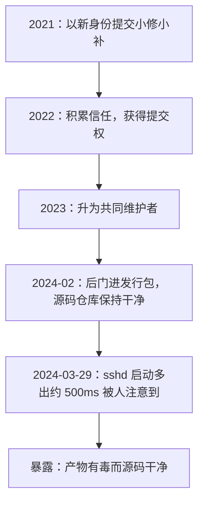
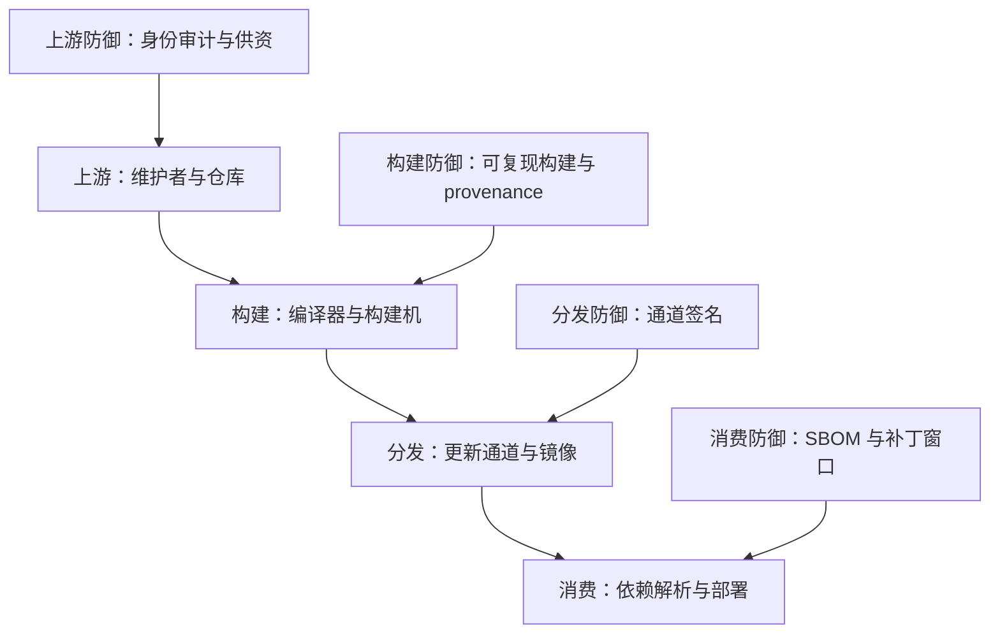

# 软件供应链安全

你审计的是自己的代码，运行的却是几百个陌生人的业余项目；攻击者于是不再撞你的门，改劫你的快递。

<footer>—— 据 Thompson, Reflections on Trusting Trust, 1984；SolarWinds 与 xz-utils 事件公开报告整理</footer>

[上一课](/cs/ss-sandbox-escape)回答了「边界内的代码被打穿之后还剩多少」。本课把镜头拉向更早的一环：打进来的代码从哪来。主干已有[SBOM 与可复现构建](/cs/sbom-reproducible-builds)、[依赖混淆](/cs/dependency-confusion)、[补丁管理](/cs/patch-management)与[固件安全](/cs/firmware-security)；缺口是把从上游维护者到你的构建产物之间的整条链当成攻防面，钉成一张站点图：攻击者在哪几站下手，每一站的防御对应物是什么。

## 问题

现代软件的自研占比很小：一个二进制里，你的代码是少数派，其余来自依赖与构建链。只审计自己的代码守不住面，因为攻击面已经转移：链条上每一站都是一次「别人写的代码在你这里获得执行权」。上游站：维护者账号被社工、被转手、被倦怠出租。构建站：编译器与构建机本身就是代码（Thompson 的 Trusting Trust 证明了编译器可以是永久后门的宿主），构建机被入侵则产物可被替换——SolarWinds 2020 年的入侵正是往更新产物里塞了后门，再借合法签名通道分发给上万客户。分发站：更新通道被劫持，2017 年乌克兰税务软件 M.E.Doc 的更新通道被用来分发 NotPetya，几十小时内席卷全球。消费站：依赖解析骗过 CI，依赖混淆一课已有专述。

供应链攻击的直觉类比：入室盗窃不砸你家门，改在快递中转站把包裹换了——你签收时包裹带着完整的官方封条。SolarWinds 里上万客户收到的更新「签名齐全、通道正规」，坏只在源头那一站；这就是为什么只盯自家门锁（终端防护）守不住，要盯整条快递线。

## 方法

### 站点对防御

每一站配一件防御。上游：维护者身份是软环节，多元维护、关键库供资与交接审计是仅有的对策——技术单点防不住耐心的人。构建：[可复现构建](/cs/sbom-reproducible-builds)把「源码加配方到产物」变成任何人可重算的函数，签名从「构建机声称这是产物」变成「配方重算得出同一哈希」；provenance 分级框架把「构建有多可证」变成可比的等级。分发：通道签名校验、密钥硬件化。消费：[SBOM](/cs/sbom-reproducible-builds) 回答「我中没中招」，[补丁管理](/cs/patch-management)回答「多快修掉」。

xz-utils：攻击者自 2021 年起以「Jia Tan」身份耐心贡献直至共同维护者，2024 年 2 月在 5.6.0/5.6.1 的发行包里放入后门而 git 仓库保持干净；3 月 29 日由 Andres Freund 因 sshd 登录多出约 500 毫秒开销而暴露（CVE-2024-3094）。

可复现构建就是「同一份源码加同一份配方，在任何机器上重算都得到逐字节相同的产物」。有了它，「产物有没有被动过手脚」从信任问题变成算术问题：拿公开配方自己重算一遍，哈希相等就干净。xz 后门恰好只存在于发行包、git 仓库干净——正是「看源码」照不出来、必须复算才能照出来的那一类。

这张时间线回答的问题是「攻击如何分步推进」：三年半里每一步单看都像正常贡献。常见误区是「开源等于安全」——xz 是开源项目，代码人人可看，但可审计不等于有人审；后门藏在构建脚本而非主干源码，多数贡献者的视线根本不会落在那里。

## 机制

供应链的本质是信任传递：你信任一个产物，等于信任链上每一站的人与机器。可复现构建改变信任的结构——把「信任每一站」收敛为「验证源码哈希与配方」，可验证性替代可信度。xz 一案把两件事同时钉死：后门藏在构建产物而源码仓库干净，说明「看源码」不够，复现构建正是为这一类准备的；同时它针对 sshd 的符号解析定制、绕开了 fuzzing 的常规覆盖——说明任何单点检测都能被定向绕过，链条安全必须靠纵深，这正是第 2 课沙箱逻辑在时间维度的重演：不指望单墙，指望让攻击链每一段都要单独成功。

## 边界

依赖混淆的消费端机制专课已讲，本课不重写；固件层的供应链（固件签名、启动链）留给硬件一课的信任传递；合规框架清单（SLSA 等级如何逐条落地）不展开成手册。供应链攻防的攻方细节不写配方，只写结构与案例事实。

## 小结

- 攻击面已从你的代码转移到依赖与构建链；链条上每一站都是一次执行权交接。
- 四站四防：上游身份审计、构建可复现加 provenance、分发通道签名、消费 SBOM 与补丁窗口。
- 信任传递可被可复现构建收敛：从信任每一站的人，收敛为验证哈希与配方。
- xz 证明后门可藏在产物与维护者身份里，单点检测可被定向绕过，纵深不可省。
- 出处：Thompson, 1984；SolarWinds 与 xz 公开报告；对照 [sbom-reproducible-builds](/cs/sbom-reproducible-builds)、[dependency-confusion](/cs/dependency-confusion)。
