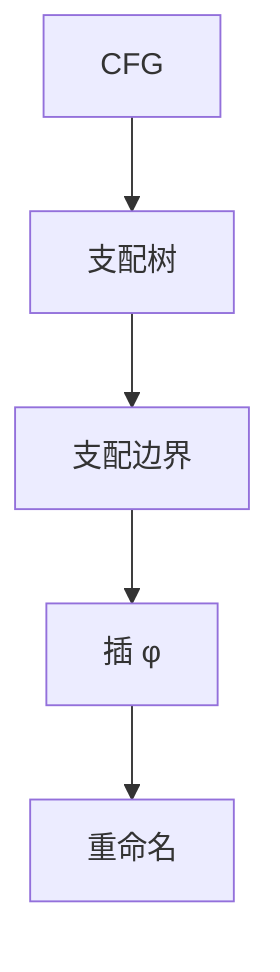

# SSA 构造 Cytron

在支配边界插入 φ，再按支配树重命名，得到静态单赋值。Cytron 等人给出与支配树相关的高效放置。

<footer>—— 据 Cytron et al., Efficiently Computing Static Single Assignment Form, 1991；Lengauer and Tarjan 支配；Appel, SSA is Functional Programming 整理</footer>

上一课[值范围](/cs/value-range-analysis)已在 SSA 上说话。主干[SSA](/cs/ssa-form)给直觉。缺口是**构造算法**：支配树、支配边界、φ 迭代插入、重命名栈。本课钉 Cytron 步骤，不写析构——下一课。

## 问题

朴素在每个汇合点对每个变量插 φ 太多。只需：变量在块定值，则在其支配边界插 φ，再迭代。缺口是**支配边界 DF**，不是值编号。

Lengauer–Tarjan 算支配。剪枝 SSA：无 use 的名不插 φ。semi-pruned 用 liveness 粗筛。

### φ 的操作数对应前驱边

顺序与 CFG 前驱列表对齐。错位则语义错。这不是「任意交换」。

Cytron et al. 1991 TOPLAS。Appel 1998。主干 SSA 课已禁止把 φ 当机器指令。本课补算法。

## 方法

1. 算支配树与 DF。2. 对每个变量的定值块工作表插 φ。3. 支配树 DFS，栈重命名，φ 操作数填入到达名。

与 mem2reg：alloca 的 store/load 先当定值/使用再走同一算法——接 SROA。

## 机制

不可约 CFG 仍可 SSA，φ 更多。关键边有时先拆，方便后边析构。不要在构造时做 GVN；顺序是先 SSA 再优化。

复杂度：近线性支配 + 与定值数相关的 φ 插入。

## 边界

本课不写 memory SSA 的全部 chi/mu。后课默认：标量可按 Cytron 构造 SSA。下一课析构：离开 SSA，φ 变传送。

也不把 SSA 当源语言语法。

## 小结

- Cytron：DF 上插 φ，支配序重命名。
- 剪枝减少无用 φ。
- 支配算法用 Lengauer–Tarjan 等。
- 出处：Cytron et al., 1991；Lengauer–Tarjan；Appel, 1998。
