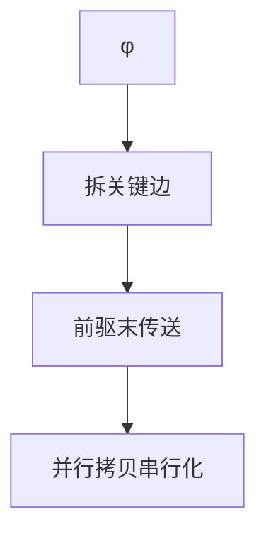

# SSA 析构与 φ 消除

机器没有 φ。析构在每条前驱边末尾插入传送，把 SSA 名合并回可着色的存储。错序会引入交换问题。

<footer>—— 据 Briggs, Harvey and Simpson, Practical Considerations for SSA Destruction；Cytron et al.；Appel 整理</footer>

上一课[Cytron 构造](/cs/ssa-construction-cytron)插入 φ。后端[寄存器分配](/cs/regalloc-color)前通常离开 SSA。缺口是**析构**：φ 变成 `mov`。经典坑：并行 φ 的交换（`x,y = y,x`）需要临时。本课钉边拷贝与关键边，不写着色。

## 问题

φ 语义是「沿进入边同时选择」。实现：在前驱块末 `x3 = x1` 或 `x3 = x2`。若同一块两个 φ 交叉赋值，串行 `mov` 会覆盖。缺口是**并行拷贝的串行化**，不是 DF。

关键边：无唯一插入点，先拆块。

### 析构不是「删掉 φ 不管」

随便删 φ 会丢失汇合。必须有拷贝或让分配器同时分配 φ 与操作数到同一寄存器（合并）。

Briggs 等 SSA destruction。Sreedhar 的方法减少拷贝。LLVM 在分配中处理 PHI。本课常规：先拆 φ 再着色，或 SSA 上着色（Chordal）点名。

## 方法

拆关键边。为每个 φ 与每个前驱生成拷贝。对块末并行拷贝图：找交换环，用临时或 swap。再跑拷贝传播。

与[合并](/cs/coalescing-splitting) 后课：析构产生的 `mov` 正是合并的输入。

## 机制

未定义的 φ 操作数（未初始化变量）须按语言填毒值或拒绝。不要在析构后还当 SSA 做 SCCP。

异常边：前驱是 invoke 的 unwind，插入点在专用边块。

## 边界

本课不写 Briggs 着色。后课默认：φ 在后端前变成传送。下一课自然循环：许多循环优化要在 SSA 上认循环，构造/析构顺序是「优化在 SSA，分配前析构」。

也不把析构当 DCE。

## 小结

- 析构：φ → 前驱边拷贝；关键边先拆。
- 并行赋值要处理交换。
- 与随后的合并、着色衔接。
- 出处：Cytron et al.；Briggs, Harvey and Simpson；Appel。
