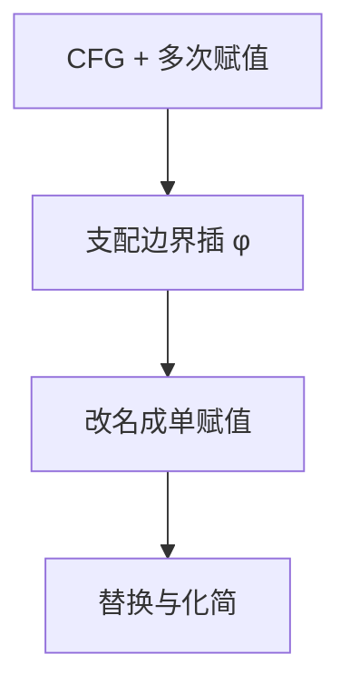

# SSA

每个名字只赋值一次；汇合点用 $\phi$ 按控制流前驱选择值。

<footer>—— 据 Cytron et al., Efficiently Computing Static Single Assignment Form, 1991；Appel, SSA is Functional Programming, 1998 整理</footer>

上一课[控制流图](/cs/cfg-ir)允许同一变量多次赋值。数据流因此要沿 CFG 跟踪「哪一次写到达这里」。本课不重定义基本块。缺口是：**静态单赋值**——改名使得每次赋值一个新名，$\phi$ 处理汇合。活跃变量仍在下一课；SSA 让许多优化变成局部替换。

## 问题

$x$ 被写两次，块尾读 $x$ 不知道该连哪条写。到达定值分析可以回答，但每个优化都要重跑。SSA：第一次写 $x_1$，第二次 $x_2$；若两路汇合，则 $x_3\leftarrow\phi(x_1,x_2)$。缺口是 φ 的放置与改名，不是新的 ISA。

支配边界决定 φ 插在哪：在「有的前驱带来这个定值、有的没有」的入口。Cytron 等给出与支配树相关的高效放置。本课要直觉，不证长度。

### φ 不是运行时指令

φ 在块首语义上「按来边选」。后端必须拆成各前驱块末的传送，或与寄存器分配合并。不要把 φ 发给[RISC-V](/cs/riscv-int-isa)。

Cytron et al. 1991。Appel 指出 SSA 与函数式 let 的对应。剪枝 SSA、半剪枝决定哪些名字需要 φ。本课默认剪枝：只用会再被读的名字。

## 方法

算支配树。对每个赋值的名字，在支配边界插 φ，再按支配序改名。化简：常数、拷贝，$x_2\leftarrow x_1$ 可替换。

与[图算法](/cs/dfs-edge-types)：支配用 DFS 深度与半支配（Lengauer–Tarjan）可算，本课点名算法名，不展开。

## 机制

死代码：赋值结果从未被读则可删（φ 的操作数也要跟着收）。常数传播在 SSA 上是替换。寄存器分配前通常离开 SSA（拆 φ）。本课不着色。

不可约 CFG 仍可 SSA，φ 更多。不要要求所有程序先变成循环树。

## 边界

本课不算活跃变量方程、不选指令。不把 memory SSA 写完（别名使内存不是标量名）。后课默认：标量 IR 可在 SSA 上优化。数据流方程以活跃变量为代表下一课补。

## 小结

- SSA：一次赋值一名；汇合用 φ。
- φ 按支配边界放置，后端要拆掉。
- 优化变成改名与替换。
- 出处：Cytron et al., 1991；Appel, 1998。
