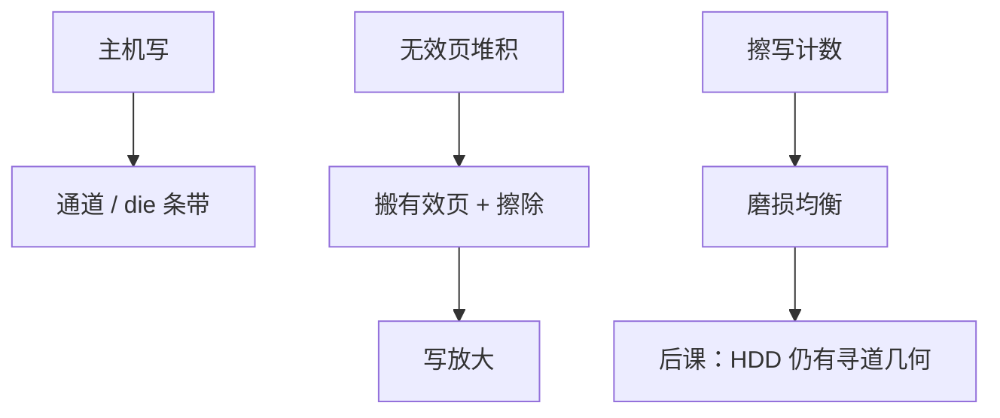

# SSD 内部并行、GC 与磨损

  
多通道、多颗粒、多 plane 把页编程叠起来才有带宽；垃圾回收搬走有效页再擦块，磨损均衡避免热逻辑地址写死同一物理块。

  <footer>—— 据 Patterson and Hennessy, Computer Organization and Design (RISC-V)；Hennessy and Patterson, CA:AQA 整理</footer>

[上一课](/cs/nand-ftl)留下无效页与 L2P。缺口是性能与寿命：**内部并行**从哪来，**GC**何时抢用户写，**磨损**如何摊。否则「SSD 很快」只是广告，写放大没有定义。

## 问题

NAND 页编程延迟远大于 DRAM 行命中，靠通道/die/plane 交错。GC：空闲块低于阈值时，选牺牲块、读有效页、写到新块、擦除牺牲块——与用户写争带宽，写放大 WA = 物理编程量 / 主机写入量。磨损：每块擦写次数有上限，热映射必须搬动物理位置。缺口不是再定义 FTL，而是这三项如何耦合。

TRIM/unmap 让主机声明 LBA 无用，减少 GC 搬移。DRAM 缓存映射加速，掉电靠电容刷回——与[持久域](/cs/nvm-persistent)同类问题。

### GC 不是「磁盘碎片整理」

HDD 碎片整理移动扇区以缩短寻道；SSD 没有寻道，GC 是擦除约束下的空间回收。把二者当同一 OS 工具，会在闪存上做无益的强制搬移。

CA:AQA 与 COD 讨论闪存与 SSD。写放大与磨损是存储系统常识。本课不引用虚构的百分数保证。

## 方法

调度：空闲时 GC，负载时让用户写。并行：把大写条带化到通道。磨损均衡：静态（搬冷块）与动态（新写落在年轻块）。超配（OP）提供空闲块，降 WA。ECC 失败则退休块，L2P 改指。

与 DRAM FR-FCFS 对照：这里优化的是擦除与编程队列，没有行缓冲，但有 plane 忙闲。

## 机制

后课 HDD 用柱面/磁头/扇区与寻道；SSD 用 LBA 平板。PCIe/NVMe 把多队列打到这块并行上。本课先把介质控制器做完。BIST/工厂坏块表在出厂；现场再成长坏块由 FTL 处理。

## 边界

本课不把某厂商主控固件当标准，不讨论 QLC 读干扰的全部模拟。不进入数据中心运维更换策略的财务表。

后课默认：SSD 带宽来自闪存并行；GC 与磨损均衡制造写放大和后台流量。

## 小结

- 并行掩盖页编程延迟；GC 回收擦除块并产生写放大。
- 磨损均衡打散热写；TRIM 减少无用搬移。
- 不是磁盘碎片整理。
- 出处：Patterson and Hennessy, COD；Hennessy and Patterson, CA:AQA。
