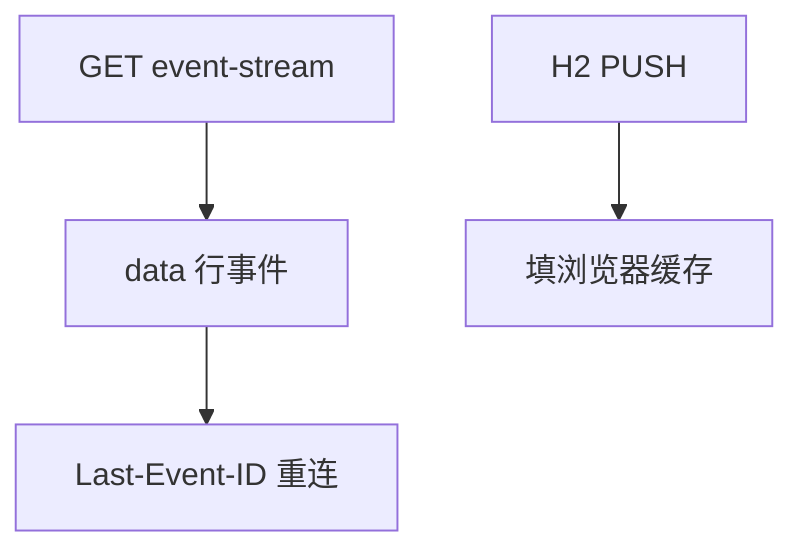

# SSE 与服务器推送

SSE 用一条永不结束的 HTTP 响应流文本事件；HTTP/2 服务器推送则预推缓存资源，对象不同，都常被误叫「推送」。

<footer>—— 据 W3C Server-Sent Events；RFC 9113 服务器推送整理</footer>

[WebSocket](/cs/websocket) 是双向帧。[上一课](/cs/websocket) 对只读更新偏重。缺口是 **SSE** 与 **H2 PUSH** 对照：一个是事件流，一个是推资源。本课不把 gRPC 写完。

## 问题

股票 ticker、通知：服务器 → 客户端即可。SSE：`text/event-stream`，chunked 或 H2 流上发 `data:` 行，浏览器自动重连并带 `Last-Event-ID`。仍是 HTTP 语义，过代理比 WS 容易。H2/H3 的 PUSH：服务器猜测下一资源推进缓存，实现与隐私问题导致浏览器削弱——不是 SSE 替代。

不要把 SSE 写成 WebSocket 的子集协议。

WHATWG/W3C SSE。H3 不用 H2 那种 PUSH，点名。本课不写 EventSource API 全集。

### 单向事件流

持久 GET，自动重连带 Last-Event-ID。H2 PUSH 是资源预推，对象不同。代理缓冲会把实时变成批量。

## 方法

对照：轮询 / SSE / WS / H2 PUSH。画：GET 事件流 → 多 event 块。与 Cookie：同一请求会话。压缩：对事件流要小心缓冲延迟。

方法止于选定对象与对照；机制才说它如何嵌入已有分层与主干课。

## 机制

反向代理要关缓冲，否则 SSE 变成批量。负载均衡空闲超时会拆流，要心跳注释行。HOL：H1 上 SSE 占一条持久连接。无线：重连风暴。与 QUIC 多流：可用专用流跑 SSE 风格。

H2 PUSH 与 CDN 预取后课相关，不是实时消息。

## 边界

本课不引入 MQTT 的全部。REST 与 gRPC 是下一课。后课默认：SSE 是单向 HTTP 事件流；PUSH 是资源预推。

把所有实时都升级到 WS 会浪费。

上一课留下的缺口在本课收口；「SSE 与服务器推送」进入后课词汇表后只引用。文献用来钉对象与边界，不把本课写成该主题的独立综述。下一课[REST 与 gRPC](/cs/rest-grpc)。

## 小结

- SSE：持久 GET，文本事件，易过 HTTP 中间件。
- H2 PUSH：资源，不是消息总线。
- 代理缓冲与超时是部署坑。
- 后课只引用本课钉死的对象，不从该领域总问题重开。
- 出处：W3C SSE；RFC 9113。
