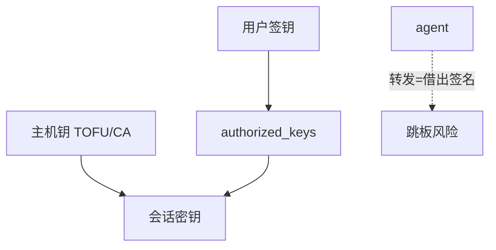

# SSH 密钥认证

SSH 用主机钥钉服务器身份，用用户钥或证书代替口令。agent 转发、已知主机文件与授权文件的权限，比再选一种分组密码更能决定这次登录是否被掉包。

<footer>—— RFC 4251–4254；Ylonen and Lonvick；对照 OpenSSH 的认证模型</footer>

## 定位

上一课[TLS 攻击史](/cs/tls-attack-history)收的是 Web 信道。缺口是**运维信道**：SSH 不走 PKI 浏览器锚，而走 first-contact TOFU 与 `authorized_keys`。不重写 AEAD。

后课默认已经读完本课钉下的合同，只补差，不从该领域第一性原理重开。

## 问题

口令登录把[口令与加盐](/cs/password-salt)问题搬到每个 sshd。公钥认证：用户持签钥，服务器存公钥。主机钥不匹配应中止——TOFU 在第一次无法防中间人。缺口是信任启动与 agent 的委托范围，不是再讲握手字节。

### 不要转发 agent 到不可信跳板

agent 转发等于把签名能力借出。跳板被占则用户钥被当签具。

RFC 4252 认证。OpenSSH 证书是另一 CA 模型，与 X.509 平行。本课不写暴力破口令的字表。

## 方法

分主机认证与用户认证。known_hosts 钉指纹；CA 签主机钥可规模化。权限：`.ssh` 过宽则密钥文件被换。对照 WireGuard：双方静态钥，模型更简单。

图中节点是本课的机制骨架；课程不把图展开成可运行的攻击步骤。

## 机制

管理面是高价值会话：一次登录等于 root 路径。密钥口令短语与硬件令牌把签钥关进第二因素。下一课 IPsec：网关到网关的 SA，不是交互式 shell。

前提写进合同之后，游戏外的误用只当失败模式点名，不在本课写成操作程序。

## 边界

本课不把全部 KEX 算法列菜单。IPsec 与 IKE 下一课：UDP 上的协商与 SPD。

## 小结

- TLS 服务万维网；SSH 钉运维身份。
- 主机钥 TOFU 弱在第一次；用户钥代替口令。
- agent 转发是委托，不是免费便利。
- 下一课 IPsec 与 IKE。
- 出处：RFC 4251–4254；OpenSSH 手册；对照 Anderson 对 TOFU。
