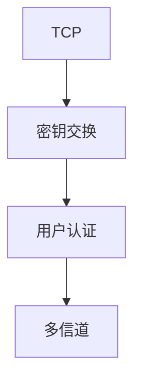

# SSH 协议

SSH 在一条 TCP 上先密钥交换再开信道：会话、端口转发、SFTP 都是信道类型，不是三个端口三个协议。

<footer>—— 据 RFC 4253 SSH 运输；RFC 4254 连接协议整理</footer>

[TLS 入口](/cs/http-tls-entry) 保护 HTTP。[上一课](/cs/spf-dkim-dmarc) 是邮件。缺口是**交互登录与隧道的 SSH**：版本交换、KEX、认证、多信道。本课不把 NTP 写完。

## 问题

telnet 明文。SSH：二进制包，运输层加密完整性，然后用户认证（公钥/密码），再 multiplex 信道。端口转发把其它应用塞进这条管道，像应用层 GRE。与 QUIC 对照：都有加密+多流，SSH 更老、跑 TCP，有 TCP HOL。主机密钥钉防中间人，类似证书钉但常 TOFU。

不要把 ssh 命令行选项当协议规范。

RFC 4251–4254。本课不写爆破密码的操作。

### 加密运输加多信道

转发是信道不是独立端口协议。主机密钥 TOFU 防中间人。TCP-over-TCP 当 VPN 有代价。Nagle 对按键有害。

## 方法

画：TCP 22 → KEX → 认证 → 信道。对照 HTTPS：证书 PKI vs known_hosts。与 keepalive：SSH 有应用层 ping。

方法止于选定对象与对照；机制才说它如何嵌入已有分层与主干课。

## 机制

Nagle 对按键延迟有害，SSH 常关。窗口与流量控制在信道上。TSO 对小交互帮助有限。跳板与 ProxyJump 是会话层，不是 BGP。安全：认证失败限速，不写绕过。

SFTP 是子系统，不是另起 FTP 课的被动模式。

## 边界

本课不引入 SSH 证书 CA 的全部。NTP 是下一课。后课默认：SSH = 加密运输 + 认证 + 多信道。

把 SSH 当通用 VPN 要接受 TCP-over-TCP 的性能。

上一课留下的缺口在本课收口；「SSH 协议」进入后课词汇表后只引用。文献用来钉对象与边界，不把本课写成该主题的独立综述。下一课[NTP](/cs/ntp)。

## 小结

- 一层加密运输，上面多信道。
- 主机密钥钉身份。
- 转发是信道，不是独立协议。
- 后课只引用本课钉死的对象，不从该领域总问题重开。
- 出处：RFC 4253；RFC 4254。
