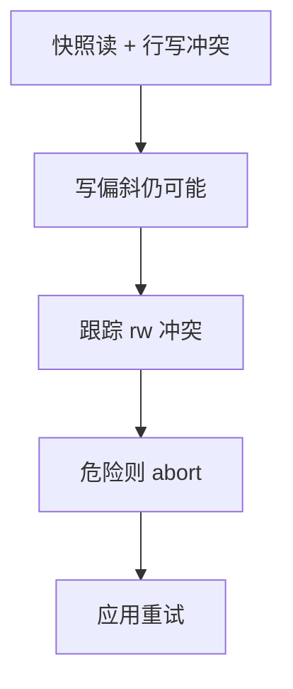

# SSI

快照隔离避免脏读与大部分幻象，仍允许写偏斜。SSI 跟踪读写冲突，在形成危险结构时 abort 一侧，换近似可串行。

<footer>—— 据 Cahill, Röhm and Fekete, Serializable Snapshot Isolation, SIGMOD 2008；Postgres SSI；Fekete 等对 SI 异常</footer>

[上一课](/cs/occ)在提交点验证读集。本课站在已实现的 [快照隔离](/cs/snapshot-isolation) 上补可串行：串行快照隔离（SSI）。主干 [写偏斜](/cs/phantom-write-skew) 已命名异常。缺口是运行时检测，不是再举医生值班例子。

## 问题

SI：读自己快照，写冲突用行版本检测（第一提交者赢）。写偏斜：两事务读同一快照、写不同行，合起来违反约束。SSI：记录事务间 rw-conflict（$T_1$ 读了 $T_2$ 将写或已写的版本关系），若出现「危险结构」（近似两个 rw 边形成的威胁），abort 一个。缺口是**假阳性**：可能 abort 本可串行的事务，换简单检测。

Postgres `SERIALIZABLE` 即 SSI 实现。真正 2PL 可串行更少假阳性、更多阻塞。

Cahill, Röhm, Fekete, SIGMOD 2008。Ports and Grittner 描述 Postgres SSI。本课不把每个危险结构变体画完，只钉：SI + 冲突监视 ≈ 可串行目标。

## 方法

事务结束时看 in/out 冲突标志。只读事务可在有时免 abort（安全快照）。索引范围：用 SIREAD 锁一类记录「扫过的间隙」，插入者与扫者冲突——与后课间隙/谓词锁交界。

失败：`40001` 序列化失败，应用重试。这是接口，不是优化器问题。

## 机制

与 OCC：SSI 不记全读集值，而记账冲突边，内存更轻，假阳性不同。与 TSO：不必全局戳序安装，保留 SI 的读不阻塞写。长只读：后课快照；SSI 下只读仍可能被标危险，实现尽力豁免。

性能：冲突多时 abort 风暴，热点应缩小事务或改悲观。

## 边界

本课不讲意向锁粒度。也不把 SSI 当分布式默认——分布式 SI 更难，Spanner 后课用真时间。谓词锁下一课族。

后课默认：要可串行优先 SSI 或 2PL，不要把 SI 叫 serializable。意向锁：多粒度锁从行走到表。

写偏斜不是幻读的同义词；SSI 两者都盯。

## 小结

- SSI 在 SI 上监视 rw 冲突以抑制写偏斜。
- 假阳性 abort，应用必须重试。
- 意向锁与粒度下一课。
- 出处：Cahill et al. SIGMOD 2008；Postgres SSI；Fekete。
