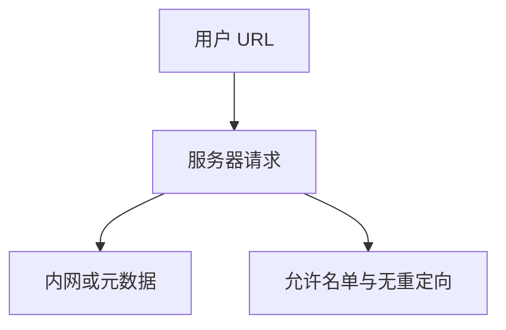

# SSRF

服务器若把用户供给的 URL 拿去自己请求，就把防火墙后面的身份借给了输入。防御是允许名单、禁内网与重定向，而不是事后看返回体像不像 HTML。

<footer>—— 据 OWASP SSRF；CWE-918；对照[注入](/cs/injection-boundary)</footer>

## 定位

上一课[点击劫持](/cs/clickjacking)借用户手指。缺口是**借服务器的网络位置**。云元数据、内网管理口是典型受害者。不给打内网的步骤。

后课默认已经读完本课钉下的合同，只补差，不从该领域第一性原理重开。

## 问题

Webhook、预览、换图：应用去抓 URL。若跟重定向、改写 IP、DNS 再绑定，允许名单会被绕——只陈述要钉死解析与禁止私网段。缺口是出站策略。

### 元数据服务

云实例角色凭证常在链路本地。SSRF 的危害是身份，不只是读 HTML。

CWE-918。课程禁止 SSRF 打靶教程。防御：允许名单主机、禁重定向、隔离出站。

## 方法

对照浏览器 CORS：那是读别人；SSRF 是服务器当客户端。下一课反序列化：输入变成对象图与代码路径。

图中节点是本课的机制骨架；课程不把图展开成可运行的攻击步骤。

## 机制

最小特权：应用默认不应能碰元数据与管理网。网络分段后课会再收。反序列化下一课是进程内的输入变对象。

前提写进合同之后，游戏外的误用只当失败模式点名，不在本课写成操作程序。

## 边界

不写元数据利用步骤。反序列化下一课。

## 小结

- 点击借用户；SSRF 借服务器出站。
- 允许名单、禁私网、慎重定向。
- 危害常是云身份，不只是页面。
- 下一课反序列化。
- 出处：CWE-918；OWASP SSRF。
