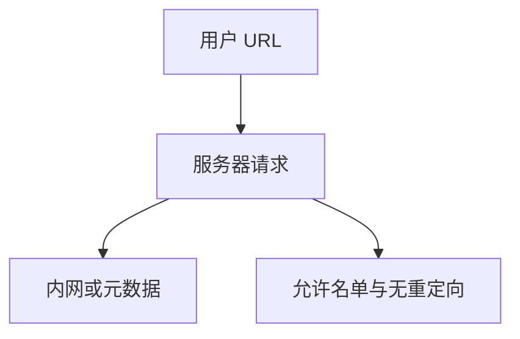
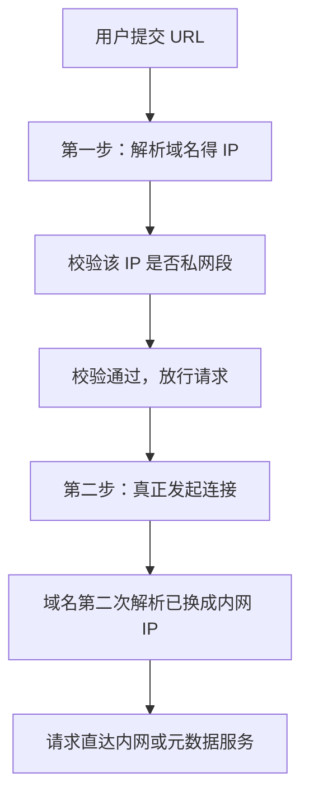

# SSRF

服务器若把用户供给的 URL 拿去自己请求，就把防火墙后面的身份借给了输入。防御是允许名单、禁内网与重定向，而不是事后看返回体像不像 HTML。

<footer>—— 据 OWASP SSRF；CWE-918；对照[注入](/cs/injection-boundary)</footer>

上一课[点击劫持](/cs/clickjacking)借用户手指。缺口是**借服务器的网络位置**。云元数据、内网管理口是典型受害者。不给打内网的步骤。

后课默认已经读完本课钉下的合同，只补差，不从该领域第一性原理重开。

## 问题

Webhook、预览、换图：应用去抓 URL。若跟重定向、改写 IP、DNS 再绑定，允许名单会被绕——只陈述要钉死解析与禁止私网段。缺口是出站策略。

SSRF 的直觉类比：让公司保安替一个陌生访客去送信。保安有进机房的门禁卡（服务器的内网身份），而信的内容和地址是外人写的——门禁再严，执行者被骗了就等于没设防。所以防线必须在「接单」这一步：只送白名单地址的信，而不是事后检查信封好看不好看。

### 元数据服务

云实例角色凭证常在链路本地。SSRF 的危害是身份，不只是读 HTML。

为什么重要：云元数据服务（如 169.254.169.254）会直接返回该实例的临时访问凭证。一次看似「只是读了个内部页面」的 SSRF，实际效果可能是攻击者拿走整台实例的云角色——能读对象存储、能调管理 API。危害评估时按「身份泄露」算，不按「信息泄露」算。

CWE-918。课程禁止 SSRF 打靶教程。防御：允许名单主机、禁重定向、隔离出站。

## 方法

对照浏览器 CORS：那是读别人；SSRF 是服务器当客户端。下一课反序列化：输入变成对象图与代码路径。

```mermaid
flowchart TD
  URL["用户 URL"] --> APP["服务器请求"]
  APP --> INET["内网或元数据"]
  APP --> ALLOW["允许名单与无重定向"]
```

## 机制

最小特权：应用默认不应能碰元数据与管理网。网络分段后课会再收。反序列化下一课是进程内的输入变对象。

```mermaid
flowchart TD
  INPUT["用户提交 URL"] --> RESOLVE["第一步：解析域名得 IP"]
  RESOLVE --> CHECK["校验该 IP 是否私网段"]
  CHECK --> PASS["校验通过，放行请求"]
  PASS --> FETCH["第二步：真正发起连接"]
  FETCH --> REBIND["域名第二次解析已换成内网 IP"]
  REBIND --> REACH["请求直达内网或元数据服务"]
```

DNS 再绑定就是上图的两步坑：校验用第一次解析的结果，请求时域名又解析了一次，两次答案可以不一样——「域名没变，门牌换了」。防御不是把校验写得更聪明，而是消除两步：钉死一次性解析（校验用的 IP 就是连接用的 IP），或出站走代理、由代理统一执行私网段拦截。

## 边界

不写元数据利用步骤。反序列化下一课。

## 小结

- 点击借用户；SSRF 借服务器出站。
- 允许名单、禁私网、慎重定向。
- 危害常是云身份，不只是页面。
- 下一课反序列化。
- 出处：CWE-918；OWASP SSRF。
