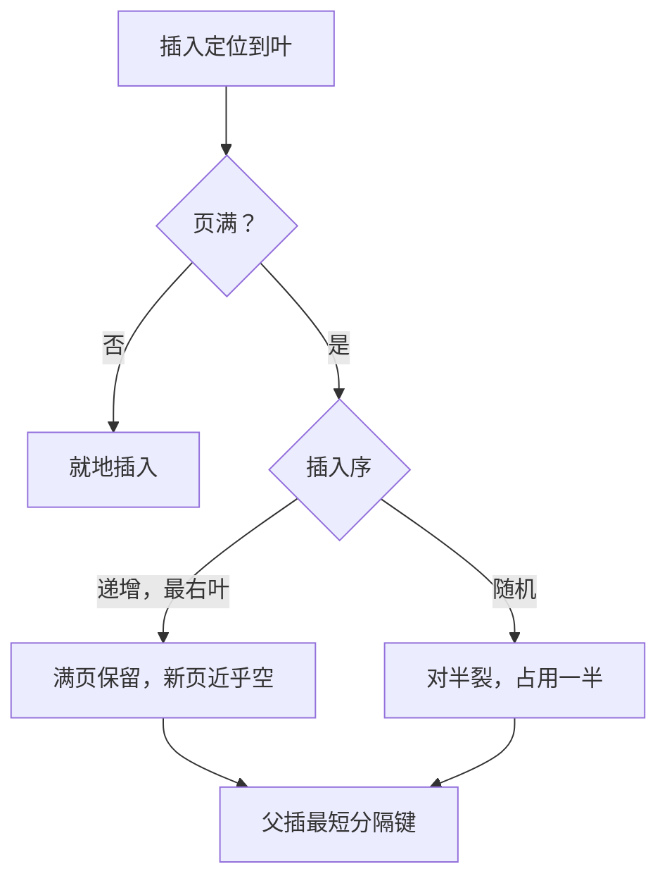
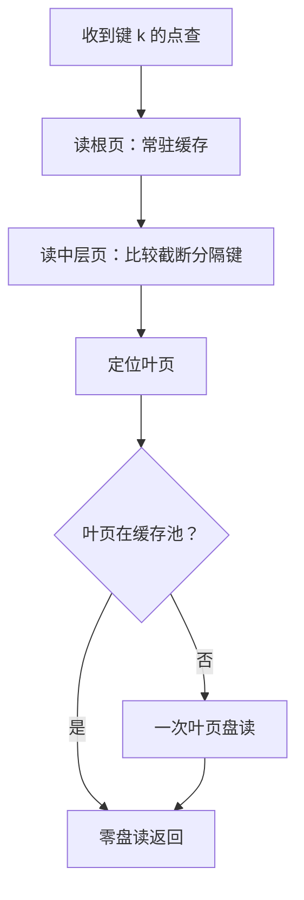

# B+ 树的实现细节

教科书只保证 B+ 树是平衡的；实现者真正签字的地方是页多大、分隔键留多长、叶子填多满——同一棵树，签错一处随机写吞吐差几倍。

<footer>—— 据 Comer, The Ubiquitous B-Tree, 1979；Graefe, Modern B-Tree Techniques, 2010；InnoDB 与 PostgreSQL 文档整理</footer>

[上一课](/cs/st-lsm-deep)把 LSM 的三本放大账立了起来：写放大要做预算、停顿是流控、排序是有成本的决策。本课转到另一族结构。主干已钉过 [B 树与外存](/cs/btree-external)的高扇出压高度、[B+ 树作为结构](/cs/bplus-as-ds)的叶链布局、[B+ 分裂与合并](/cs/bplus-split)的维护机制与祖先写放大、[latch crabbing](/cs/latch-crabbing) 的并发耦合。本课不重讲正确性，写的是实现者真正签字的四份合同：页大小怎么选、变长键怎么放、填充率怎么定、装载怎么走。后课默认：B+ 的实现差异足以让同一种结构在不同负载下差出数倍。

## 问题

同样的 B+，换一种实现随机写吞吐能差数倍，缺口在四处。其一，页大小：16 KiB 与 8 KiB 的盘型适配、缓存粒度、单页写放大互相牵制，没有免费的选项。其二，变长键：内节点的分隔键其实不必是任何真实键，只要足以分路——留整键是浪费扇出。其三，填充率：顺序递增键全部落在最右叶，页反复分裂再回填；随机键让每页半满，空间翻倍。其四，装载：逐条插入一棵空树，分裂把占用率钉在六七成；自底向上建树可以近满。这四处的共同点是：结构课的正确性对它们都沉默。

## 方法

页大小的预算账：扇出 $f$ 约等于页大小 $P$ 除以键加指针的平均字节数 $s$。16 KiB 页、每项约 16 B 时扇出上千，三层可指称十亿行量级，根与内层常驻缓存后，点查只剩一次叶页读。数字实例：16 KiB 页、每项约 16 B，扇出约 1000。三层树根下有 1000 个中层节点、中层共有约 100 万个叶页、叶层覆盖约 10 亿行。根与中层常驻缓存后，一次点查只需读 1 个叶页——树高每降一层，省的就是一次随机盘读。页加大树更矮，但每次页写携带更多无关键，页级写放大随之上涨——闪存介质对这一项另有一份收费，下一课细算。

分隔键的截断：孩子之间的真实边界是右孩子的最小键，内节点只需存任一落在区间内的值。把分隔键截到足以区分左右的最短前缀，内节点容量上升、扇出上升、树更矮。变长键场景下，前缀压缩再省一遍。判定只依赖比较，不依赖键值本身，这是截断合法的全部理由。常见误区：初学者容易以为内节点必须存完整的真实键。实际上分隔键只要落在左右孩子的键值区间之间即可，截成最短前缀不改变任何查找结果——比较只问「走左还是走右」，不问这个值是否真的存在。

填充率与分裂点的选择：分裂不必永远对半。递增键写最右叶时，实现可以整页写满、新页几乎空着，顺序装载的占用率接近百分之百；随机键对半裂，占用率一半，是「给未来插入留白」的定价。主键选了随机 UUID 再抱怨写散页满，是索引组织表课已经警告过的错。空库装载走排序后自底向上：叶层近满、内节点一次写就，I/O 是顺序的——导入用建索引代替逐行插入，是这个原理的工程形式。

## 机制

四处细节是同一机制的四张脸：B+ 树把磁盘收费单位（页）当作一切决策的原子，实现是在「每页带多少无关键」与「未来写要付多少分裂」之间定价。页大，扇出高、读路径短，但页内无关键陪写、缓存粒度变粗；分隔键短，扇出再高一层，但查找语义完全不变；填充率是空间换未来写 I/O：满叶立刻分裂，半满叶给每次插入预留了未来。非唯一二级索引还可以把「页不在池里」的插入先记进 change buffer，读到此页再合并——把随机读推迟，与上一课 LSM 把随机写改顺序是同一个思路在不同结构里的落点。

直觉类比：半满分裂像停车场留白——每排只停一半车，新车随到随停；排排停满，每来一辆就得把整排拆成两排。多占的空间买的是未来插入的免折腾，随机键负载里这笔租金常常是值的。

易错点：用自增主键跑出漂亮的顺序装载曲线，再换 UUID 复用同一份容量规划——占用率从近满掉到一半，空间与缓存预算双双翻倍，优化器统计却未必同步。

## 边界

本课不重讲分裂与合并的正确性（[B+ 分裂与合并](/cs/bplus-split)已钉）、不进 latch 协议（[latch crabbing](/cs/latch-crabbing) 与 [Bw-tree](/cs/bw-tree) 各有专课）、不做缓存无关布局（另有 [缓存无关结构](/cs/cache-oblivious)）。页内变长记录的槽位管理是页布局课的对象。后课默认：B+ 的页就是 I/O 单元，「页可原地覆盖读写」是这份合同成立的前提。下一课去问介质：这个前提在闪存上要收多少税。

## 小结

- 页大小是三方预算：扇出与树高、页级写放大、缓存粒度，没有全赢的选项。
- 内节点只需最短分隔键，截断合法因为查找只做比较；扇出白捡。
- 分裂点按插入序定价：递增键近满叶，随机键半满叶，容量规划要跟着变。
- 装载走排序加自底向上建树；change buffer 把非唯一二级索引的随机读推迟。
- 出处：Comer, *CSUR* 1979；Graefe, *Modern B-Tree Techniques*, 2010；InnoDB、PostgreSQL 存储文档。
