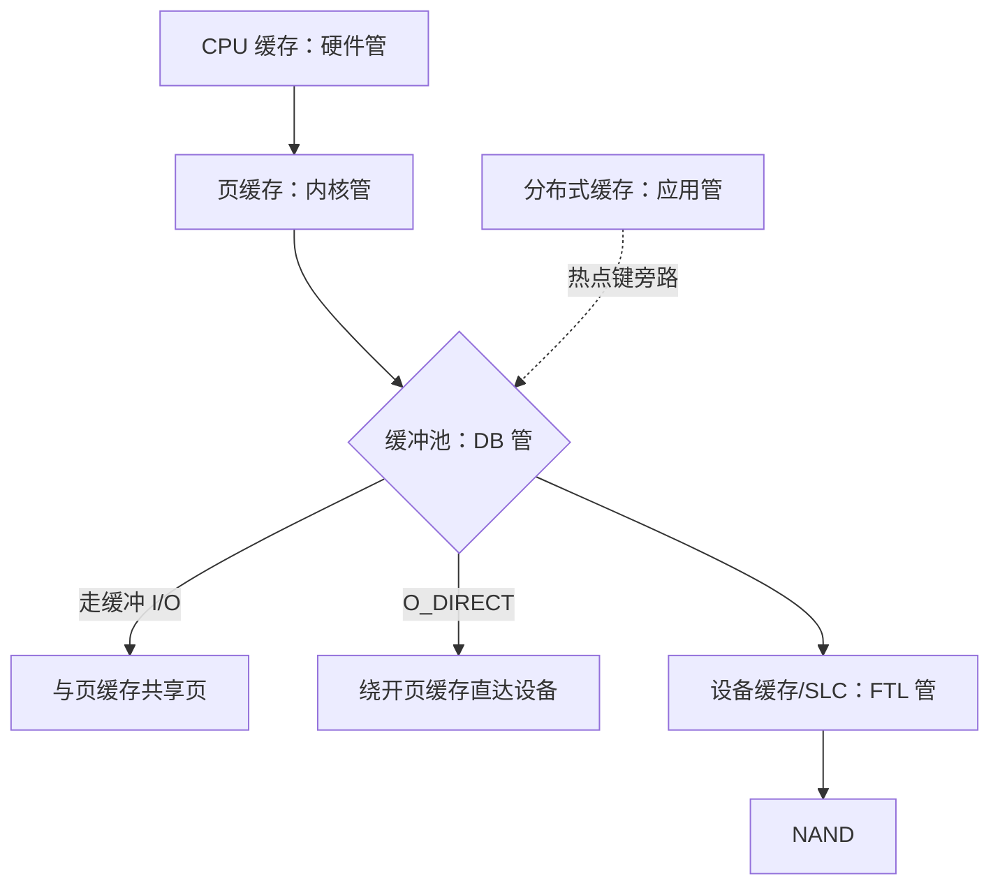

# 缓存的层次

存储栈上每一层缓存都有自己的主人：硬件管 CPU 缓存，内核管页缓存，数据库管缓冲池，应用管分布式缓存。层是各自为政的，拼起来的图才是一等研究对象。

<footer>—— 据 Denning, CACM 1968；*OSTEP*；InnoDB 与 PostgreSQL I/O 文档整理</footer>

[上一课](/cs/st-compressed-columnar)收在列块的编码-压缩栈。栈的两头都是缓存：热页在 CPU 缓存里也在缓冲池里，页在缓冲池里也可能在页缓存里，热点键还在另一台机器的缓存里。主干已有各层的单课：[页缓存](/cs/page-cache)、[缓冲池 LRU-K](/cs/buffer-pool-lru-k)、[bcache](/cs/bcache)、[CDN 缓存层次](/cs/cdn-cache-hierarchy)。本课不重讲单层，把层叠起来，回答两个只有叠起来才存在的问题：同一份数据被两层缓存的双重浪费怎么办、写怎么保证跨层一致。后课默认：层间决策（准入、旁路、绕开）与层内替换同样是设计对象。

## 问题

单层视角有两个盲区。盲区一是双重缓存：数据库缓冲池与内核页缓存各存一份热点页，内存减半、替换策略互相看不见。PostgreSQL 走缓冲 I/O 把替换交给操作系统；InnoDB 可用 O_DIRECT 绕开页缓存。绕开拿回的是「内存只存一份、写回时机可控」，付出去的是内核的预读与共享缓存。两条路都成立，唯独「两层都全量缓存」是纯粹的浪费——这笔浪费在内存对账时以「缓存命中率虚高、实际穿透更多」的面目出现。盲区二是写路径：WAL 顺序写进页缓存，提交要 fsync 落盘，脏数据页异步回写；层与层之间「已见」的顺序必须用写屏障钉住，断电重放时才有一个一致的根——这些机制主干已钉，本课要的是层间的账。

## 方法

先画图再算账。同一份数据从快到慢经过：CPU 缓存（硬件自动，纳秒）、页缓存（内核，按文件偏移）、缓冲池（数据库，按页号，可与页缓存二选一或叠加）、设备侧缓存与 SLC 区（FTL 管理）、分布式缓存（应用管理，按键，跨网络）、CDN（边缘，按 URL）。每层有自己的替换策略与准入规则，且互相不可见。期望延迟按穿透概率复合：若命中代价 $0.1\ \mu s$、下层设备 $100\ \mu s$，命中率 $99\%$ 时平均约 $1\ \mu s$，$98\%$ 时约 $2\ \mu s$——每差一个百分点，平均延迟翻一倍。容量规划因此先算 miss 税：一层 $20\ \mu s$ 级的 SSD 缓存值得插入，当且仅当它吃掉的 miss 比例乘以DRAM 层的 miss 代价，大于它自己引入的复杂度。

## 机制

层间决策的机制有三种名字。准入：什么值得进这一层——bcache 对顺序流旁路，防止一次全表扫描把热页冲走，与缓冲池对付扫描用 LRU-K 是同一问题在层间的投影。旁路：O_DIRECT 绕开页缓存、DAX 直接映射持久内存，绕开的本质是把这一层的职责合并进上一层，减少一次翻译与一份副本。写一致：各层副本的先后由写路径纪律保证——WAL 先落、脏页后回、屏障钉序，任何一层都不能自行「提前可见」到破坏这个顺序的程度；读路径不广播失效，因为单机内层间的失配靠重读自然修复，跨机的失效才需要协议（分布式缓存失效另课已钉）。层存在的合法性统一成一个判据：这一层比下一层快得多、比上一层大得多，且有人愿意为它的替换策略负责。

数字锚点：DRAM 约 $100\ \mu s$ 的百分之一、NVMe 读约 $10$–$100\ \mu s$、跨机缓存往返 $0.1$–$1\ ms$——每层的延迟差是两到三个数量级，所以命中率报表上一个小数点的挪动，等价于换一代硬件。

## 边界

本课不重讲单层机制：页缓存的回写、缓冲池的 pin 与 latch、bcache 的 writeback、CDN 的失效各有专课；CPU 缓存的实现与假名另属体系结构课；分布式缓存的一致性协议不展开。本课钉的是层间的三张决策：准入、旁路、写序。后课默认：单机栈的层次图已经拼完。下一课把这页纸带进集群：单机的页、日志与格式在分布式里如何成为四个案例。

## 小结

- 每层缓存有各自的主人、策略与盲区；层间图是研究对象，单层机制是前置。
- 双重缓存必须表态：缓冲 I/O 或 O_DIRECT 二选一，两层全量缓存是纯浪费。
- 期望延迟按 miss 概率复合：命中率差一个百分点，平均延迟可以差一倍。
- 层间三决策：准入（防扫描污染）、旁路（减少翻译与副本）、写序（屏障钉住跨层顺序）。
- 出处：Denning, CACM 1968；*OSTEP*；InnoDB、PostgreSQL I/O 文档；Linux page cache 语义。
