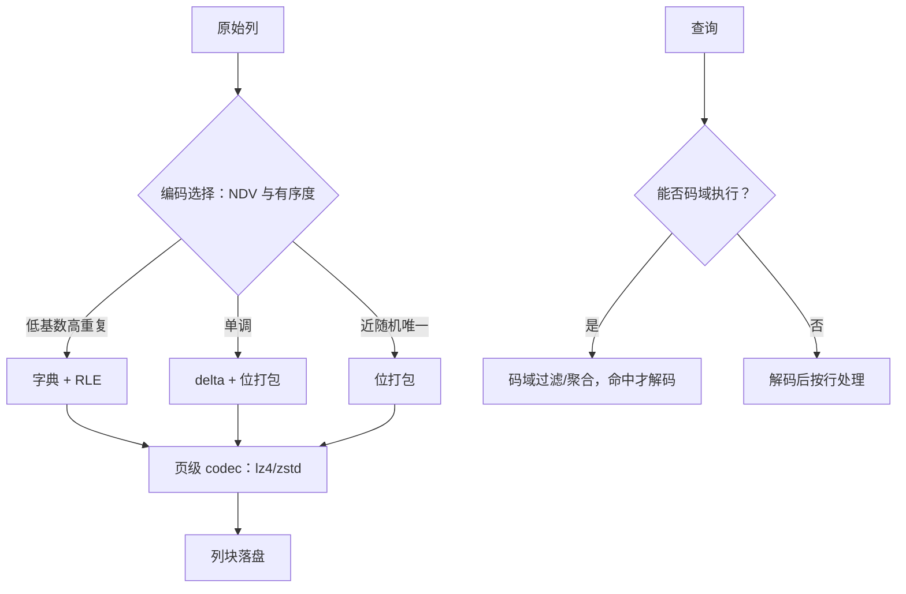

# 压缩列存

编码与压缩是两层而非一个旋钮：编码把列变成小整数与重复结构，通用压缩再压一遍字节。压缩比与扫描速度是联合设计，不是分开调的两个参数。

<footer>—— 据 Abadi, Madden and Ferreira, CIDR 2006；Zukowski et al., CIDR 2005；Apache Parquet 文档整理</footer>

[上一课](/cs/st-parquet-anatomy)解剖到列块为止，列块内部是编码与压缩的两层栈。主干已钉过 [列压缩：字典、RLE、位打包](/cs/column-compression) 的三种语义编码如何服务扫描与过滤、编码选择看 NDV 与有序度。本课不再定义编码，问三层更深的账：语义编码与字节级压缩怎么叠、排序怎么变成压缩、查询怎么在码域完成而迟迟不解码。后课默认：列块的编码-压缩栈是读写合同的最后一段，选择它就是选择扫描的执行方式。

## 问题

第一个坑是把两层当一层。语义编码（字典、RLE、delta、frame-of-reference、位打包）可逆且保持列语义，把高熵字符串换成小整数、把重复暴露成游程；字节级 codec（snappy、lz4、zstd）对页再做一遍熵压缩。问「zstd 是不是比 RLE 好」是错的问题——它们作用在不同层，混用判断会让引擎既丢掉码域执行，又拿到更慢的解码。第二个坑是解压吞吐：单核 lz4 解压以 GB/s 计，zstd 以数百 MB/s 计，而内存带宽十 GB/s 量级——编码选错，扫描瓶颈就从 I/O 挪到解压，压缩比再漂亮也是负资产。第三个坑是乱序：同一列，有序时 RLE 收益巨大，乱序时字典或许尚可，硬上 RLE 只是白写白读。

## 方法

决策按下游算子倒推。先看谓词与聚合：过滤条件与分组键若能落在字典码上，过滤与聚合就成了整数运算，原值只在投影出口解码，且只解码命中行——这是延迟物化的执行形态。再看分布：低基数高重复选字典加 RLE，单调列选 delta 加 frame-of-reference，近随机唯一列只剩位打包加字节压缩。然后定排序：复合排序键把常一起过滤的列放前面，前列等值时后列局部有序，RLE 与字典的收益从前列传导到后列；跨行组用区间聚簇、行组内排序，两段配合也喂饱了上一课的页级统计。最后叠 codec：语义编码已把结构暴露，页级压缩常取中低级别——zstd 的解压速度对压缩级别不敏感，编码端才敏感，扫描型负载吃亏在哪一端要先测再定。

## 机制

两层栈有效的机制在于熵的搬运：字典把随机字符串的熵集中到码本、把列体变成低熵整数流；codec 恰好吃低熵与长重复。跳过语义编码直接压原始字节也能压，但码域过滤与延迟解码随之消失——执行器从此必须解压才能判断。所以压缩比与执行是联合设计：一个数列若能用 1–2 字节的位打包表示，多数谓词不必解压就能评估；用 zstd 硬压到类似大小，则每个谓词都欠一次整页解压。排序是唯一的免费午餐：它同时改善编码收益、页级统计与区间跳过，代价只在写入端付一次。

数字锚点：4 字节时间戳列经 delta 加 frame-of-reference 常可压到 1–2 字节每值，且等值过滤在打包域即可完成；直接 zstd 压原始字节虽可达相近大小，但每个谓词都要付整页解压。

## 边界

本课不重讲三种语义编码的定义（[列压缩课](/cs/column-compression)是前置），不进向量化执行引擎的完整展开，也不比 Parquet 与 ORC 的编码开关细节。压缩域执行到此只到「码域谓词与延迟物化」，join 与聚合在压缩域的进一步展开不属本课。后课默认：列块的编码-压缩栈已定，扫描的代价模型按「码域完成多少」重新校准。下一课把视野拉回整条存储栈：各层缓存怎么拼成一张层次图。

## 小结

- 编码与压缩是两层：语义编码保可逆与列语义，codec 对页再做熵压缩，不可混为一谈。
- 解码吞吐是预算：编码选错，扫描瓶颈从 I/O 挪到解压。
- 编码按下游算子倒推：谓词能落码域，过滤与聚合就是整数运算，命中才解码。
- 排序是免费午餐：前列等值让后列局部有序，编码、统计、跳过三处同赚。
- 出处：Abadi, Madden and Ferreira, CIDR 2006；Zukowski et al., CIDR 2005；Apache Parquet 文档。
