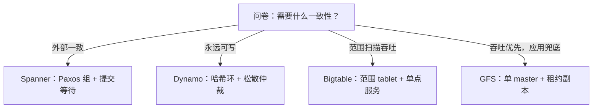

# 分布式存储的案例

GFS、Dynamo、Bigtable、Spanner 回答的是同一份问卷：元数据谁管、数据怎么切、一致性卖到哪一级、失败假设是什么。四个答案互不相让，因为各自签的产品不同。

<footer>—— 据 Ghemawat et al., SOSP 2003；DeCandia et al., SOSP 2007；Chang et al., OSDI 2006；Corbett et al., OSDI 2012 整理</footer>

[上一课](/cs/st-cache-tiers)把单机栈的层次图拼完：页、日志、格式、缓存各归其位。机器多于一台时，这页纸要重新签。主干已钉过部分条款：[分布式文件与元数据](/cs/distributed-fs-metadata)的元数据集中度、[Bigtable](/cs/wide-column-bigtable) 的有序行键与列族、[S3 对象存储语义](/cs/object-storage-s3)、[存算分离](/cs/storage-compute-separation)。本课程倒数第二课读四个案例，把它们当同一份问卷的四份答卷来读：不是史实罗列，而是读出「取舍即产品定义」。后课收束。

## 问题

问卷四问。一问元数据：谁来回答「这段数据在哪」。二问切分：按范围还是按哈希，一片数据几个副本、谁主写。三问一致性：卖到最终一致还是外部一致，冲突留给谁。四问失败假设：组件按常坏设计还是按可信任设计。四问的答案组合就是产品：批处理为主的数据湖、购物车必须永远可写、万亿级行键扫描、全球金融级强一致，各自指向不同的组合。缺口是把这些组合放一张桌上对读，看每一家在哪一问上收、在哪一问上付。

## 方法

GFS 先答：单 master 把全部元数据放进内存，数据切成 64 MiB chunk 三副本，租约指定主副本；一致性只卖到「记录追加至少一次」，副本间可能不一致，散射与去重留给应用。付的是元数据服务的单点语义、收的是简单与吞吐——失败假设是组件常坏，检测比预防便宜。Dynamo 换卷：去中心，一致性哈希定环上位置，偏好列表放 $N$ 副本，读写用松散仲裁 $R+W \gt N$，向量时钟存版本、hinted handoff 兜节点故障、Merkle 树做反熵；一致性只卖最终一致，冲突合并交给客户端。收的是永远可写，付的是冲突语义外泄到业务层。Bigtable 折中：tablet 按行键范围切、单点服务，位置表两级、根挂 Chubby，数据落 GFS；单行原子、批无跨行事务，收范围扫描的有序性。Spanner 加码：每个分片一组 Paxos，跨组两阶段提交，TrueTime 给时间戳加不确定区间，提交等到「时刻 $s$ 确定已过去」才完成——外部一致是买来的，价格是每次提交等待 $\epsilon$，以及部署 GPS 与原子钟的基础设施。

## 机制

四份答卷共享三个机制判断。其一，元数据集中度决定故障域与规模上限：GFS 的单 master 简单、但 master 的内存是 chunk 数量的天花板；Bigtable 的两级位置表把「谁服务这片」与「数据在哪」分开，是 [存算分离](/cs/storage-compute-separation)的雏形。其二，一致性级别与延迟直接挂钩：Spanner 的提交等待把时钟不确定度变成了每个事务的税，Dynamo 把仲裁降级成可用性，本质都是「一致性卖到哪级，延迟就在哪级收钱」。其三，副本数与冗余方式是失败假设的函数：GFS 时代顺序读为主，三副本够用；对象存储时代随机访问为主、容量便宜，纠删码接替三副本——[S3 的语义课](/cs/object-storage-s3)钉的正是这一步。案例读法至此成形：先问产品要什么，再倒推四问的答案，而不是相反。

数字锚点：GFS 的 64 MiB chunk 是为顺序扫描定的粒度，放到随机小读负载上就是元数据放大与热点；粒度是负载假设的化石——读案例先读它的失败假设。

## 边界

本课不重讲各系统内部：Bigtable 的 LSM tablet、S3 的语义、元数据层的做法各有专课；一致性理论的证明与 CAP 的推导不属本课；不写云厂商的现状对照。四个案例也不是终点：NewSQL、日志即数据库、湖仓一体都是问卷的新答卷，本课程把它们留给读法而不是罗列。下一课收束整门课程。

## 小结

- 四问问卷：元数据归属、切分方式、一致性级别、失败假设；答案组合即产品定义。
- GFS 卖吞吐留不一致给应用；Dynamo 卖可写把冲突外泄；Bigtable 卖范围有序；Spanner 买外部一致付提交等待。
- 元数据集中度决定故障域；GFS 单 master 与 Bigtable 位置表是两个极端的折中谱。
- 冗余方式随失败假设与负载演进：三副本到纠删码是负载假设变了。
- 出处：Ghemawat, Gobioff and Leung, SOSP 2003；DeCandia et al., SOSP 2007；Chang et al., OSDI 2006；Corbett et al., OSDI 2012。
