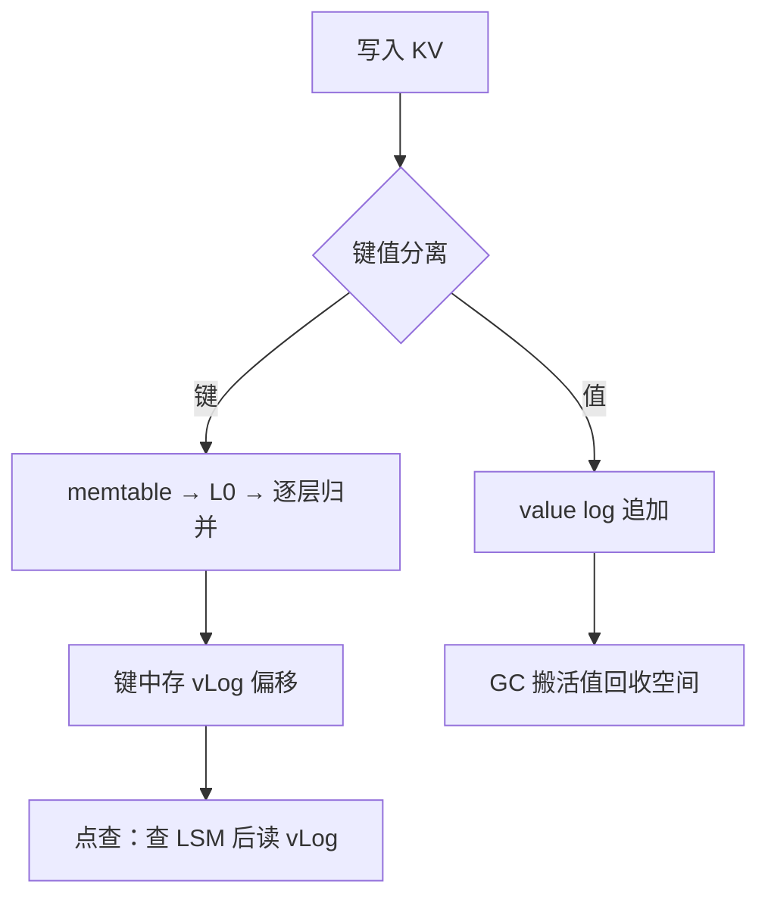

# LSM 的深入

LSM 用顺序写换随机写的报价不是一次付清：每层归并都把同一批字节重写一遍，深入是读完这份报价单的细则。

<footer>—— 据 O'Neil et al., 1996；Lu et al., WiscKey, FAST 2016；RocksDB 文档整理</footer>

[上一课](/cs/hpc-map)把高性能网络的账收束在「每下移一层，就把每次都付的固定税改写成一次付清的固定成本」，并留下测量纪律先于优化的结论。本课是「存储系统深入」的第一课，回到磁盘上的结构：主干已经钉过 [LSM 树作为结构](/cs/lsm-tree-ds)的内存表加不可变有序段、[compaction](/cs/lsm-compaction) 的顺序刷盘与持续税、[读放大与布隆](/cs/lsm-read-amplification)的过滤、[leveled 对 tiered](/cs/leveled-tiered-compaction) 的形状合同，以及 [RocksDB](/cs/rocksdb) 把这一切变成选项名。本课不再比较形状，而是立三本放大的总账，回答工程里真正卡住人的三个问题：写放大的预算怎么算、写停顿为什么是流控而不是故障、把值从 LSM 里搬出去为什么几乎全面变好。后课默认这三本账已经立起。

## 问题

主干课给了方向：leveled 写重读轻、tiered 相反。深入要的是数。缺口一，放大的预算式核算：写放大 WAF（落盘字节除以逻辑写入字节）、读放大、空间放大各是多少量级，怎么折成带宽与容量规划——持续写 100 MB/s、WAF 为 20 的系统，compaction 带宽必须按 2 GB/s 起步去规划，否则顺序读 3 GB/s 的盘也会被拖垮。缺口二，写停顿：compaction 跟不上时写被延迟甚至拒绝，这是机制还是故障。缺口三，值的问题：排序只对键有意义，值却占字节大头，跟着键一层层重写——WiscKey 问的就是这个字节交得冤不冤。

## 方法

先立账。写放大的机制账这样算：在层间比值为 $T$ 的 leveled 形状里，第 $i$ 层并入第 $i+1$ 层时要重写本层数据加下一层的重叠区间，摊到每次刷盘约是 memtable 的 $T$ 倍，$L$ 层合计最坏在 $T\cdot L$ 量级，其中 $L=\log_T(N/T)$；tiered 每层只摊一份，写放大约是层数，但同层 $T$ 个重叠文件把点查读放大抬到 $T\cdot L$。两端的量级差就是形状课主曲线的具体数字。

写停顿按流控读：memtable 满而 L0 到 L1 没有槽位时，刷盘阻塞，写入在内存里堆积，系统先延迟（软限）后拒绝（硬限）。此时 pending compaction bytes 是债务：读这个数比读延迟分布更早知道故障。停顿不是 bug 而是背压——不停顿，归并债务按指数滚，最后一次性以分钟级停顿结清。

值的出路是分离：键小而需要有序，留在 LSM 里保点查与范围扫描；值大而不需要顺序，进一个只追加的 value log，键里只存偏移。点查变两步：查 LSM 拿偏移，再读一次值。范围扫描要先按偏移排序再成批顺序读。GC 搬活值回收空间，与 compaction 同构。

## 机制

分离有效的机制在于成本与收益错位：归并重写按字节计费，有序性只按键维护。一个 1 KiB 的值配 100 B 的键，值贡献了九成字节却对排序毫无贡献，却要在写放大 $T\cdot L$ 的账单里按同样倍数被重写。摘出去之后，值的写放大从「跟着键走 $L$ 层」降到「只写一次加 GC 摊销」，三本账同时改善，唯独范围扫描付出按偏移重排的代价——这也是分离方案只在点查为主的负载上稳赚的原因。

空间放大与写放大同构：旧版本和墓碑靠归并回收，快照把读序列号钉住，compaction 就不敢丢被它看见的版本。一个被遗忘的长快照能让 SAF 静默翻倍，病根与 MVCC 的长事务相同。GC 与 compaction 是同一个思想在 vLog 与 LSM 里的两个名字：搬运活数据、丢弃死数据、付写放大。

量级锚点：$T=10$、四层数据时，leveled 写放大最坏在 $T\cdot L\approx 40$ 的量级，常见实测 10–30；预算式核算是「持续写入带宽乘 WAF 等于 compaction 所需带宽」，先有这道乘法再谈盘型选型。

## 边界

本课不重比 leveled 与 tiered 的放大公式（[形状课](/cs/leveled-tiered-compaction)已钉），不展开 RocksDB 的调参清单（[嵌入式合同](/cs/rocksdb)已给），不进分布式复制；数字是量级锚点而非实测承诺，上盘前按网络课程留下的纪律先测自己的负载。后课默认：写入放大是要做预算的账，排序是有成本的决策。下一课看另一族结构怎么在同样的页 I/O 账上签字。

## 小结

- 三本账先立预算：WAF、读放大、SAF；compaction 带宽按 WAF 乘持续写入带宽规划。
- 写停顿是流控不是故障：pending compaction bytes 是债务，比延迟更早报警。
- WiscKey 把值摘出排序机：值只写一次，范围扫描付按偏移重排的代价。
- 空间放大来自旧版本与墓碑；长快照钉住回收，与 MVCC 长事务同病。
- 出处：O'Neil et al., 1996；Lu et al., WiscKey, FAST 2016；Dayan and Idreos, PVLDB 2018；RocksDB 文档。
